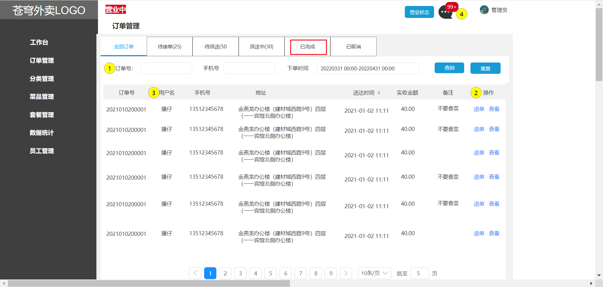
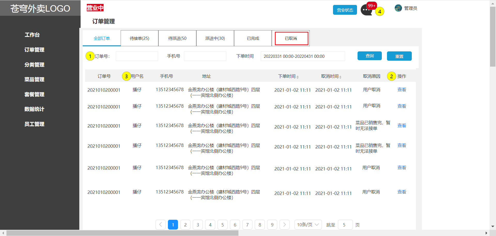
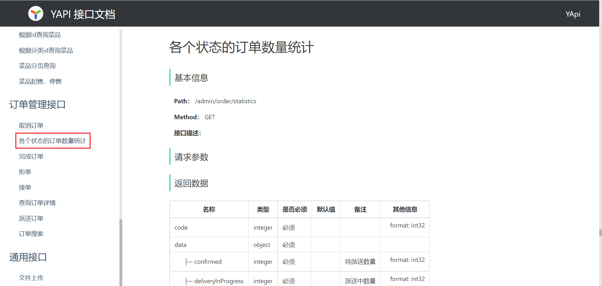

# 黑马-苍穹外卖项目学习笔记

## ——BY mozijie

## 0.说明

> 该课程是黑马程序员springboot的经典项目课程
> 
> 课程地址：https://www.bilibili.com/video/BV1TP411v7v6/?spm_id_from=333.788.comment.all.click&vd_source=7c23485904ea3584fb46e603e43ca789
> 
>

# 苍穹外卖-day01

## 2025.07.06学完

## 课程内容

- 软件开发整体介绍
- 苍穹外卖项目介绍
- 开发环境搭建
- 导入接口文档
- Swagger


**项目整体效果展示：**


​																	        管理端-外卖商家使用


​																		    用户端-点餐用户使用

当我们完成该项目的学习，可以培养以下能力：


## 1. 软件开发整体介绍

作为一名软件开发工程师,我们需要了解在软件开发过程中的开发流程， 以及软件开发过程中涉及到的岗位角色，角色的分工、职责， 并了解软件开发中涉及到的三种软件环境。那么这一小节，我们将从 软件开发流程、角色分工、软件环境 三个方面整体介绍一下软件开发。


### 1.1 软件开发流程


**1). 第1阶段: 需求分析**

完成需求规格说明书、产品原型编写。  

需求规格说明书， 一般来说就是使用 Word 文档来描述当前项目的各个组成部分，如：系统定义、应用环境、功能规格、性能需求等，都会在文档中描述。**例如：**


产品原型，一般是通过网页(html)的形式展示当前的页面展示什么样的数据, 页面的布局是什么样子的，点击某个菜单，打开什么页面，点击某个按钮，出现什么效果，都可以通过产品原型看到。 **例如：**


**2). 第2阶段: 设计**

设计的内容包含 UI设计、数据库设计、接口设计。

UI设计：用户界面的设计，主要设计项目的页面效果，小到一个按钮，大到一个页面布局，还有人机交互逻辑的体现。**例如：**


数据库设计：需要设计当前项目中涉及到哪些数据库，每一个数据库里面包含哪些表，这些表结构之间的关系是什么样的，表结构中包含哪些字段。**例如：**


接口设计：通过分析原型图，首先，粗粒度地分析每个页面有多少接口，然后，再细粒度地分析每个接口的传入参数，返回值参数，同时明确接口路径及请求方式。**例如：**


**3). 第3阶段: 编码**

编写项目代码、并完成单元测试。

项目代码编写：作为软件开发工程师，我们需要对项目的模块功能分析后，进行编码实现。

单元测试：编码实现完毕后，进行单元测试，单元测试通过后再进入到下一阶段。**例如：**


**4). 第4阶段: 测试**

在该阶段中主要由测试人员, 对部署在测试环境的项目进行功能测试, 并出具测试报告。


**5). 第5阶段: 上线运维**

在项目上线之前， 会由运维人员准备服务器上的软件环境安装、配置， 配置完毕后， 再将我们开发好的项目，部署在服务器上运行。


### 1.2 角色分工

在对整个软件开发流程熟悉后， 我们还有必要了解一下在整个软件开发流程中涉及到的岗位角色，以及各个角色的职责分工。


| 岗位/角色                           | 对应阶段                      | 职责/分工                                  |
| :---------------------------------- | ----------------------------- | :----------------------------------------- |
| 项目经理                            | 全阶段                        | 对整个项目负责，任务分配、把控进度         |
| 产品经理                            | 需求分析                      | 进行需求调研，输出需求调研文档、产品原型等 |
| UI设计师                            | 设计                          | 根据产品原型输出界面效果图                 |
| 架构师                              | 设计                          | 项目整体架构设计、技术选型等               |
| <font color='red'>开发工程师</font> | <font color='red'>编码</font> | <font color='red'>功能代码实现</font>      |
| 测试工程师                          | 测试                          | 编写测试用例，输出测试报告                 |
| 运维工程师                          | 上线运维                      | 软件环境搭建、项目上线                     |


上述我们讲解的角色分工, 是在一个项目组中比较标准的角色分工, 但是在实际的项目中, 有一些项目组由于人员配置紧张, 可能并没有专门的架构师或测试人员, 这个时候可能需要有项目经理或者程序员兼任。


### 1.3 软件环境

作为软件开发工程师，在编码的过程中就不可避免地会接触多种软件环境，我们主要来分析在工作中经常遇到的三套环境， 分别是: 开发环境、测试环境、生产环境。 接下来，我们分别介绍一下这三套环境的作用和特点。


**1). 开发环境(development)**

我们作为软件开发人员，在开发阶段使用的环境，就是开发环境，一般外部用户无法访问。

比如，我们在开发中使用的MySQL数据库和其他的一些常用软件，我们可以安装在本地， 也可以安装在一台专门的服务器中， 这些应用软件仅仅在软件开发过程中使用， 项目测试、上线时，我们不会使用这套环境了，这个环境就是开发环境。


**2). 测试环境(testing)**

当软件开发工程师，将项目的功能模块开发完毕，并且单元测试通过后，就需要将项目部署到测试服务器上，让测试人员对项目进行测试。那这台测试服务器就是专门给测试人员使用的环境， 也就是测试环境，用于项目测试，一般外部用户无法访问。


**3). 生产环境(production)**

当项目开发完毕，并且由测试人员测试通过之后，就可以上线项目，将项目部署到线上环境，并正式对外提供服务，这个线上环境也称之为生产环境。


​		        **开发环境**                                                         **测试环境**                                                **生产环境**


首先，会在开发环境中进行项目开发，往往开发环境大多数都是本地的电脑环境和局域网内的环境，当开发完毕后，然后会把项目部署到测试环境，测试环境一般是一台独立测试服务器的环境，项目测试通过后，最终把项目部署到生产环境，生产环境可以是机房或者云服务器等线上环境。


## 2. 苍穹外卖项目介绍

在开发苍穹外卖这个项目之前，我们需要全方位的来介绍一下当前我们学习的这个项目。接下来，我们将从项目简介、产品原型、技术选型三个方面来介绍苍穹外卖这个项目。


### 2.1 项目介绍

本项目（苍穹外卖）是专门为餐饮企业（餐厅、饭店）定制的一款软件产品，包括 系统管理后台 和 小程序端应用 两部分。其中系统管理后台主要提供给餐饮企业内部员工使用，可以对餐厅的分类、菜品、套餐、订单、员工等进行管理维护，对餐厅的各类数据进行统计，同时也可进行来单语音播报功能。小程序端主要提供给消费者使用，可以在线浏览菜品、添加购物车、下单、支付、催单等。


接下来，通过功能架构图来展示**管理端**和**用户端**的具体业务功能模块。


**1). 管理端功能**

员工登录/退出 , 员工信息管理 , 分类管理 , 菜品管理 , 套餐管理 , 菜品口味管理 , 订单管理 ，数据统计，来单提醒。

**2). 用户端功能**

 微信登录 , 收件人地址管理 , 用户历史订单查询 , 菜品规格查询 , 购物车功能 , 下单 , 支付、分类及菜品浏览。


### 2.2 产品原型

**产品原型**，用于展示项目的业务功能，一般由产品经理进行设计。

> **<font color='red'>注意事项：</font>** 产品原型主要用于展示项目的功能，并不是最终的页面效果。


在课程资料的产品原型文件夹下,提供了两份产品原型。


**管理端原型图：**


**用户端原型图：**


**1). 管理端**

餐饮企业内部员工使用。 主要功能有: 

| 模块      | 描述                                                         |
| --------- | ------------------------------------------------------------ |
| 登录/退出 | 内部员工必须登录后,才可以访问系统管理后台                    |
| 员工管理  | 管理员可以在系统后台对员工信息进行管理，包含查询、新增、编辑、禁用等功能 |
| 分类管理  | 主要对当前餐厅经营的 菜品分类 或 套餐分类 进行管理维护， 包含查询、新增、修改、删除等功能 |
| 菜品管理  | 主要维护各个分类下的菜品信息，包含查询、新增、修改、删除、启售、停售等功能 |
| 套餐管理  | 主要维护当前餐厅中的套餐信息，包含查询、新增、修改、删除、启售、停售等功能 |
| 订单管理  | 主要维护用户在移动端下的订单信息，包含查询、取消、派送、完成，以及订单报表下载等功能 |
| 数据统计  | 主要完成对餐厅的各类数据统计，如营业额、用户数量、订单等     |


**2). 用户端**

移动端应用主要提供给消费者使用。主要功能有:

| 模块        | 描述                                                         |
| ----------- | ------------------------------------------------------------ |
| 登录/退出   | 用户需要通过微信授权后登录使用小程序进行点餐                 |
| 点餐-菜单   | 在点餐界面需要展示出菜品分类/套餐分类, 并根据当前选择的分类加载其中的菜品信息, 供用户查询选择 |
| 点餐-购物车 | 用户选中的菜品就会加入用户的购物车, 主要包含 查询购物车、加入购物车、删除购物车、清空购物车等功能 |
| 订单支付    | 用户选完菜品/套餐后, 可以对购物车菜品进行结算支付, 这时就需要进行订单的支付 |
| 个人信息    | 在个人中心页面中会展示当前用户的基本信息, 用户可以管理收货地址, 也可以查询历史订单数据 |


### 2.3 技术选型

关于本项目的技术选型, 我们将会从 用户层、网关层、应用层、数据层 这几个方面进行介绍，主要用于展示项目中使用到的技术框架和中间件等。


**1). 用户层**

本项目中在构建系统管理后台的前端页面，我们会用到H5、Vue.js、ElementUI、apache echarts(展示图表)等技术。而在构建移动端应用时，我们会使用到微信小程序。


**2). 网关层**

Nginx是一个服务器，主要用来作为Http服务器，部署静态资源，访问性能高。在Nginx中还有两个比较重要的作用： 反向代理和负载均衡， 在进行项目部署时，要实现Tomcat的负载均衡，就可以通过Nginx来实现。


**3). 应用层**

SpringBoot： 快速构建Spring项目, 采用 "约定优于配置" 的思想, 简化Spring项目的配置开发。

SpringMVC：SpringMVC是spring框架的一个模块，springmvc和spring无需通过中间整合层进行整合，可以无缝集成。

Spring Task:  由Spring提供的定时任务框架。

httpclient:  主要实现了对http请求的发送。

Spring Cache:  由Spring提供的数据缓存框架

JWT:  用于对应用程序上的用户进行身份验证的标记。

阿里云OSS:  对象存储服务，在项目中主要存储文件，如图片等。

Swagger： 可以自动的帮助开发人员生成接口文档，并对接口进行测试。

POI:  封装了对Excel表格的常用操作。

WebSocket: 一种通信网络协议，使客户端和服务器之间的数据交换更加简单，用于项目的来单、催单功能实现。


**4). 数据层**

MySQL： 关系型数据库, 本项目的核心业务数据都会采用MySQL进行存储。

Redis： 基于key-value格式存储的内存数据库, 访问速度快, 经常使用它做缓存。

Mybatis： 本项目持久层将会使用Mybatis开发。

pagehelper:  分页插件。

spring data redis:  简化java代码操作Redis的API。


**5). 工具**

git: 版本控制工具, 在团队协作中, 使用该工具对项目中的代码进行管理。

maven: 项目构建工具。

junit：单元测试工具，开发人员功能实现完毕后，需要通过junit对功能进行单元测试。

postman:  接口测工具，模拟用户发起的各类HTTP请求，获取对应的响应结果。


## 3. 开发环境搭建


开发环境搭建主要包含**前端环境**和**后端环境**两部分。作为服务端开发工程师， 我们课程学习的重心应该放在后端的业务代码上， 前端的页面我们只需要导入资料中的nginx， 前端页面的代码我们只需要能看懂即可。


### 3.1 前端环境搭建

**1). 前端工程基于 nginx** 

从资料中找到前端运行环境的nginx，移动到**非中文目录**下。


**sky**目录中存放了管理端的前端资源，具体如下：


**2). 启动nginx，访问测试** 

双击 nginx.exe 即可启动 nginx 服务，访问端口号为 80

http://localhost:80


### 3.2 后端环境搭建

#### 3.2.1 熟悉项目结构

后端工程基于 maven 进行项目构建，并且进行分模块开发。

**1). 从当天资料中找到后端初始工程：**


**2). 用 IDEA 打开初始工程，了解项目的整体结构：**


对工程的每个模块作用说明：

| **序号** | **名称**     | **说明**                                                     |
| -------- | ------------ | ------------------------------------------------------------ |
| 1        | sky-take-out | maven父工程，统一管理依赖版本，聚合其他子模块                |
| 2        | sky-common   | 子模块，存放公共类，例如：工具类、常量类、异常类等           |
| 3        | sky-pojo     | 子模块，存放实体类、VO、DTO等                                |
| 4        | sky-server   | 子模块，后端服务，存放配置文件、Controller、Service、Mapper等 |

对项目整体结构了解后，接下来我们详细分析上述的每个子模块：


- **sky-common:** 模块中存放的是一些公共类，可以供其他模块使用

  

  

  分析sky-common模块的每个包的作用：

  | 名称        | 说明                           |
  | ----------- | ------------------------------ |
  | constant    | 存放相关常量类                 |
  | context     | 存放上下文类                   |
  | enumeration | 项目的枚举类存储               |
  | exception   | 存放自定义异常类               |
  | json        | 处理json转换的类               |
  | properties  | 存放SpringBoot相关的配置属性类 |
  | result      | 返回结果类的封装               |
  | utils       | 常用工具类                     |

  

- **sky-pojo:** 模块中存放的是一些 entity、DTO、VO

  

  分析sky-pojo模块的每个包的作用：

  | **名称** | **说明**                                     |
  | -------- | -------------------------------------------- |
  | Entity   | 实体，通常和数据库中的表对应                 |
  | DTO      | 数据传输对象，通常用于程序中各层之间传递数据 |
  | VO       | 视图对象，为前端展示数据提供的对象           |
  | POJO     | 普通Java对象，只有属性和对应的getter和setter |

  

- **sky-server:** 模块中存放的是 配置文件、配置类、拦截器、controller、service、mapper、启动类等

  

  分析sky-server模块的每个包的作用：

  | 名称           | 说明             |
  | -------------- | ---------------- |
  | config         | 存放配置类       |
  | controller     | 存放controller类 |
  | interceptor    | 存放拦截器类     |
  | mapper         | 存放mapper接口   |
  | service        | 存放service类    |
  | SkyApplication | 启动类           |


#### 3.2.2 Git版本控制

使用Git进行项目代码的版本控制，具体操作：

**1). 创建Git本地仓库**


当Idea中出现：


说明本地仓库创建成功。


**2). 创建Git远程仓库**

访问https://gitee.com/，新建仓库


点击 创建 


**3). 将本地文件推送到Git远程仓库**


1. **提交文件至本地仓库**

   忽略以下类型文件

   

   开始提交

   

   中间出现：点击commit

   

2. **添加Git远程仓库地址**

   复制远程地址：

   

   添加地址：

   

   

3. **推送**


成功推送至远程仓库


#### 3.2.3 数据库环境搭建

1. **从资料中找到sky.sql**


直接打开sky.sql文件


通过该sql文件直接可创建数据库，所以不需要提前创建数据库，直接导入该文件执行即可。

2. **执行sky.sql文件**


执行完成后，共创建出11张表


每张表的说明：

| **序号** | **表名**      | **中文名**     |
| -------- | ------------- | -------------- |
| 1        | employee      | 员工表         |
| 2        | category      | 分类表         |
| 3        | dish          | 菜品表         |
| 4        | dish_flavor   | 菜品口味表     |
| 5        | setmeal       | 套餐表         |
| 6        | setmeal_dish  | 套餐菜品关系表 |
| 7        | user          | 用户表         |
| 8        | address_book  | 地址表         |
| 9        | shopping_cart | 购物车表       |
| 10       | orders        | 订单表         |
| 11       | order_detail  | 订单明细表     |

我们目前先简单了解大概有哪些表, 每张表存储什么数据, 有一个印象。对于具体的表结构, 以及表结构中的字段, 可以参考资料中的**《数据库设计文档》**，同时在讲解具体的功能开发时, 我们也会再详细介绍。


#### 3.2.4 前后端联调

后端的初始工程中已经实现了**登录**功能，直接进行前后端联调测试即可

实现思路：


**0.后端编译、启动、前端启动**

**首先后端编译**


**然后后端启动**


**然后前端启动**


**在浏览器输入 http://localhost 进入**

**注意：如果点击登录出现问题**

大概是因为与数据库链接出问题

我的电脑的数据库账号和密码分别为root和123456

代码里面默认的是root和root

在配置文件里面改一下就行：


**1.Controller层**

在sky-server模块中，com.sky.controller.admin.EmployeeController

```java
/**
     * 登录
     *
     * @param employeeLoginDTO
     * @return
     */
    @PostMapping("/login")
    public Result<EmployeeLoginVO> login(@RequestBody EmployeeLoginDTO employeeLoginDTO) {
        log.info("员工登录：{}", employeeLoginDTO);
		//调用service方法查询数据库
        Employee employee = employeeService.login(employeeLoginDTO);

        //登录成功后，生成jwt令牌
        Map<String, Object> claims = new HashMap<>();
        claims.put(JwtClaimsConstant.EMP_ID, employee.getId());
        String token = JwtUtil.createJWT(
                jwtProperties.getAdminSecretKey(),
                jwtProperties.getAdminTtl(),
                claims);

        EmployeeLoginVO employeeLoginVO = EmployeeLoginVO.builder()
                .id(employee.getId())
                .userName(employee.getUsername())
                .name(employee.getName())
                .token(token)
                .build();

        return Result.success(employeeLoginVO);
    }
```

**2.Service层**

在sky-server模块中，com.sky.service.impl.EmployeeServiceImpl

```java
/**
     * 员工登录
     *
     * @param employeeLoginDTO
     * @return
     */
    public Employee login(EmployeeLoginDTO employeeLoginDTO) {
        String username = employeeLoginDTO.getUsername();
        String password = employeeLoginDTO.getPassword();

        //1、根据用户名查询数据库中的数据
        Employee employee = employeeMapper.getByUsername(username);

        //2、处理各种异常情况（用户名不存在、密码不对、账号被锁定）
        if (employee == null) {
            //账号不存在
            throw new AccountNotFoundException(MessageConstant.ACCOUNT_NOT_FOUND);
        }

        //密码比对
        if (!password.equals(employee.getPassword())) {
            //密码错误
            throw new PasswordErrorException(MessageConstant.PASSWORD_ERROR);
        }

        if (employee.getStatus() == StatusConstant.DISABLE) {
            //账号被锁定
            throw new AccountLockedException(MessageConstant.ACCOUNT_LOCKED);
        }

        //3、返回实体对象
        return employee;
    }
```

**3.Mapper层**

在sky-server模块中，com.sky.mapper.EmployeeMapper

```java
package com.sky.mapper;

import com.sky.entity.Employee;
import org.apache.ibatis.annotations.Mapper;
import org.apache.ibatis.annotations.Select;

@Mapper
public interface EmployeeMapper {

    /**
     * 根据用户名查询员工
     * @param username
     * @return
     */
    @Select("select * from employee where username = #{username}")
    Employee getByUsername(String username);

}

```

注：可以通过**断点调试跟踪后端程序的执行过程**


#### 3.2.5 nginx反向代理和负载均衡

对登录功能测试完毕后，接下来，我们思考一个问题：**前端发送的请求，是如何请求到后端服务的？**

前端请求地址：http://localhost/api/employee/login

后端接口地址：http://localhost:8080/admin/employee/login


              **前端请求地址**                                                                                       **后端接口地址**

                                  

很明显，两个地址不一致，那是如何请求到后端服务的呢？


**1). nginx反向代理**

**nginx 反向代理**，就是将前端发送的动态请求由 nginx 转发到后端服务器


那为什么不直接通过浏览器直接请求后台服务端，需要通过nginx反向代理呢？


**nginx 反向代理的好处：**

- 提高访问速度

  因为nginx本身可以进行缓存，如果访问的同一接口，并且做了数据缓存，nginx就直接可把数据返回，不需要真正地访问服务端，从而提高访问速度。

- 进行负载均衡

  所谓负载均衡,就是把大量的请求按照我们指定的方式均衡的分配给集群中的每台服务器。

- 保证后端服务安全

  因为一般后台服务地址不会暴露，所以使用浏览器不能直接访问，可以把nginx作为请求访问的入口，请求到达nginx后转发到具体的服务中，从而保证后端服务的安全。


**nginx 反向代理的配置方式：**

```nginx
server{
    listen 80;
    server_name localhost;
    
    location /api/{
        proxy_pass http://localhost:8080/admin/; #反向代理
    }
}
```

**proxy_pass：**该指令是用来设置代理服务器的地址，可以是主机名称，IP地址加端口号等形式。

如上代码的含义是：监听80端口号， 然后当我们访问 http://localhost:80/api/../..这样的接口的时候，它会通过 location /api/ {} 这样的反向代理到 http://localhost:8080/admin/上来。


接下来，进到nginx-1.20.2\conf，打开nginx配置

```nginx
# 反向代理,处理管理端发送的请求
location /api/ {
	proxy_pass   http://localhost:8080/admin/;
    #proxy_pass   http://webservers/admin/;
}
```

当在访问http://localhost/api/employee/login，nginx接收到请求后转到http://localhost:8080/admin/，故最终的请求地址为http://localhost:8080/admin/employee/login，和后台服务的访问地址一致。


**2). nginx 负载均衡**

当如果服务以集群的方式进行部署时，那nginx在转发请求到服务器时就需要做相应的负载均衡。其实，负载均衡从本质上来说也是基于反向代理来实现的，最终都是转发请求。


**nginx 负载均衡的配置方式：**

```nginx
upstream webservers{
    server 192.168.100.128:8080;
    server 192.168.100.129:8080;
}
server{
    listen 80;
    server_name localhost;
    
    location /api/{
        proxy_pass http://webservers/admin;#负载均衡
    }
}
```

**upstream：**如果代理服务器是一组服务器的话，我们可以使用upstream指令配置后端服务器组。

如上代码的含义是：监听80端口号， 然后当我们访问 http://localhost:80/api/../..这样的接口的时候，它会通过 location /api/ {} 这样的反向代理到 http://webservers/admin，根据webservers名称找到一组服务器，根据设置的负载均衡策略(默认是轮询)转发到具体的服务器。

**注：**upstream后面的名称可自定义，但要上下保持一致。


**nginx 负载均衡策略：**

| **名称**   | **说明**                                               |
| ---------- | ------------------------------------------------------ |
| 轮询       | 默认方式                                               |
| weight     | 权重方式，默认为1，权重越高，被分配的客户端请求就越多  |
| ip_hash    | 依据ip分配方式，这样每个访客可以固定访问一个后端服务   |
| least_conn | 依据最少连接方式，把请求优先分配给连接数少的后端服务   |
| url_hash   | 依据url分配方式，这样相同的url会被分配到同一个后端服务 |
| fair       | 依据响应时间方式，响应时间短的服务将会被优先分配       |

具体配置方式：

**轮询：**

```nginx
upstream webservers{
    server 192.168.100.128:8080;
    server 192.168.100.129:8080;
}
```

**weight:**

```nginx
upstream webservers{
    server 192.168.100.128:8080 weight=90;
    server 192.168.100.129:8080 weight=10;
}
```

**ip_hash:**

```nginx
upstream webservers{
    ip_hash;
    server 192.168.100.128:8080;
    server 192.168.100.129:8080;
}
```

**least_conn:**

```nginx
upstream webservers{
    least_conn;
    server 192.168.100.128:8080;
    server 192.168.100.129:8080;
}
```

**url_hash:**

```nginx
upstream webservers{
    hash &request_uri;
    server 192.168.100.128:8080;
    server 192.168.100.129:8080;
}
```

**fair:**

```nginx
upstream webservers{
    server 192.168.100.128:8080;
    server 192.168.100.129:8080;
    fair;
}
```


### 3.3 完善登录功能

**问题：**员工表中的密码是明文存储，安全性太低。


**解决思路：**

1. 将密码加密后存储，提高安全性

   

2. 使用MD5加密方式对明文密码加密

   

**实现步骤：**

1. 修改数据库中明文密码，改为MD5加密后的密文

   打开employee表，修改密码

   

2. 修改Java代码，前端提交的密码进行MD5加密后再跟数据库中密码比对

   打开EmployeeServiceImpl.java，修改比对密码

   ```java
   /**
        * 员工登录
        *
        * @param employeeLoginDTO
        * @return
        */
       public Employee login(EmployeeLoginDTO employeeLoginDTO) {
   
           //1、根据用户名查询数据库中的数据
          
           //2、处理各种异常情况（用户名不存在、密码不对、账号被锁定）
           //.......
           //密码比对
           // TODO 后期需要进行md5加密，然后再进行比对
           password = DigestUtils.md5DigestAsHex(password.getBytes());
           if (!password.equals(employee.getPassword())) {
               //密码错误
               throw new PasswordErrorException(MessageConstant.PASSWORD_ERROR);
           }
   
           //........
   
           //3、返回实体对象
           return employee;
       }
   ```

   

## 4. 导入接口文档

接下来，就要进入到项目的业务开发了，而我们的开发方式就是基本当前企业主流的前后端分离开发方式，那么这种方式就要求我们之前需要先将接口定义好，这样前后端人员才能并行开发，所以，这个章节就需要将接口文档导入到管理平台，为我们后面业务开发做好准备。其实，在真实的企业开发中，接口设计过程其实是一个非常漫长的过程，可能需要多次开会讨论调整，甚至在开发的过程中才会发现某些接口定义还需要再调整，这种情况其实是非常常见的，但是由于项目时间原因，所以选择一次性导入所有的接口，在开发业务功能过程当中，也会带着大家一起来分析一下对应的接口是怎么确定下来的，为什么要这样定义，从而培养同学们的接口设计能力。


### 4.1 前后端分离开发流程


第一步：定义接口，确定接口的路径、请求方式、传入参数、返回参数。

第二步：前端开发人员和后端开发人员并行开发，同时，也可自测。

第三步：前后端人员进行连调测试。

第四步：提交给测试人员进行最终测试。


### 4.2 操作步骤

**注意：这里提到的接口管理网站YApi并不好使 ， 以后请使用java自带的Swagger或者网页端的apifox。这个YApi可以不管他**

将课程资料中提供的项目接口导入YApi。访问地址：https://yapi.pro/

我的yapiPro账号密码为：

账号：2421126939@qq.com

密码：略

**1). 从资料中找到项目接口文件**


**2). 导入到YApi平台**

在YApi平台创建出两个项目


选择苍穹外卖-管理端接口.json导入


导入成功


另一个用户端json文件也执行相同操作。


## 5. Swagger

### 5.1 介绍

Swagger 是一个规范和完整的框架，用于生成、描述、调用和可视化 RESTful 风格的 Web 服务(<https://swagger.io/>)。 它的主要作用是：

1. 使得前后端分离开发更加方便，有利于团队协作

2. 接口的文档在线自动生成，降低后端开发人员编写接口文档的负担

3. 功能测试 

   Spring已经将Swagger纳入自身的标准，建立了Spring-swagger项目，现在叫Springfox。通过在项目中引入Springfox ，即可非常简单快捷的使用Swagger。

knife4j是为Java MVC框架集成Swagger生成Api文档的增强解决方案,前身是swagger-bootstrap-ui,取名kni4j是希望它能像一把匕首一样小巧,轻量,并且功能强悍!

目前，一般都使用knife4j框架。


### 5.2 使用步骤

1. 导入 knife4j 的maven坐标

   在pom.xml中添加依赖

   ```xml
   <dependency>
      <groupId>com.github.xiaoymin</groupId>
      <artifactId>knife4j-spring-boot-starter</artifactId>
   </dependency>
   ```

2. 在配置类中加入 knife4j 相关配置

   WebMvcConfiguration.java

   ```java
   /**
        * 通过knife4j生成接口文档
        * @return
   */
       @Bean
       public Docket docket() {
           ApiInfo apiInfo = new ApiInfoBuilder()
                   .title("苍穹外卖项目接口文档")
                   .version("2.0")
                   .description("苍穹外卖项目接口文档")
                   .build();
           Docket docket = new Docket(DocumentationType.SWAGGER_2)
                   .apiInfo(apiInfo)
                   .select()
                   .apis(RequestHandlerSelectors.basePackage("com.sky.controller"))
                   .paths(PathSelectors.any())
                   .build();
           return docket;
       }
   ```

   

3. 设置静态资源映射，否则接口文档页面无法访问

   WebMvcConfiguration.java

   ```java
   /**
        * 设置静态资源映射
        * @param registry
   */
   protected void addResourceHandlers(ResourceHandlerRegistry registry) {
           registry.addResourceHandler("/doc.html").addResourceLocations("classpath:/META-INF/resources/");
           registry.addResourceHandler("/webjars/**").addResourceLocations("classpath:/META-INF/resources/webjars/");
   }
   ```

4. 访问测试

   接口文档访问路径为 http://ip:port/doc.html ---> http://localhost:8080/doc.html

   

   接口测试:测试登录功能

   

**思考：**通过 Swagger 就可以生成接口文档，那么我们就不需要 Yapi 了？

1、Yapi 是设计阶段使用的工具，管理和维护接口

2、Swagger 在开发阶段使用的框架，帮助后端开发人员做后端的接口测试


### 5.3 常用注解

通过注解可以控制生成的接口文档，使接口文档拥有更好的可读性，常用注解如下：

| **注解**          | **说明**                                               |
| ----------------- | ------------------------------------------------------ |
| @Api              | 用在类上，例如Controller，表示对类的说明               |
| @ApiModel         | 用在类上，例如entity、DTO、VO                          |
| @ApiModelProperty | 用在属性上，描述属性信息                               |
| @ApiOperation     | 用在方法上，例如Controller的方法，说明方法的用途、作用 |

接下来，使用上述注解，生成可读性更好的接口文档

在sky-pojo模块中

EmployeeLoginDTO.java

```java
package com.sky.dto;

import io.swagger.annotations.ApiModel;
import io.swagger.annotations.ApiModelProperty;
import lombok.Data;

import java.io.Serializable;

@Data
@ApiModel(description = "员工登录时传递的数据模型")
public class EmployeeLoginDTO implements Serializable {

    @ApiModelProperty("用户名")
    private String username;

    @ApiModelProperty("密码")
    private String password;

}

```

EmployeeLoginVo.java

```java
package com.sky.vo;

import io.swagger.annotations.ApiModel;
import io.swagger.annotations.ApiModelProperty;
import lombok.AllArgsConstructor;
import lombok.Builder;
import lombok.Data;
import lombok.NoArgsConstructor;

import java.io.Serializable;

@Data
@Builder
@NoArgsConstructor
@AllArgsConstructor
@ApiModel(description = "员工登录返回的数据格式")
public class EmployeeLoginVO implements Serializable {

    @ApiModelProperty("主键值")
    private Long id;

    @ApiModelProperty("用户名")
    private String userName;

    @ApiModelProperty("姓名")
    private String name;

    @ApiModelProperty("jwt令牌")
    private String token;

}
```

在sky-server模块中

EmployeeController.java

```java
package com.sky.controller.admin;

import com.sky.constant.JwtClaimsConstant;
import com.sky.dto.EmployeeLoginDTO;
import com.sky.entity.Employee;
import com.sky.properties.JwtProperties;
import com.sky.result.Result;
import com.sky.service.EmployeeService;
import com.sky.utils.JwtUtil;
import com.sky.vo.EmployeeLoginVO;
import io.swagger.annotations.Api;
import io.swagger.annotations.ApiOperation;
import lombok.extern.slf4j.Slf4j;
import org.springframework.beans.factory.annotation.Autowired;
import org.springframework.web.bind.annotation.PostMapping;
import org.springframework.web.bind.annotation.RequestBody;
import org.springframework.web.bind.annotation.RequestMapping;
import org.springframework.web.bind.annotation.RestController;

import java.util.HashMap;
import java.util.Map;

/**
 * 员工管理
 */
@RestController
@RequestMapping("/admin/employee")
@Slf4j
@Api(tags = "员工相关接口")
public class EmployeeController {

    @Autowired
    private EmployeeService employeeService;
    @Autowired
    private JwtProperties jwtProperties;

    /**
     * 登录
     *
     * @param employeeLoginDTO
     * @return
     */
    @PostMapping("/login")
    @ApiOperation(value = "员工登录")
    public Result<EmployeeLoginVO> login(@RequestBody EmployeeLoginDTO employeeLoginDTO) 	{
        //..............

        
    }

    /**
     * 退出
     *
     * @return
     */
    @PostMapping("/logout")
    @ApiOperation("员工退出")
    public Result<String> logout() {
        return Result.success();
    }

}

```

启动服务：访问http://localhost:8080/doc.html


# 苍穹外卖-day02

## 2025.08.02学完

## 课程内容

- 新增员工
- 员工分页查询
- 启用禁用员工账号
- 编辑员工
- 导入分类模块功能代码


**功能实现：**员工管理、菜品分类管理。

**员工管理效果：**

 


**菜品分类管理效果：**

 


## 1. 新增员工

### 1.1 需求分析和设计

#### 1.1.1 产品原型

一般在做需求分析时，往往都是对照着产品原型进行分析，因为产品原型比较直观，便于我们理解业务。

后台系统中可以管理员工信息，通过新增员工来添加后台系统用户。

**新增员工原型：**

 


当填写完表单信息, 点击"保存"按钮后, 会提交该表单的数据到服务端, 在服务端中需要接受数据, 然后将数据保存至数据库中。

**注意事项：**

1. 账号必须是唯一的
2. 手机号为合法的11位手机号码
3. 身份证号为合法的18位身份证号码
4. 密码默认为123456


#### 1.1.2 接口设计

找到资料-->项目接口文档-->苍穹外卖-管理端接口.html

 


明确新增员工接口的**请求路径、请求方式、请求参数、返回数据**。


本项目约定：

- **管理端**发出的请求，统一使用**/admin**作为前缀。
- **用户端**发出的请求，统一使用**/user**作为前缀。


#### 1.1.3 表设计

新增员工，其实就是将我们新增页面录入的员工数据插入到employee表。

**employee表结构：**

| **字段名**  | **数据类型** | **说明**     | **备注**    |
| ----------- | ------------ | ------------ | ----------- |
| id          | bigint       | 主键         | 自增        |
| name        | varchar(32)  | 姓名         |             |
| username    | varchar(32)  | 用户名       | 唯一        |
| password    | varchar(64)  | 密码         |             |
| phone       | varchar(11)  | 手机号       |             |
| sex         | varchar(2)   | 性别         |             |
| id_number   | varchar(18)  | 身份证号     |             |
| status      | Int          | 账号状态     | 1正常 0锁定 |
| create_time | Datetime     | 创建时间     |             |
| update_time | datetime     | 最后修改时间 |             |
| create_user | bigint       | 创建人id     |             |
| update_user | bigint       | 最后修改人id |             |

其中，employee表中的status字段已经设置了默认值1，表示状态正常。


### 1.2 代码开发

#### 1.2.1 设计DTO类

**根据新增员工接口设计对应的DTO**

前端传递参数列表：

 

**思考：**是否可以使用对应的实体类来接收呢？

 

**注意：**当前端提交的数据和实体类中对应的属性差别比较大时，建议使用DTO来封装数据

由于上述传入参数和实体类有较大差别，所以自定义DTO类。

进入sky-pojo模块，在com.sky.dto包下，已定义EmployeeDTO

```java
package com.sky.dto;

import lombok.Data;

import java.io.Serializable;

@Data
public class EmployeeDTO implements Serializable {

    private Long id;

    private String username;

    private String name;

    private String phone;

    private String sex;

    private String idNumber;

}
```


#### 1.2.2 Controller层

 **EmployeeController中创建新增员工方法**

进入到sky-server模块中，在com.sky.controller.admin包下，在EmployeeController中创建新增员工方法，接收前端提交的参数。

```java
	/**
     * 新增员工
     * @param employeeDTO
     * @return
     */
    @PostMapping
    @ApiOperation("新增员工")
    public Result save(@RequestBody EmployeeDTO employeeDTO){
        log.info("新增员工：{}",employeeDTO);
        employeeService.save(employeeDTO);//该方法后续步骤会定义
        return Result.success();
    }
```

**注：**Result类定义了后端统一返回结果格式。

进入sky-common模块，在com.sky.result包下定义了Result.java

```java
package com.sky.result;

import lombok.Data;

import java.io.Serializable;

/**
 * 后端统一返回结果
 * @param <T>
 */
@Data
public class Result<T> implements Serializable {

    private Integer code; //编码：1成功，0和其它数字为失败
    private String msg; //错误信息
    private T data; //数据

    public static <T> Result<T> success() {
        Result<T> result = new Result<T>();
        result.code = 1;
        return result;
    }

    public static <T> Result<T> success(T object) {
        Result<T> result = new Result<T>();
        result.data = object;
        result.code = 1;
        return result;
    }

    public static <T> Result<T> error(String msg) {
        Result result = new Result();
        result.msg = msg;
        result.code = 0;
        return result;
    }

}
```


#### 1.2.3 Service层接口

**在EmployeeService接口中声明新增员工方法**

进入到sky-server模块中,com.sky.server.EmployeeService

```java
	/**
     * 新增员工
     * @param employeeDTO
     */
    void save(EmployeeDTO employeeDTO);
```


#### 1.2.4 Service层实现类

**在EmployeeServiceImpl中实现新增员工方法**

com.sky.server.impl.EmployeeServiceImpl中创建方法

```java
	/**
     * 新增员工
     *
     * @param employeeDTO
     */
    public void save(EmployeeDTO employeeDTO) {
        Employee employee = new Employee();

        //对象属性拷贝
        BeanUtils.copyProperties(employeeDTO, employee);

        //设置账号的状态，默认正常状态 1表示正常 0表示锁定
        employee.setStatus(StatusConstant.ENABLE);

        //设置密码，默认密码123456
        employee.setPassword(DigestUtils.md5DigestAsHex(PasswordConstant.DEFAULT_PASSWORD.getBytes()));

        //设置当前记录的创建时间和修改时间
        employee.setCreateTime(LocalDateTime.now());
        employee.setUpdateTime(LocalDateTime.now());

        //设置当前记录创建人id和修改人id
        employee.setCreateUser(10L);//目前写个假数据，后期修改
        employee.setUpdateUser(10L);

        employeeMapper.insert(employee);//后续步骤定义
    }
```


在sky-common模块com.sky.constants包下已定义StatusConstant.java

```java
package com.sky.constant;

/**
 * 状态常量，启用或者禁用
 */
public class StatusConstant {

    //启用
    public static final Integer ENABLE = 1;

    //禁用
    public static final Integer DISABLE = 0;
}

```


#### 1.2.5 Mapper层

**在EmployeeMapper中声明insert方法**

com.sky.EmployeeMapper中添加方法

```java
	/**
     * 插入员工数据
     * @param employee
     */
    @Insert("insert into employee (name, username, password, phone, sex, id_number, create_time, update_time, create_user, update_user,status) " +
            "values " +
            "(#{name},#{username},#{password},#{phone},#{sex},#{idNumber},#{createTime},#{updateTime},#{createUser},#{updateUser},#{status})")
    void insert(Employee employee);
```


在application.yml中已开启驼峰命名，故id_number和idNumber可对应。

```yaml
mybatis:
  configuration:
    #开启驼峰命名
    map-underscore-to-camel-case: true
```


### 1.3 功能测试

代码已经发开发完毕，对新增员工功能进行测试。

**功能测试实现方式：**

- 通过接口文档测试
- 通前后端联调测试

接下来我们使用上述两种方式分别测试。


#### 1.3.1 接口文档测试

**启动服务：**访问http://localhost:8080/doc.html，进入新增员工接口

   

json数据：

```json
{
  "id": 0,
  "idNumber": "111222333444555666",
  "name": "xiaozhi",
  "phone": "13812344321",
  "sex": "1",
  "username": "小智"
}
```

响应码：401 报错

**通过断点调试：**进入到JwtTokenAdminInterceptor拦截器

```java
 	/**
     * 校验jwt
     *
     * @param request
     * @param response
     * @param handler
     * @return
     * @throws Exception
     */
    public boolean preHandle(HttpServletRequest request, HttpServletResponse response, Object handler) throws Exception {
        //判断当前拦截到的是Controller的方法还是其他资源
        if (!(handler instanceof HandlerMethod)) {
            //当前拦截到的不是动态方法，直接放行
            return true;
        }

        //1、从请求头中获取令牌 jwtProperties.getAdminTokenName()获取为token
        String token = request.getHeader(jwtProperties.getAdminTokenName());

        //2、校验令牌
        try {
            log.info("jwt校验:{}", token);
            Claims claims = JwtUtil.parseJWT(jwtProperties.getAdminSecretKey(), token);
            Long empId = Long.valueOf(claims.get(JwtClaimsConstant.EMP_ID).toString());
            log.info("当前员工id：", empId);
            //3、通过，放行
            return true;
        } catch (Exception ex) {
            //4、不通过，响应401状态码
            response.setStatus(401);
            return false;
        }
    }
```

**报错原因：**由于JWT令牌校验失败，导致EmployeeController的save方法没有被调用

**解决方法：**调用员工登录接口获得一个合法的JWT令牌

使用admin用户登录获取令牌

 

**添加令牌：**

将合法的JWT令牌添加到全局参数中

文档管理-->全局参数设置-->添加参数

 

**接口测试：**

 

其中，请求头部含有JWT令牌

 

**查看employee表：**


测试成功。


#### 1.3.2 前后端联调测试

启动nginx,访问 http://localhost

登录-->员工管理-->添加员工

**注意这里的前端代码对手机号和身份证号也写了判断：**

**手机号开头必须是13，身份证号开头必须是11。我服了，哪有前端这么写的，不符合实际情况**

 

保存后，查看employee表

 

测试成功。


**注意：**由于开发阶段前端和后端是并行开发的，后端完成某个功能后，此时前端对应的功能可能还没有开发完成，
导致无法进行前后端联调测试。所以在开发阶段，后端测试主要以接口文档测试为主。


### 1.4 代码完善

目前，程序存在的问题主要有两个：

- 录入的用户名已存，抛出的异常后没有处理
- 新增员工时，创建人id和修改人id设置为固定值

接下来，我们对上述两个问题依次进行分析和解决。


#### 1.4.1 问题一

**描述：**录入的用户名已存，抛出的异常后没有处理

**分析：**

新增username=zhangsan的用户，若employee表中之前已存在。

 


**注意：这里如果响应码是401，而不是500，说明token过期了，要重新创建一个token配置**

**具体操作可以见1.3.1**

后台报错信息：

 

查看employee表结构：

 

发现，username已经添加了唯一约束，不能重复。

**解决：**

通过全局异常处理器来处理。

进入到sky-server模块，com.sky.hander包下，GlobalExceptionHandler.java添加方法

```java
	/**
     * 处理SQL异常
     * @param ex
     * @return
     */
    @ExceptionHandler
    public Result exceptionHandler(SQLIntegrityConstraintViolationException ex){
        //Duplicate entry 'zhangsan' for key 'employee.idx_username'
        String message = ex.getMessage();
        if(message.contains("Duplicate entry")){
            String[] split = message.split(" ");
            String username = split[2];
            String msg = username + MessageConstant.ALREADY_EXISTS;
            return Result.error(msg);
        }else{
            return Result.error(MessageConstant.UNKNOWN_ERROR);
        }
    }
```

进入到sky-common模块，在MessageConstant.java添加

```java
public static final String ALREADY_EXISTS = "已存在";
```

再次，接口测试：

 


####  1.4.2 问题二

**描述**：新增员工时，创建人id和修改人id设置为固定值

**分析：**

```java
	/**
     * 新增员工
     *
     * @param employeeDTO
     */
    public void save(EmployeeDTO employeeDTO) {
        Employee employee = new Employee();
        //................
        //////////当前设置的id为固定值10//////////
        employee.setCreateUser(10L);
        employee.setUpdateUser(10L);
        //////////////////////////////////////
        //.................................

        employeeMapper.insert(employee);//后续步骤定义
    }
```

**解决：**

通过某种方式动态获取当前登录员工的id。

 

员工登录成功后会生成JWT令牌并响应给前端：

在sky-server模块

```java
package com.sky.controller.admin;
/**
 * 员工管理
 */
@RestController
@RequestMapping("/admin/employee")
@Slf4j
@Api(tags = "员工相关接口")
public class EmployeeController {

    @Autowired
    private EmployeeService employeeService;
    @Autowired
    private JwtProperties jwtProperties;

    /**
     * 登录
     *
     * @param employeeLoginDTO
     * @return
     */
    @PostMapping("/login")
    @ApiOperation(value = "员工登录")
    public Result<EmployeeLoginVO> login(@RequestBody EmployeeLoginDTO employeeLoginDTO) {
        //.........

        //登录成功后，生成jwt令牌
        Map<String, Object> claims = new HashMap<>();
        claims.put(JwtClaimsConstant.EMP_ID, employee.getId());
        String token = JwtUtil.createJWT(
                jwtProperties.getAdminSecretKey(),
                jwtProperties.getAdminTtl(),
                claims);

        //............

        return Result.success(employeeLoginVO);
    }

}
```

后续请求中，前端会携带JWT令牌，通过JWT令牌可以解析出当前登录员工id：

JwtTokenAdminInterceptor.java

```java
package com.sky.interceptor;

/**
 * jwt令牌校验的拦截器
 */
@Component
@Slf4j
public class JwtTokenAdminInterceptor implements HandlerInterceptor {

    @Autowired
    private JwtProperties jwtProperties;

    /**
     * 校验jwt
     *
     * @param request
     * @param response
     * @param handler
     * @return
     * @throws Exception
     */
    public boolean preHandle(HttpServletRequest request, HttpServletResponse response, Object handler) throws Exception {
       
		//..............
        
        //1、从请求头中获取令牌
        String token = request.getHeader(jwtProperties.getAdminTokenName());

        //2、校验令牌
        try {
            log.info("jwt校验:{}", token);
            Claims claims = JwtUtil.parseJWT(jwtProperties.getAdminSecretKey(), token);
            Long empId = Long.valueOf(claims.get(JwtClaimsConstant.EMP_ID).toString());
            log.info("当前员工id：", empId);
            //3、通过，放行
            return true;
        } catch (Exception ex) {
            //4、不通过，响应401状态码
            response.setStatus(401);
            return false;
        }
    }
}
```

**思考：**解析出登录员工id后，如何传递给Service的save方法？

通过ThreadLocal进行传递。


#### 1.4.3 ThreadLocal

**介绍：**

ThreadLocal 并不是一个Thread，而是Thread的局部变量。
ThreadLocal为每个线程提供单独一份存储空间，具有线程隔离的效果，只有在线程内才能获取到对应的值，线程外则不能访问。

**常用方法：**

- public void set(T value) 	设置当前线程的线程局部变量的值
- public T get() 		返回当前线程所对应的线程局部变量的值
- public void remove()        移除当前线程的线程局部变量

对ThreadLocal有了一定认识后，接下来继续解决**问题二**

 

初始工程中已经封装了 ThreadLocal 操作的工具类：

在sky-common模块

```java
package com.sky.context;

public class BaseContext {

    public static ThreadLocal<Long> threadLocal = new ThreadLocal<>();

    public static void setCurrentId(Long id) {
        threadLocal.set(id);
    }

    public static Long getCurrentId() {
        return threadLocal.get();
    }

    public static void removeCurrentId() {
        threadLocal.remove();
    }

}
```

在拦截器中解析出当前登录员工id，并放入线程局部变量中：

在sky-server模块中，拦截器：

```java
package com.sky.interceptor;

/**
 * jwt令牌校验的拦截器
 */
@Component
@Slf4j
public class JwtTokenAdminInterceptor implements HandlerInterceptor {

    @Autowired
    private JwtProperties jwtProperties;

    /**
     * 校验jwt
     *
     * @param request
     * @param response
     * @param handler
     * @return
     * @throws Exception
     */
    public boolean preHandle(HttpServletRequest request, HttpServletResponse response, Object handler) throws Exception {
        
		//.............................
       
        //2、校验令牌
        try {
            //.................
            Claims claims = JwtUtil.parseJWT(jwtProperties.getAdminSecretKey(), token);
            Long empId = Long.valueOf(claims.get(JwtClaimsConstant.EMP_ID).toString());
            log.info("当前员工id：", empId);
            /////将用户id存储到ThreadLocal////////
            BaseContext.setCurrentId(empId);
            ////////////////////////////////////
            //3、通过，放行
            return true;
        } catch (Exception ex) {
            //......................
        }
    }
}
```

在Service中获取线程局部变量中的值：

```java
	/**
     * 新增员工
     *
     * @param employeeDTO
     */
    public void save(EmployeeDTO employeeDTO) {
        //.............................

        //设置当前记录创建人id和修改人id
        employee.setCreateUser(BaseContext.getCurrentId());//目前写个假数据，后期修改
        employee.setUpdateUser(BaseContext.getCurrentId());

        employeeMapper.insert(employee);
    }
```

测试：使用admin(id=1)用户登录后添加一条记录

 

查看employee表记录

 


### 1.5 代码提交

点击提交：

 

提交过程中，出现提示：

 

继续push:

 

推送成功：

 


## 2. 员工分页查询

### 2.1 需求分析和设计

#### 2.1.1 产品原型

系统中的员工很多的时候，如果在一个页面中全部展示出来会显得比较乱，不便于查看，所以一般的系统中都会以分页的方式来展示列表数据。而在我们的分页查询页面中, 除了分页条件以外，还有一个查询条件 "员工姓名"。

**查询员工原型：**

 

**业务规则**：

- 根据页码展示员工信息
- 每页展示10条数据
- 分页查询时可以根据需要，输入员工姓名进行查询


#### 2.1.2 接口设计

找到资料-->项目接口文档-->苍穹外卖-管理端接口.html


**注意事项：**

- 请求参数类型为Query，不是json格式提交，在路径后直接拼接。/admin/employee/page?name=zhangsan
- 返回数据中records数组中使用Employee实体类对属性进行封装。


### 2.2 代码开发

#### 2.2.1 设计DTO类

根据请求参数进行封装，在sky-pojo模块中

```java
package com.sky.dto;

import lombok.Data;

import java.io.Serializable;

@Data
public class EmployeePageQueryDTO implements Serializable {

    //员工姓名
    private String name;

    //页码
    private int page;

    //每页显示记录数
    private int pageSize;

}

```


#### 2.2.2 封装PageResult

后面所有的分页查询，统一都封装为PageResult对象。

在sky-common模块

```java
package com.sky.result;

import lombok.AllArgsConstructor;
import lombok.Data;
import lombok.NoArgsConstructor;

import java.io.Serializable;
import java.util.List;

/**
 * 封装分页查询结果
 */
@Data
@AllArgsConstructor
@NoArgsConstructor
public class PageResult implements Serializable {

    private long total; //总记录数

    private List records; //当前页数据集合

}

```

员工信息分页查询后端返回的对象类型为: Result<PageResult>

```java
package com.sky.result;

import lombok.Data;

import java.io.Serializable;

/**
 * 后端统一返回结果
 * @param <T>
 */
@Data
public class Result<T> implements Serializable {

    private Integer code; //编码：1成功，0和其它数字为失败
    private String msg; //错误信息
    private T data; //数据

    public static <T> Result<T> success() {
        Result<T> result = new Result<T>();
        result.code = 1;
        return result;
    }

    public static <T> Result<T> success(T object) {
        Result<T> result = new Result<T>();
        result.data = object;
        result.code = 1;
        return result;
    }

    public static <T> Result<T> error(String msg) {
        Result result = new Result();
        result.msg = msg;
        result.code = 0;
        return result;
    }

}
```


#### 2.2.3 Controller层

在sky-server模块中，com.sky.controller.admin.EmployeeController中添加分页查询方法。

```java
	/**
     * 员工分页查询
     * @param employeePageQueryDTO
     * @return
     */
    @GetMapping("/page")
    @ApiOperation("员工分页查询")
    public Result<PageResult> page(EmployeePageQueryDTO employeePageQueryDTO){
        log.info("员工分页查询，参数为：{}", employeePageQueryDTO);
        PageResult pageResult = employeeService.pageQuery(employeePageQueryDTO);//后续定义
        return Result.success(pageResult);
    }
```


#### 2.2.4 Service层接口

在EmployeeService接口中声明pageQuery方法：

```java
	/**
     * 分页查询
     * @param employeePageQueryDTO
     * @return
     */
    PageResult pageQuery(EmployeePageQueryDTO employeePageQueryDTO);
```


#### 2.2.5 Service层实现类

在EmployeeServiceImpl中实现pageQuery方法：

```java
	/**
     * 分页查询
     *
     * @param employeePageQueryDTO
     * @return
     */
    public PageResult pageQuery(EmployeePageQueryDTO employeePageQueryDTO) {
        // select * from employee limit 0,10
        //开始分页查询
        PageHelper.startPage(employeePageQueryDTO.getPage(), employeePageQueryDTO.getPageSize());

        Page<Employee> page = employeeMapper.pageQuery(employeePageQueryDTO);//后续定义

        long total = page.getTotal();
        List<Employee> records = page.getResult();

        return new PageResult(total, records);
    }
```

**注意：**此处使用 mybatis 的分页插件 PageHelper 来简化分页代码的开发。底层基于 mybatis 的拦截器实现。

故在pom.xml文中添加依赖(初始工程已添加)

```xml
<dependency>
   <groupId>com.github.pagehelper</groupId>
   <artifactId>pagehelper-spring-boot-starter</artifactId>
   <version>${pagehelper}</version>
</dependency>
```


#### 2.2.6 Mapper层

在 EmployeeMapper 中声明 pageQuery 方法：

```java
	/**
     * 分页查询
     * @param employeePageQueryDTO
     * @return
     */
    Page<Employee> pageQuery(EmployeePageQueryDTO employeePageQueryDTO);
```

在 src/main/resources/mapper/EmployeeMapper.xml 中编写SQL：

```sql
<select id="pageQuery" resultType="com.sky.entity.Employee">
        select * from employee
        <where>
            <if test="name != null and name != ''">
                and name like concat('%',#{name},'%')
            </if>
        </where>
        order by create_time desc
    </select>
```


### 2.3 功能测试

可以通过接口文档进行测试，也可以进行前后端联调测试。

接下来使用两种方式分别测试：


#### 2.3.1 接口文档测试

**重启服务：**访问http://localhost:8080/doc.html，进入员工分页查询

这里将application.yml 里面的admin-ttl参数修改一下。

以后就不会遇到token失效的问题了

```yaml
    # 设置jwt过期时间,这里设置约3年，防止每次请求都需要重新登录
    admin-ttl: 45768000000
```


 

**响应结果：**

 


#### 2.3.2 前后端联调测试

**点击员工管理**

  


**输入员工姓名为zhangsan**

 

不难发现，**最后操作时间格式**不清晰，在**代码完善**中解决。

 


### 2.4 代码完善

**问题描述：**操作时间字段显示有问题。

 


**解决方式：**

**1).  方式一**

在属性上加上注解，对日期进行格式化

 

但这种方式，需要在每个时间属性上都要加上该注解，使用较麻烦，不能全局处理。


**2).  方式二（推荐 )**

在WebMvcConfiguration中扩展SpringMVC的消息转换器，统一对日期类型进行格式处理

```java
	/**
     * 扩展Spring MVC框架的消息转化器
     * @param converters
     */
    protected void extendMessageConverters(List<HttpMessageConverter<?>> converters) {
        log.info("扩展消息转换器...");
        //创建一个消息转换器对象
        MappingJackson2HttpMessageConverter converter = new MappingJackson2HttpMessageConverter();
        //需要为消息转换器设置一个对象转换器，对象转换器可以将Java对象序列化为json数据
        converter.setObjectMapper(new JacksonObjectMapper());
        //将自己的消息转化器加入容器中
        converters.add(0,converter);
    }
```

添加后，再次测试

 

时间格式定义，sky-common模块中

```java
package com.sky.json;

public class JacksonObjectMapper extends ObjectMapper {

	//.......
    public static final String DEFAULT_DATE_TIME_FORMAT = "yyyy-MM-dd HH:mm";
    //.......

    }
}
```

### 2.5 代码提交

 

后续步骤和新增员工代码提交一致，不再赘述。


## 3. 启用禁用员工账号

### 3.1 需求分析与设计

#### 3.1.1 产品原型

在员工管理列表页面，可以对某个员工账号进行启用或者禁用操作。账号禁用的员工不能登录系统，启用后的员工可以正常登录。如果某个员工账号状态为正常，则按钮显示为 "禁用"，如果员工账号状态为已禁用，则按钮显示为"启用"。

**启禁用员工原型：**

 

**业务规则：**

- 可以对状态为“启用” 的员工账号进行“禁用”操作
- 可以对状态为“禁用”的员工账号进行“启用”操作
- 状态为“禁用”的员工账号不能登录系统


#### 3.1.2 接口设计


1). 路径参数携带状态值。

2). 同时，把id传递过去，明确对哪个用户进行操作。

3). 返回数据code状态是必须，其它是非必须。


### 3.2 代码开发

#### 3.2.1 Controller层

在sky-server模块中，根据接口设计中的请求参数形式对应的在 EmployeeController 中创建启用禁用员工账号的方法：

```java
	/**
     * 启用禁用员工账号
     * @param status
     * @param id
     * @return
     */
    @PostMapping("/status/{status}")
    @ApiOperation("启用禁用员工账号")
    public Result startOrStop(@PathVariable Integer status,Long id){
        // 路径参数要使用@PathVariable
        log.info("启用禁用员工账号：{},{}",status,id);
        employeeService.startOrStop(status,id);//后绪步骤定义
        return Result.success();
    }
```


#### 3.2.2 Service层接口

在 EmployeeService 接口中声明启用禁用员工账号的业务方法：

```java
	/**
     * 启用禁用员工账号
     * @param status
     * @param id
     */
    void startOrStop(Integer status, Long id);
```


#### 3.2.3 Service层实现类

在 EmployeeServiceImpl 中实现启用禁用员工账号的业务方法：

```java
	/**
     * 启用禁用员工账号
     *
     * @param status
     * @param id
     */
    public void startOrStop(Integer status, Long id) {
        // 更新员工账号状态
        // update employee set status = ? where id = ?;
        Employee employee = Employee.builder()
                .status(status)
                .id(id)
                .build();

        employeeMapper.update(employee);
    }
```


#### 3.2.4 Mapper层

在 EmployeeMapper 接口中声明 update 方法：

```java
	/**
     * 根据主键动态修改属性
     * @param employee
     */
    void update(Employee employee);
```

在 EmployeeMapper.xml 中编写SQL：

```sql
<update id="update" parameterType="Employee">
        update employee
        <set>
            <if test="name != null">name = #{name},</if>
            <if test="username != null">username = #{username},</if>
            <if test="password != null">password = #{password},</if>
            <if test="phone != null">phone = #{phone},</if>
            <if test="sex != null">sex = #{sex},</if>
            <if test="idNumber != null">id_Number = #{idNumber},</if>
            <if test="updateTime != null">update_Time = #{updateTime},</if>
            <if test="updateUser != null">update_User = #{updateUser},</if>
            <if test="status != null">status = #{status},</if>
        </set>
        where id = #{id}
    </update>
```


### 3.3 功能测试

#### 3.3.1 接口文档测试

**测试前，**查询employee表中员工账号状态

 

**开始测试**

 

**测试完毕后**，再次查询员工账号状态

 


#### 3.3.2 前后端联调测试

**测试前：**

 

**点击启用:**

 


### 3.4 代码提交

 

后续步骤和上述功能代码提交一致，不再赘述。


## 4. 编辑员工

### 4.1 需求分析与设计

#### 4.1.1 产品原型

在员工管理列表页面点击 "编辑" 按钮，跳转到编辑页面，在编辑页面回显员工信息并进行修改，最后点击 "保存" 按钮完成编辑操作。

**员工列表原型：**

 

**修改页面原型**：

注：点击修改时，数据应该正常回显到修改页面。

 


#### 4.1.2 接口设计

根据上述原型图分析，编辑员工功能涉及到两个接口：

- 根据id查询员工信息
- 编辑员工信息

**1). 根据id查询员工信息**


 


**2). 编辑员工信息**

 


**注:因为是修改功能，请求方式可设置为PUT。**


### 4.2 代码开发

#### 4.2.1 回显员工信息功能

**1). Controller层**

在 EmployeeController 中创建 getById 方法：

```java
	/**
     * 根据id查询员工信息
     * @param id
     * @return
     */
    @GetMapping("/{id}")
    @ApiOperation("根据id查询员工信息")
    public Result<Employee> getById(@PathVariable Long id){
        Employee employee = employeeService.getById(id);
        return Result.success(employee);
    }
```


**2). Service层接口**

在 EmployeeService 接口中声明 getById 方法：

```java
    /**
     * 根据id查询员工
     * @param id
     * @return
     */
    Employee getById(Long id);
```


**3). Service层实现类**

在 EmployeeServiceImpl 中实现 getById 方法：

```java
 	/**
     * 根据id查询员工
     *
     * @param id
     * @return
     */
    public Employee getById(Long id) {
        Employee employee = employeeMapper.getById(id);
        employee.setPassword("****");// 这里是为了防止看到数据库里的密码，导致密码泄露
        return employee;
    }
```


**4). Mapper层**

在 EmployeeMapper 接口中声明 getById 方法：

```java
	/**
     * 根据id查询员工信息
     * @param id
     * @return
     */
    @Select("select * from employee where id = #{id}")
    Employee getById(Long id);
```


#### 4.2.2 修改员工信息功能

**1). Controller层**

在 EmployeeController 中创建 update 方法：

```java
	/**
     * 编辑员工信息
     * @param employeeDTO
     * @return
     */
    @PutMapping
    @ApiOperation("编辑员工信息")
    public Result update(@RequestBody EmployeeDTO employeeDTO){
        log.info("编辑员工信息：{}", employeeDTO);
        employeeService.update(employeeDTO);
        return Result.success();
    }
```


**2). Service层接口**

在 EmployeeService 接口中声明 update 方法：

```java
    /**
     * 编辑员工信息
     * @param employeeDTO
     */
    void update(EmployeeDTO employeeDTO);
```


**3). Service层实现类**

在 EmployeeServiceImpl 中实现 update 方法：

```java
 	/**
     * 编辑员工信息
     *
     * @param employeeDTO
     */
    public void update(EmployeeDTO employeeDTO) {
        Employee employee = new Employee();
        BeanUtils.copyProperties(employeeDTO, employee);

        employee.setUpdateTime(LocalDateTime.now());
        employee.setUpdateUser(BaseContext.getCurrentId());

        employeeMapper.update(employee);
    }
```

在实现**启用禁用员工账号**功能时，已实现employeeMapper.update(employee)，在此不需写Mapper层代码。


### 4.3 功能测试

#### 4.3.1 接口文档测试

分别测试**根据id查询员工信息**和**编辑员工信息**两个接口

**1). 根据id查询员工信息**

查询employee表中的数据，以id=4的记录为例


开始测试

 

获取到了id=4的相关员工信息

**2). 编辑员工信息**

修改id=4的员工信息，**name**由**zhangsan**改为**张三丰**，**username**由**张三**改为**zhangsanfeng**。

  

查看employee表数据


#### 4.3.2 前后端联调测试

进入到员工列表查询

 

对员工姓名为杰克的员工数据修改，点击修改，数据已回显

 

修改后，点击保存

 

### 4.4 代码提交

 

后续步骤和上述功能代码提交一致，不再赘述。


## 5. 导入分类模块功能代码

### 5.1 需求分析与设计

#### 5.1.1 产品原型

后台系统中可以管理分类信息，分类包括两种类型，分别是 **菜品分类** 和 **套餐分类** 。

先来分析**菜品分类**相关功能。

**新增菜品分类：**当我们在后台系统中添加菜品时需要选择一个菜品分类，在移动端也会按照菜品分类来展示对应的菜品。

**菜品分类分页查询：**系统中的分类很多的时候，如果在一个页面中全部展示出来会显得比较乱，不便于查看，所以一般的系统中都会以分页的方式来展示列表数据。

**根据id删除菜品分类：**在分类管理列表页面，可以对某个分类进行删除操作。需要注意的是当分类关联了菜品或者套餐时，此分类不允许删除。

**修改菜品分类：**在分类管理列表页面点击修改按钮，弹出修改窗口，在修改窗口回显分类信息并进行修改，最后点击确定按钮完成修改操作。

**启用禁用菜品分类：**在分类管理列表页面，可以对某个分类进行启用或者禁用操作。

**分类类型查询：**当点击分类类型下拉框时，从数据库中查询所有的菜品分类数据进行展示。


**分类管理原型：**

 

**业务规则：**

- 分类名称必须是唯一的
- 分类按照类型可以分为菜品分类和套餐分类
- 新添加的分类状态默认为“禁用”


#### 5.1.2 接口设计

根据上述原型图分析，菜品分类模块共涉及6个接口。

- 新增分类
- 分类分页查询
- 根据id删除分类
- 修改分类
- 启用禁用分类
- 根据类型查询分类

接下来，详细地分析每个接口。

找到资料-->项目接口文档-->苍穹外卖-管理端接口.html

**1). 新增分类**


 

**2). 分类分页查询**


**3). 根据id删除分类**

 

**4). 修改分类**

 


**5). 启用禁用分类**


**6). 根据类型查询分类**


 


#### 5.1.3 表设计

**category表结构：**

| **字段名**  | **数据类型** | **说明**     | **备注**            |
| ----------- | ------------ | ------------ | ------------------- |
| id          | bigint       | 主键         | 自增                |
| name        | varchar(32)  | 分类名称     | 唯一                |
| type        | int          | 分类类型     | 1菜品分类 2套餐分类 |
| sort        | int          | 排序字段     | 用于分类数据的排序  |
| status      | int          | 状态         | 1启用 0禁用         |
| create_time | datetime     | 创建时间     |                     |
| update_time | datetime     | 最后修改时间 |                     |
| create_user | bigint       | 创建人id     |                     |
| update_user | bigint       | 最后修改人id |                     |


### 5.2 代码导入

导入资料中的分类管理模块功能代码即可

 

可按照mapper-->service-->controller依次导入，这样代码不会显示相应的报错。

进入到sky-server模块中

#### 5.2.1 Mapper层

**DishMapper.java**

```java
package com.sky.mapper;

import org.apache.ibatis.annotations.Mapper;
import org.apache.ibatis.annotations.Select;

@Mapper
public interface DishMapper {

    /**
     * 根据分类id查询菜品数量
     * @param categoryId
     * @return
     */
    @Select("select count(id) from dish where category_id = #{categoryId}")
    Integer countByCategoryId(Long categoryId);

}

```

**SetmealMapper.java**

```java
package com.sky.mapper;

import org.apache.ibatis.annotations.Mapper;
import org.apache.ibatis.annotations.Select;

@Mapper
public interface SetmealMapper {

    /**
     * 根据分类id查询套餐的数量
     * @param id
     * @return
     */
    @Select("select count(id) from setmeal where category_id = #{categoryId}")
    Integer countByCategoryId(Long id);

}
```

**CategoryMapper.java**

```java
package com.sky.mapper;

import com.github.pagehelper.Page;
import com.sky.dto.CategoryPageQueryDTO;
import com.sky.entity.Category;
import org.apache.ibatis.annotations.Delete;
import org.apache.ibatis.annotations.Insert;
import org.apache.ibatis.annotations.Mapper;

import java.util.List;

@Mapper
public interface CategoryMapper {

    /**
     * 插入数据
     * @param category
     */
    @Insert("insert into category(type, name, sort, status, create_time, update_time, create_user, update_user)" +
            " VALUES" +
            " (#{type}, #{name}, #{sort}, #{status}, #{createTime}, #{updateTime}, #{createUser}, #{updateUser})")
    void insert(Category category);

    /**
     * 分页查询
     * @param categoryPageQueryDTO
     * @return
     */
    Page<Category> pageQuery(CategoryPageQueryDTO categoryPageQueryDTO);

    /**
     * 根据id删除分类
     * @param id
     */
    @Delete("delete from category where id = #{id}")
    void deleteById(Long id);

    /**
     * 根据id修改分类
     * @param category
     */
    void update(Category category);

    /**
     * 根据类型查询分类
     * @param type
     * @return
     */
    List<Category> list(Integer type);
}
```

**CategoryMapper.xml**,进入到resources/mapper目录下

```xml
<?xml version="1.0" encoding="UTF-8" ?>
<!DOCTYPE mapper PUBLIC "-//mybatis.org//DTD Mapper 3.0//EN"
        "http://mybatis.org/dtd/mybatis-3-mapper.dtd" >
<mapper namespace="com.sky.mapper.CategoryMapper">

    <select id="pageQuery" resultType="com.sky.entity.Category">
        select * from category
        <where>
            <if test="name != null and name != ''">
                and name like concat('%',#{name},'%')
            </if>
            <if test="type != null">
                and type = #{type}
            </if>
        </where>
        order by sort asc , create_time desc
    </select>

    <update id="update" parameterType="Category">
        update category
        <set>
            <if test="type != null">
                type = #{type},
            </if>
            <if test="name != null">
                name = #{name},
            </if>
            <if test="sort != null">
                sort = #{sort},
            </if>
            <if test="status != null">
                status = #{status},
            </if>
            <if test="updateTime != null">
                update_time = #{updateTime},
            </if>
            <if test="updateUser != null">
                update_user = #{updateUser}
            </if>
        </set>
        where id = #{id}
    </update>

    <select id="list" resultType="Category">
        select * from category
        where status = 1
        <if test="type != null">
            and type = #{type}
        </if>
        order by sort asc,create_time desc
    </select>
</mapper>

```


#### 5.2.2 Service层

**CategoryService.java**

```java
package com.sky.service;

import com.sky.dto.CategoryDTO;
import com.sky.dto.CategoryPageQueryDTO;
import com.sky.entity.Category;
import com.sky.result.PageResult;
import java.util.List;

public interface CategoryService {

    /**
     * 新增分类
     * @param categoryDTO
     */
    void save(CategoryDTO categoryDTO);

    /**
     * 分页查询
     * @param categoryPageQueryDTO
     * @return
     */
    PageResult pageQuery(CategoryPageQueryDTO categoryPageQueryDTO);

    /**
     * 根据id删除分类
     * @param id
     */
    void deleteById(Long id);

    /**
     * 修改分类
     * @param categoryDTO
     */
    void update(CategoryDTO categoryDTO);

    /**
     * 启用、禁用分类
     * @param status
     * @param id
     */
    void startOrStop(Integer status, Long id);

    /**
     * 根据类型查询分类
     * @param type
     * @return
     */
    List<Category> list(Integer type);
}

```

**EmployeeServiceImpl.java**

```java
package com.sky.service.impl;

import com.github.pagehelper.Page;
import com.github.pagehelper.PageHelper;
import com.sky.constant.MessageConstant;
import com.sky.constant.PasswordConstant;
import com.sky.constant.StatusConstant;
import com.sky.context.BaseContext;
import com.sky.dto.EmployeeDTO;
import com.sky.dto.EmployeeLoginDTO;
import com.sky.dto.EmployeePageQueryDTO;
import com.sky.entity.Employee;
import com.sky.exception.AccountLockedException;
import com.sky.exception.AccountNotFoundException;
import com.sky.exception.PasswordErrorException;
import com.sky.mapper.EmployeeMapper;
import com.sky.result.PageResult;
import com.sky.service.EmployeeService;
import org.springframework.beans.BeanUtils;
import org.springframework.beans.factory.annotation.Autowired;
import org.springframework.stereotype.Service;
import org.springframework.util.DigestUtils;

import java.time.LocalDateTime;
import java.util.List;

@Service
public class EmployeeServiceImpl implements EmployeeService {

    @Autowired
    private EmployeeMapper employeeMapper;

    /**
     * 员工登录
     *
     * @param employeeLoginDTO
     * @return
     */
    public Employee login(EmployeeLoginDTO employeeLoginDTO) {
        String username = employeeLoginDTO.getUsername();
        String password = employeeLoginDTO.getPassword();

        //1、根据用户名查询数据库中的数据
        Employee employee = employeeMapper.getByUsername(username);

        //2、处理各种异常情况（用户名不存在、密码不对、账号被锁定）
        if (employee == null) {
            //账号不存在
            throw new AccountNotFoundException(MessageConstant.ACCOUNT_NOT_FOUND);
        }

        //密码比对
        // TODO 后期需要进行md5加密，然后再进行比对
        password = DigestUtils.md5DigestAsHex(password.getBytes());
        if (!password.equals(employee.getPassword())) {
            //密码错误
            throw new PasswordErrorException(MessageConstant.PASSWORD_ERROR);
        }

        if (employee.getStatus() == StatusConstant.DISABLE) {
            //账号被锁定
            throw new AccountLockedException(MessageConstant.ACCOUNT_LOCKED);
        }

        //3、返回实体对象
        return employee;
    }

    /**
     * 新增员工
     *
     * @param employeeDTO
     */
    public void save(EmployeeDTO employeeDTO) {
        Employee employee = new Employee();

        //对象属性拷贝
        BeanUtils.copyProperties(employeeDTO, employee);

        //设置账号的状态，默认正常状态 1表示正常 0表示锁定
        employee.setStatus(StatusConstant.ENABLE);

        //设置密码，默认密码123456
        employee.setPassword(DigestUtils.md5DigestAsHex(PasswordConstant.DEFAULT_PASSWORD.getBytes()));

        //设置当前记录的创建时间和修改时间
        employee.setCreateTime(LocalDateTime.now());
        employee.setUpdateTime(LocalDateTime.now());

        //设置当前记录创建人id和修改人id
        employee.setCreateUser(BaseContext.getCurrentId());//目前写个假数据，后期修改
        employee.setUpdateUser(BaseContext.getCurrentId());

        employeeMapper.insert(employee);
    }

    /**
     * 分页查询
     *
     * @param employeePageQueryDTO
     * @return
     */
    public PageResult pageQuery(EmployeePageQueryDTO employeePageQueryDTO) {
        // select * from employee limit 0,10
        //开始分页查询
        PageHelper.startPage(employeePageQueryDTO.getPage(), employeePageQueryDTO.getPageSize());

        Page<Employee> page = employeeMapper.pageQuery(employeePageQueryDTO);

        long total = page.getTotal();
        List<Employee> records = page.getResult();

        return new PageResult(total, records);
    }

    /**
     * 启用禁用员工账号
     *
     * @param status
     * @param id
     */
    public void startOrStop(Integer status, Long id) {
        Employee employee = Employee.builder()
                .status(status)
                .id(id)
                .build();

        employeeMapper.update(employee);
    }

    /**
     * 根据id查询员工
     *
     * @param id
     * @return
     */
    public Employee getById(Long id) {
        Employee employee = employeeMapper.getById(id);
        employee.setPassword("****");
        return employee;
    }

    /**
     * 编辑员工信息
     *
     * @param employeeDTO
     */
    public void update(EmployeeDTO employeeDTO) {
        Employee employee = new Employee();
        BeanUtils.copyProperties(employeeDTO, employee);

        employee.setUpdateTime(LocalDateTime.now());
        employee.setUpdateUser(BaseContext.getCurrentId());

        employeeMapper.update(employee);
    }

}
```


#### 5.2.3 Controller层

**CategoryController.java**

```java
package com.sky.controller.admin;

import com.sky.dto.CategoryDTO;
import com.sky.dto.CategoryPageQueryDTO;
import com.sky.entity.Category;
import com.sky.result.PageResult;
import com.sky.result.Result;
import com.sky.service.CategoryService;
import io.swagger.annotations.Api;
import io.swagger.annotations.ApiOperation;
import lombok.extern.slf4j.Slf4j;
import org.springframework.beans.factory.annotation.Autowired;
import org.springframework.web.bind.annotation.*;
import java.util.List;

/**
 * 分类管理
 */
@RestController
@RequestMapping("/admin/category")
@Api(tags = "分类相关接口")
@Slf4j
public class CategoryController {

    @Autowired
    private CategoryService categoryService;

    /**
     * 新增分类
     * @param categoryDTO
     * @return
     */
    @PostMapping
    @ApiOperation("新增分类")
    public Result<String> save(@RequestBody CategoryDTO categoryDTO){
        log.info("新增分类：{}", categoryDTO);
        categoryService.save(categoryDTO);
        return Result.success();
    }

    /**
     * 分类分页查询
     * @param categoryPageQueryDTO
     * @return
     */
    @GetMapping("/page")
    @ApiOperation("分类分页查询")
    public Result<PageResult> page(CategoryPageQueryDTO categoryPageQueryDTO){
        log.info("分页查询：{}", categoryPageQueryDTO);
        PageResult pageResult = categoryService.pageQuery(categoryPageQueryDTO);
        return Result.success(pageResult);
    }

    /**
     * 删除分类
     * @param id
     * @return
     */
    @DeleteMapping
    @ApiOperation("删除分类")
    public Result<String> deleteById(Long id){
        log.info("删除分类：{}", id);
        categoryService.deleteById(id);
        return Result.success();
    }

    /**
     * 修改分类
     * @param categoryDTO
     * @return
     */
    @PutMapping
    @ApiOperation("修改分类")
    public Result<String> update(@RequestBody CategoryDTO categoryDTO){
        categoryService.update(categoryDTO);
        return Result.success();
    }

    /**
     * 启用、禁用分类
     * @param status
     * @param id
     * @return
     */
    @PostMapping("/status/{status}")
    @ApiOperation("启用禁用分类")
    public Result<String> startOrStop(@PathVariable("status") Integer status, Long id){
        categoryService.startOrStop(status,id);
        return Result.success();
    }

    /**
     * 根据类型查询分类
     * @param type
     * @return
     */
    @GetMapping("/list")
    @ApiOperation("根据类型查询分类")
    public Result<List<Category>> list(Integer type){
        List<Category> list = categoryService.list(type);
        return Result.success(list);
    }
}
```

全部导入完毕后，进行编译

 

### 5.3 功能测试

重启服务，访问http://localhost:80,进入分类管理

**分页查询：**

 

**分类类型：**

 

**启用禁用：**

 

点击禁用

 

**修改：**

回显

  

修改后


**新增：**

 

点击确定，查询列表

 

**删除：**

 

删除后，查询分类列表

 

删除成功

### 5.4 代码提交

 

后续步骤和上述功能代码提交一致，不再赘述。


# 苍穹外卖-day03

## 2025.09.16学完

## 课程内容

- 公共字段自动填充
- 新增菜品
- 菜品分页查询
- 删除菜品
- 修改菜品


**功能实现：**菜品管理

**菜品管理效果图：**

 


## 1. 公共字段自动填充

### 1.1 问题分析

在上一章节我们已经完成了后台系统的**员工管理功能**和**菜品分类功能**的开发，在**新增员工**或者**新增菜品分类**时需要设置创建时间、创建人、修改时间、修改人等字段，在**编辑员工**或者**编辑菜品分类**时需要设置修改时间、修改人等字段。这些字段属于公共字段，也就是也就是在我们的系统中很多表中都会有这些字段，如下：

| **序号** | **字段名**  | **含义** | **数据类型** |
| -------- | ----------- | -------- | ------------ |
| 1        | create_time | 创建时间 | datetime     |
| 2        | create_user | 创建人id | bigint       |
| 3        | update_time | 修改时间 | datetime     |
| 4        | update_user | 修改人id | bigint       |

而针对于这些字段，我们的赋值方式为： 

1). 在新增数据时, 将createTime、updateTime 设置为当前时间, createUser、updateUser设置为当前登录用户ID。

2). 在更新数据时, 将updateTime 设置为当前时间, updateUser设置为当前登录用户ID。


目前,在我们的项目中处理这些字段都是在每一个业务方法中进行赋值操作,如下:

**新增员工方法：**

```java
	/**
     * 新增员工
     *
     * @param employeeDTO
     */
    public void save(EmployeeDTO employeeDTO) {
        //.......................
		//////////////////////////////////////////
        //设置当前记录的创建时间和修改时间
        employee.setCreateTime(LocalDateTime.now());
        employee.setUpdateTime(LocalDateTime.now());

        //设置当前记录创建人id和修改人id
        employee.setCreateUser(BaseContext.getCurrentId());//目前写个假数据，后期修改
        employee.setUpdateUser(BaseContext.getCurrentId());
		///////////////////////////////////////////////
        employeeMapper.insert(employee);
    }
```

**编辑员工方法：**

```java
	/**
     * 编辑员工信息
     *
     * @param employeeDTO
     */
    public void update(EmployeeDTO employeeDTO) {
       //........................................
	   ///////////////////////////////////////////////
        employee.setUpdateTime(LocalDateTime.now());
        employee.setUpdateUser(BaseContext.getCurrentId());
       ///////////////////////////////////////////////////

        employeeMapper.update(employee);
    }
```

**新增菜品分类方法：**

```java
	/**
     * 新增分类
     * @param categoryDTO
     */
    public void save(CategoryDTO categoryDTO) {
       //....................................
       //////////////////////////////////////////
        //设置创建时间、修改时间、创建人、修改人
        category.setCreateTime(LocalDateTime.now());
        category.setUpdateTime(LocalDateTime.now());
        category.setCreateUser(BaseContext.getCurrentId());
        category.setUpdateUser(BaseContext.getCurrentId());
        ///////////////////////////////////////////////////

        categoryMapper.insert(category);
    }
```

**修改菜品分类方法：**

```java
	/**
     * 修改分类
     * @param categoryDTO
     */
    public void update(CategoryDTO categoryDTO) {
        //....................................
        
		//////////////////////////////////////////////
        //设置修改时间、修改人
        category.setUpdateTime(LocalDateTime.now());
        category.setUpdateUser(BaseContext.getCurrentId());
        //////////////////////////////////////////////////

        categoryMapper.update(category);
    }
```


如果都按照上述的操作方式来处理这些公共字段, 需要在每一个业务方法中进行操作, 编码相对冗余、繁琐，那能不能对于这些公共字段在某个地方统一处理，来简化开发呢？

**答案是可以的，我们使用AOP切面编程，实现功能增强，来完成公共字段自动填充功能。**


### 1.2 实现思路

在实现公共字段自动填充，也就是在插入或者更新的时候为指定字段赋予指定的值，使用它的好处就是可以统一对这些字段进行处理，避免了重复代码。在上述的问题分析中，我们提到有四个公共字段，需要在新增/更新中进行赋值操作, 具体情况如下: 

| **序号** | **字段名**  | **含义** | **数据类型** | **操作类型**   |
| -------- | ----------- | -------- | ------------ | -------------- |
| 1        | create_time | 创建时间 | datetime     | insert         |
| 2        | create_user | 创建人id | bigint       | insert         |
| 3        | update_time | 修改时间 | datetime     | insert、update |
| 4        | update_user | 修改人id | bigint       | insert、update |


**实现步骤：**

1). 自定义注解 AutoFill，用于标识需要进行公共字段自动填充的方法

2). 自定义切面类 AutoFillAspect，统一拦截加入了 AutoFill 注解的方法，通过反射为公共字段赋值

3). 在 Mapper 的方法上加入 AutoFill 注解


若要实现上述步骤，需掌握以下知识(之前课程内容都学过)

**技术点：**枚举、注解、AOP、反射


### 1.3 代码开发

按照上一小节分析的实现步骤依次实现，共三步。

#### 1.3.1 步骤一

**自定义注解 AutoFill**              

进入到sky-server模块，创建com.sky.annotation包。

```java
package com.sky.annotation;

import com.sky.enumeration.OperationType;
import java.lang.annotation.ElementType;
import java.lang.annotation.Retention;
import java.lang.annotation.RetentionPolicy;
import java.lang.annotation.Target;

/**
 * 自定义注解，用于标识某个方法需要进行功能字段自动填充处理
 */
@Target(ElementType.METHOD)
@Retention(RetentionPolicy.RUNTIME)
public @interface AutoFill {
    //数据库操作类型：UPDATE INSERT
    OperationType value();
}
```

其中OperationType已在sky-common模块中定义

```java
package com.sky.enumeration;

/**
 * 数据库操作类型
 */
public enum OperationType {

    /**
     * 更新操作
     */
    UPDATE,

    /**
     * 插入操作
     */
    INSERT
}
```


#### 1.3.2 步骤二

**自定义切面 AutoFillAspect**

在sky-server模块，创建com.sky.aspect包。

```java
package com.sky.aspect;

/**
 * 自定义切面，实现公共字段自动填充处理逻辑
 */
@Aspect
@Component
@Slf4j
public class AutoFillAspect {

    /**
     * 切入点
     */
    @Pointcut("execution(* com.sky.mapper.*.*(..)) && @annotation(com.sky.annotation.AutoFill)")
    public void autoFillPointCut(){}

    /**
     * 前置通知，在通知中进行公共字段的赋值
     */
    @Before("autoFillPointCut()")
    public void autoFill(JoinPoint joinPoint){
        /////////////////////重要////////////////////////////////////
        //可先进行调试，是否能进入该方法 提前在mapper方法添加AutoFill注解
        log.info("开始进行公共字段自动填充...");

    }
}
```

**完善自定义切面 AutoFillAspect 的 autoFill 方法**

```java
package com.sky.aspect;

import com.sky.annotation.AutoFill;
import com.sky.constant.AutoFillConstant;
import com.sky.context.BaseContext;
import com.sky.enumeration.OperationType;
import lombok.extern.slf4j.Slf4j;
import org.aspectj.lang.JoinPoint;
import org.aspectj.lang.annotation.Aspect;
import org.aspectj.lang.annotation.Before;
import org.aspectj.lang.annotation.Pointcut;
import org.aspectj.lang.reflect.MethodSignature;
import org.springframework.stereotype.Component;
import java.lang.reflect.Method;
import java.time.LocalDateTime;

/**
 * 自定义切面，实现公共字段自动填充处理逻辑
 */
@Aspect
@Component
@Slf4j
public class AutoFillAspect {

    /**
     * 切入点
     */
    @Pointcut("execution(* com.sky.mapper.*.*(..)) && @annotation(com.sky.annotation.AutoFill)")
    public void autoFillPointCut(){}

    /**
     * 前置通知，在通知中进行公共字段的赋值
     */
    @Before("autoFillPointCut()")
    public void autoFill(JoinPoint joinPoint){
        log.info("开始进行公共字段自动填充...");

        //获取到当前被拦截的方法上的数据库操作类型
        MethodSignature signature = (MethodSignature) joinPoint.getSignature();//方法签名对象
        AutoFill autoFill = signature.getMethod().getAnnotation(AutoFill.class);//获得方法上的注解对象
        OperationType operationType = autoFill.value();//获得数据库操作类型

        //获取到当前被拦截的方法的参数--实体对象
        Object[] args = joinPoint.getArgs();
        if(args == null || args.length == 0){
            return;
        }

        Object entity = args[0];

        //准备赋值的数据
        LocalDateTime now = LocalDateTime.now();
        Long currentId = BaseContext.getCurrentId();

        //根据当前不同的操作类型，为对应的属性通过反射来赋值
        if(operationType == OperationType.INSERT){
            //为4个公共字段赋值
            try {
                Method setCreateTime = entity.getClass().getDeclaredMethod(AutoFillConstant.SET_CREATE_TIME, LocalDateTime.class);
                Method setCreateUser = entity.getClass().getDeclaredMethod(AutoFillConstant.SET_CREATE_USER, Long.class);
                Method setUpdateTime = entity.getClass().getDeclaredMethod(AutoFillConstant.SET_UPDATE_TIME, LocalDateTime.class);
                Method setUpdateUser = entity.getClass().getDeclaredMethod(AutoFillConstant.SET_UPDATE_USER, Long.class);

                //通过反射为对象属性赋值
                setCreateTime.invoke(entity,now);
                setCreateUser.invoke(entity,currentId);
                setUpdateTime.invoke(entity,now);
                setUpdateUser.invoke(entity,currentId);
            } catch (Exception e) {
                e.printStackTrace();
            }
        }else if(operationType == OperationType.UPDATE){
            //为2个公共字段赋值
            try {
                Method setUpdateTime = entity.getClass().getDeclaredMethod(AutoFillConstant.SET_UPDATE_TIME, LocalDateTime.class);
                Method setUpdateUser = entity.getClass().getDeclaredMethod(AutoFillConstant.SET_UPDATE_USER, Long.class);

                //通过反射为对象属性赋值
                setUpdateTime.invoke(entity,now);
                setUpdateUser.invoke(entity,currentId);
            } catch (Exception e) {
                e.printStackTrace();
            }
        }
    }
}
```


#### 1.3.3 步骤三

**在Mapper接口的方法上加入 AutoFill 注解**

以**CategoryMapper**为例，分别在新增和修改方法添加@AutoFill()注解，也需要**EmployeeMapper**做相同操作

```java
package com.sky.mapper;

@Mapper
public interface CategoryMapper {
    /**
     * 插入数据
     * @param category
     */
    @Insert("insert into category(type, name, sort, status, create_time, update_time, create_user, update_user)" +
            " VALUES" +
            " (#{type}, #{name}, #{sort}, #{status}, #{createTime}, #{updateTime}, #{createUser}, #{updateUser})")
    @AutoFill(value = OperationType.INSERT)
    void insert(Category category);
    /**
     * 根据id修改分类
     * @param category
     */
    @AutoFill(value = OperationType.UPDATE)
    void update(Category category);

}
```

**同时**，将业务层为公共字段赋值的代码注释掉。

1). 将员工管理的新增和编辑方法中的公共字段赋值的代码注释。

2). 将菜品分类管理的新增和修改方法中的公共字段赋值的代码注释。


### 1.4 功能测试

以**新增菜品分类**为例，进行测试

**启动项目和Nginx**

 

**查看控制台**

通过观察控制台输出的SQL来确定公共字段填充是否完成


**查看表**

category表中数据


其中create_time,update_time,create_user,update_user字段都已完成自动填充。

由于使用admin(id=1)用户登录进行菜品添加操作,故create_user,update_user都为1.


### 1.5 代码提交

**点击提交：**

 


**提交过程中**，出现提示：

 


**继续push:**

 

**推送成功：**

 


## 2. 新增菜品

### 2.1 需求分析与设计

#### 2.1.1 产品原型

后台系统中可以管理菜品信息，通过 **新增功能**来添加一个新的菜品，在添加菜品时需要选择当前菜品所属的菜品分类，并且需要上传菜品图片。

**新增菜品原型：**

 

当填写完表单信息, 点击"保存"按钮后, 会提交该表单的数据到服务端, 在服务端中需要接受数据, 然后将数据保存至数据库中。


**业务规则：**

- 菜品名称必须是唯一的
- 菜品必须属于某个分类下，不能单独存在
- 新增菜品时可以根据情况选择菜品的口味
- 每个菜品必须对应一张图片


#### 2.1.2 接口设计

根据上述原型图先**粗粒度**设计接口，共包含3个接口。

**接口设计：**

- 根据类型查询分类（已完成）
- 文件上传
- 新增菜品


接下来**细粒度**分析每个接口，明确每个接口的请求方式、请求路径、传入参数和返回值。

**1. 根据类型查询分类**


 


**2. 文件上传**


**3. 新增菜品**


#### 2.1.3 表设计

通过原型图进行分析：

 

新增菜品，其实就是将新增页面录入的菜品信息插入到dish表，如果添加了口味做法，还需要向dish_flavor表插入数据。所以在新增菜品时，涉及到两个表：

| 表名        | 说明       |
| ----------- | ---------- |
| dish        | 菜品表     |
| dish_flavor | 菜品口味表 |


**1). 菜品表:dish**

| **字段名**  | **数据类型**  | **说明**     | **备注**    |
| ----------- | ------------- | ------------ | ----------- |
| id          | bigint        | 主键         | 自增        |
| name        | varchar(32)   | 菜品名称     | 唯一        |
| category_id | bigint        | 分类id       | 逻辑外键    |
| price       | decimal(10,2) | 菜品价格     |             |
| image       | varchar(255)  | 图片路径     |             |
| description | varchar(255)  | 菜品描述     |             |
| status      | int           | 售卖状态     | 1起售 0停售 |
| create_time | datetime      | 创建时间     |             |
| update_time | datetime      | 最后修改时间 |             |
| create_user | bigint        | 创建人id     |             |
| update_user | bigint        | 最后修改人id |             |

**2). 菜品口味表:dish_flavor**

| **字段名** | **数据类型** | **说明** | **备注** |
| ---------- | ------------ | -------- | -------- |
| id         | bigint       | 主键     | 自增     |
| dish_id    | bigint       | 菜品id   | 逻辑外键 |
| name       | varchar(32)  | 口味名称 |          |
| value      | varchar(255) | 口味值   |          |


### 2.2 代码开发

#### 2.2.1 文件上传实现

因为在新增菜品时，需要上传菜品对应的图片(文件)，包括后绪其它功能也会使用到文件上传，故要实现通用的文件上传接口。

文件上传，是指将本地图片、视频、音频等文件上传到服务器上，可以供其他用户浏览或下载的过程。文件上传在项目中应用非常广泛，我们经常发抖音、发朋友圈都用到了文件上传功能。

实现文件上传服务，需要有存储的支持，那么我们的解决方案将以下几种：

1. 直接将图片保存到服务的硬盘（springmvc中的文件上传）
   1. 优点：开发便捷，成本低
   2. 缺点：扩容困难
2. 使用分布式文件系统进行存储
   1. 优点：容易实现扩容
   2. 缺点：开发复杂度稍大（有成熟的产品可以使用，比如：FastDFS,MinIO）
3. 使用第三方的存储服务（例如OSS）
   1. 优点：开发简单，拥有强大功能，免维护
   2. 缺点：付费

在本项目选用阿里云的OSS服务进行文件存储。（前面课程已学习过阿里云OSS,不再赘述）

 

**由于我跳过了前面的阿里云OSS 的相关课程，在这里补充使用阿里云OSS的一些准备工作：**

那我们学习使用这类云服务，我们主要学习什么呢？其实我们主要学习的是如何在项目当中来使用云服务完成具体的业务功能。而无论使用什么样的云服务，阿里云也好，腾讯云、华为云也罢，在使用第三方的服务时，操作的思路都是一样的。


> SDK：Software Development Kit 的缩写，软件开发工具包，包括辅助软件开发的依赖（jar包）、代码示例等，都可以叫做SDK。
>
> 简单说，sdk中包含了我们使用第三方云服务时所需要的依赖，以及一些示例代码。我们可以参照sdk所提供的示例代码就可以完成入门程序。

第三方服务使用的通用思路，我们做一个简单介绍之后，接下来我们就来介绍一下我们当前要使用的阿里云oss对象存储服务具体的使用步骤。


> Bucket：存储空间是用户用于存储对象（Object，就是文件）的容器，所有的对象都必须隶属于某个存储空间。

下面我们根据之前介绍的使用步骤，完成准备工作：

1. 注册阿里云账户（注册完成后需要实名认证）
2. 注册完账号之后，就可以登录阿里云


3. 通过控制台找到对象存储OSS服务


> 如果是第一次访问，还需要开通对象存储服务OSS


4. 开通OSS服务之后，就可以进入到阿里云对象存储的控制台


5. 点击左侧的 "Bucket列表"，创建一个Bucket


阿里云oss 对象存储服务的准备工作我们已经完成了，接下来我们就来完成第二步操作：参照官方所提供的sdk示例来编写入门程序。

首先我们需要来打开阿里云OSS的官方文档，在官方文档中找到 SDK 的示例代码：


> 如果是在实际开发当中，我们是需要从前往后仔细的去阅读这一份文档的，但是由于现在是教学，我们就只挑重点的去看。有兴趣的同学大家下来也可以自己去看一下这份官方文档。


参照官方提供的SDK，改造一下，即可实现文件上传功能：


> 

运行以上程序后，会把本地的文件上传到阿里云OSS服务器上：


**实现步骤：**

**1). 定义OSS相关配置**

在sky-server模块

application-dev.yml

**注意下面这些配置信息都要改成自己的阿里云OSS 相关信息**

application.yml

```yaml
spring:
  profiles:
    active: dev    #设置环境
sky:
  alioss:
    endpoint: ${sky.alioss.endpoint}
    access-key-id: ${sky.alioss.access-key-id}
    access-key-secret: ${sky.alioss.access-key-secret}
    bucket-name: ${sky.alioss.bucket-name}

```


**2). 读取OSS配置**


**3). 生成OSS工具类对象**


**4). 定义文件上传接口**

在sky-server模块中定义接口

```java
package com.sky.controller.admin;

import com.sky.constant.MessageConstant;
import com.sky.result.Result;
import com.sky.utils.AliOssUtil;
import io.swagger.annotations.Api;
import io.swagger.annotations.ApiOperation;
import lombok.extern.slf4j.Slf4j;
import org.springframework.beans.factory.annotation.Autowired;
import org.springframework.web.bind.annotation.PostMapping;
import org.springframework.web.bind.annotation.RequestMapping;
import org.springframework.web.bind.annotation.RestController;
import org.springframework.web.multipart.MultipartFile;
import java.io.IOException;
import java.util.UUID;

/**
 * 通用接口
 */
@RestController
@RequestMapping("/admin/common")
@Api(tags = "通用接口")
@Slf4j
public class CommonController {

    @Autowired
    private AliOssUtil aliOssUtil;

    /**
     * 文件上传
     * @param file
     * @return
     */
    @PostMapping("/upload")
    @ApiOperation("文件上传")
    public Result<String> upload(MultipartFile file){
        log.info("文件上传：{}",file);

        try {
            //原始文件名
            String originalFilename = file.getOriginalFilename();
            //截取原始文件名的后缀   dfdfdf.png
            String extension = originalFilename.substring(originalFilename.lastIndexOf("."));
            //构造新文件名称
            String objectName = UUID.randomUUID().toString() + extension;

            //文件的请求路径
            String filePath = aliOssUtil.upload(file.getBytes(), objectName);
            return Result.success(filePath);
        } catch (IOException e) {
            log.error("文件上传失败：{}", e);
        }

        return Result.error(MessageConstant.UPLOAD_FAILED);
    }
}
```


#### 2.2.2 新增菜品实现

**1). 设计DTO类**

在sky-pojo模块中

```java
package com.sky.dto;

import com.sky.entity.DishFlavor;
import lombok.Data;
import java.io.Serializable;
import java.math.BigDecimal;
import java.util.ArrayList;
import java.util.List;

@Data
public class DishDTO implements Serializable {

    private Long id;
    //菜品名称
    private String name;
    //菜品分类id
    private Long categoryId;
    //菜品价格
    private BigDecimal price;
    //图片
    private String image;
    //描述信息
    private String description;
    //0 停售 1 起售
    private Integer status;
    //口味
    private List<DishFlavor> flavors = new ArrayList<>();
}
```


**2). Controller层**

进入到sky-server模块

```java
package com.sky.controller.admin;

import com.sky.dto.DishDTO;
import com.sky.dto.DishPageQueryDTO;
import com.sky.entity.Dish;
import com.sky.result.PageResult;
import com.sky.result.Result;
import com.sky.service.DishService;
import com.sky.vo.DishVO;
import io.swagger.annotations.Api;
import io.swagger.annotations.ApiOperation;
import lombok.extern.slf4j.Slf4j;
import org.springframework.beans.factory.annotation.Autowired;
import org.springframework.web.bind.annotation.*;
import java.util.List;
import java.util.Set;

/**
 * 菜品管理
 */
@RestController
@RequestMapping("/admin/dish")
@Api(tags = "菜品相关接口")
@Slf4j
public class DishController {

    @Autowired
    private DishService dishService;

    /**
     * 新增菜品
     *
     * @param dishDTO
     * @return
     */
    @PostMapping
    @ApiOperation("新增菜品")
    public Result save(@RequestBody DishDTO dishDTO) {
        log.info("新增菜品：{}", dishDTO);
        dishService.saveWithFlavor(dishDTO);//后绪步骤开发
        return Result.success();
    }
}
```


**3). Service层接口**

```java
package com.sky.service;

import com.sky.dto.DishDTO;
import com.sky.entity.Dish;

public interface DishService {

    /**
     * 新增菜品和对应的口味
     *
     * @param dishDTO
     */
    public void saveWithFlavor(DishDTO dishDTO);

}
```


**4). Service层实现类**

```java
package com.sky.service.impl;


@Service
@Slf4j
public class DishServiceImpl implements DishService {

    @Autowired
    private DishMapper dishMapper;
    @Autowired
    private DishFlavorMapper dishFlavorMapper;

    /**
     * 新增菜品和对应的口味
     *
     * @param dishDTO
     */
    @Transactional
    public void saveWithFlavor(DishDTO dishDTO) {

        Dish dish = new Dish();
        BeanUtils.copyProperties(dishDTO, dish);

        //向菜品表插入1条数据
        dishMapper.insert(dish);//后绪步骤实现

        //获取insert语句生成的主键值
        Long dishId = dish.getId();

        List<DishFlavor> flavors = dishDTO.getFlavors();
        if (flavors != null && flavors.size() > 0) {
            flavors.forEach(dishFlavor -> {
                dishFlavor.setDishId(dishId);
            });
            //向口味表插入n条数据
            dishFlavorMapper.insertBatch(flavors);//后绪步骤实现
        }
    }

}
```


**5). Mapper层**

DishMapper.java中添加

```java
	/**
     * 插入菜品数据
     *
     * @param dish
     */
    @AutoFill(value = OperationType.INSERT)
    void insert(Dish dish);
```

在/resources/mapper中创建DishMapper.xml

```xml
<?xml version="1.0" encoding="UTF-8" ?>
<!DOCTYPE mapper PUBLIC "-//mybatis.org//DTD Mapper 3.0//EN"
        "http://mybatis.org/dtd/mybatis-3-mapper.dtd" >
<mapper namespace="com.sky.mapper.DishMapper">

    <insert id="insert" useGeneratedKeys="true" keyProperty="id">
        insert into dish (name, category_id, price, image, description, create_time, update_time, create_user,update_user, status)
        values (#{name}, #{categoryId}, #{price}, #{image}, #{description}, #{createTime}, #{updateTime}, #{createUser}, #{updateUser}, #{status})
    </insert>
</mapper>

```

DishFlavorMapper.java

```java
package com.sky.mapper;

import com.sky.entity.DishFlavor;
import java.util.List;

@Mapper
public interface DishFlavorMapper {
    /**
     * 批量插入口味数据
     * @param flavors
     */
    void insertBatch(List<DishFlavor> flavors);

}
```

在/resources/mapper中创建DishFlavorMapper.xml

```xml
<?xml version="1.0" encoding="UTF-8" ?>
<!DOCTYPE mapper PUBLIC "-//mybatis.org//DTD Mapper 3.0//EN"
        "http://mybatis.org/dtd/mybatis-3-mapper.dtd" >
<mapper namespace="com.sky.mapper.DishFlavorMapper">
    <insert id="insertBatch">
        insert into dish_flavor (dish_id, name, value) VALUES
        <foreach collection="flavors" item="df" separator=",">
            (#{df.dishId},#{df.name},#{df.value})
        </foreach>
    </insert>
</mapper>
```


### 2.3 功能测试

进入到菜品管理--->新建菜品

 

由于没有实现菜品查询功能，所以保存后，暂且在表中查看添加的数据。

dish表：

 

dish_flavor表：

 

测试成功。


### 2.4代码提交

  

后续步骤和上述功能代码提交一致，不再赘述。


## 3. 菜品分页查询

### 3.1 需求分析和设计

#### 3.1.1 产品原型

系统中的菜品数据很多的时候，如果在一个页面中全部展示出来会显得比较乱，不便于查看，所以一般的系统中都会以分页的方式来展示列表数据。

**菜品分页原型：**

 

在菜品列表展示时，除了菜品的基本信息(名称、售价、售卖状态、最后操作时间)外，还有两个字段略微特殊，第一个是图片字段 ，我们从数据库查询出来的仅仅是图片的名字，图片要想在表格中回显展示出来，就需要下载这个图片。第二个是菜品分类，这里展示的是分类名称，而不是分类ID，此时我们就需要根据菜品的分类ID，去分类表中查询分类信息，然后在页面展示。

**业务规则：**

- 根据页码展示菜品信息
- 每页展示10条数据
- 分页查询时可以根据需要输入菜品名称、菜品分类、菜品状态进行查询


#### 3.1.2 接口设计

根据上述原型图，设计出相应的接口。


### 3.2 代码开发

#### 3.2.1 设计DTO类

**根据菜品分页查询接口定义设计对应的DTO：**

在sky-pojo模块中，已定义

```java
package com.sky.dto;

import lombok.Data;
import java.io.Serializable;

@Data
public class DishPageQueryDTO implements Serializable {

    private int page;
    private int pageSize;
    private String name;
    private Integer categoryId; //分类id
    private Integer status; //状态 0表示禁用 1表示启用

}
```


#### 3.2.2 设计VO类

**根据菜品分页查询接口定义设计对应的VO：**

在sky-pojo模块中，已定义

```java
package com.sky.vo;

import com.sky.entity.DishFlavor;
import lombok.AllArgsConstructor;
import lombok.Builder;
import lombok.Data;
import lombok.NoArgsConstructor;
import java.io.Serializable;
import java.math.BigDecimal;
import java.time.LocalDateTime;
import java.util.ArrayList;
import java.util.List;

@Data
@Builder
@NoArgsConstructor
@AllArgsConstructor
public class DishVO implements Serializable {

    private Long id;
    //菜品名称
    private String name;
    //菜品分类id
    private Long categoryId;
    //菜品价格
    private BigDecimal price;
    //图片
    private String image;
    //描述信息
    private String description;
    //0 停售 1 起售
    private Integer status;
    //更新时间
    private LocalDateTime updateTime;
    //分类名称
    private String categoryName;
    //菜品关联的口味
    private List<DishFlavor> flavors = new ArrayList<>();
}
```


#### 3.2.3 Controller层

**根据接口定义创建DishController的page分页查询方法：**

```java
	/**
     * 菜品分页查询
     *
     * @param dishPageQueryDTO
     * @return
     */
    @GetMapping("/page")
    @ApiOperation("菜品分页查询")
    public Result<PageResult> page(DishPageQueryDTO dishPageQueryDTO) {
        log.info("菜品分页查询:{}", dishPageQueryDTO);
        PageResult pageResult = dishService.pageQuery(dishPageQueryDTO);//后绪步骤定义
        return Result.success(pageResult);
    }
```


#### 3.2.4 Service层接口

**在 DishService 中扩展分页查询方法：**

```java
	/**
     * 菜品分页查询
     *
     * @param dishPageQueryDTO
     * @return
     */
    PageResult pageQuery(DishPageQueryDTO dishPageQueryDTO);
```


#### 3.2.5 Service层实现类

**在 DishServiceImpl 中实现分页查询方法：**

```java
	/**
     * 菜品分页查询
     *
     * @param dishPageQueryDTO
     * @return
     */
    public PageResult pageQuery(DishPageQueryDTO dishPageQueryDTO) {
        PageHelper.startPage(dishPageQueryDTO.getPage(), dishPageQueryDTO.getPageSize());
        Page<DishVO> page = dishMapper.pageQuery(dishPageQueryDTO);//后绪步骤实现
        return new PageResult(page.getTotal(), page.getResult());
    }
```


#### 3.2.6 Mapper层

**在 DishMapper 接口中声明 pageQuery 方法：**

```java
	/**
     * 菜品分页查询
     *
     * @param dishPageQueryDTO
     * @return
     */
    Page<DishVO> pageQuery(DishPageQueryDTO dishPageQueryDTO);
```

**在 DishMapper.xml 中编写SQL：**

```xml
<select id="pageQuery" resultType="com.sky.vo.DishVO">
        select d.* , c.name as categoryName from dish d left outer join category c on d.category_id = c.id
        <where>
            <if test="name != null">
                and d.name like concat('%',#{name},'%')
            </if>
            <if test="categoryId != null">
                and d.category_id = #{categoryId}
            </if>
            <if test="status != null">
                and d.status = #{status}
            </if>
        </where>
        order by d.create_time desc
</select>
```


### 3.3 功能测试

#### 3.3.1 接口文档测试

**启动服务：**访问http://localhost:8080/doc.html，进入菜品分页查询接口

**注意：**使用admin用户登录重新获取token，防止token失效。

  

**点击发送：**

 


#### 3.3.2 前后端联调测试

启动nginx,访问 http://localhost

**点击菜品管理**

 

数据成功查出。


## 4. 删除菜品

### 4.1 需求分析和设计

#### 4.1.1 产品原型

在菜品列表页面，每个菜品后面对应的操作分别为**修改**、**删除**、**停售**，可通过删除功能完成对菜品及相关的数据进行删除。

**删除菜品原型：**

 


**业务规则：**

- 可以一次删除一个菜品，也可以批量删除菜品
- 起售中的菜品不能删除
- 被套餐关联的菜品不能删除
- 删除菜品后，关联的口味数据也需要删除掉


#### 4.1.2 接口设计

根据上述原型图，设计出相应的接口。


 

**注意：**删除一个菜品和批量删除菜品共用一个接口，故ids可包含多个菜品id,之间用逗号分隔。


#### 4.1.3 表设计

在进行删除菜品操作时，会涉及到以下三张表。

 

**注意事项：**

- 在dish表中删除菜品基本数据时，同时，也要把关联在dish_flavor表中的数据一块删除。
- setmeal_dish表为菜品和套餐关联的中间表。
- 若删除的菜品数据关联着某个套餐，此时，删除失败。
- 若要删除套餐关联的菜品数据，先解除两者关联，再对菜品进行删除。


### 4.2 代码开发

#### 4.1.2 Controller层

**根据删除菜品的接口定义在DishController中创建方法：**

```java
	/**
     * 菜品批量删除
     *
     * @param ids
     * @return
     */
    @DeleteMapping
    @ApiOperation("菜品批量删除")
    public Result delete(@RequestParam List<Long> ids) {
        log.info("菜品批量删除：{}", ids);
        dishService.deleteBatch(ids);//后绪步骤实现
        return Result.success();
    }
```


#### 4.2.2 Service层接口

**在DishService接口中声明deleteBatch方法：**

```java
	/**
     * 菜品批量删除
     *
     * @param ids
     */
    void deleteBatch(List<Long> ids);
```


#### 4.2.3 Service层实现类

**在DishServiceImpl中实现deleteBatch方法：**

```java
    @Autowired
    private SetmealDishMapper setmealDishMapper;
	/**
     * 菜品批量删除
     *
     * @param ids
     */
    @Transactional//事务
    public void deleteBatch(List<Long> ids) {
        //判断当前菜品是否能够删除---是否存在起售中的菜品？？
        for (Long id : ids) {
            Dish dish = dishMapper.getById(id);//后绪步骤实现
            if (dish.getStatus() == StatusConstant.ENABLE) {
                //当前菜品处于起售中，不能删除
                throw new DeletionNotAllowedException(MessageConstant.DISH_ON_SALE);
            }
        }

        //判断当前菜品是否能够删除---是否被套餐关联了？？
        List<Long> setmealIds = setmealDishMapper.getSetmealIdsByDishIds(ids);
        if (setmealIds != null && setmealIds.size() > 0) {
            //当前菜品被套餐关联了，不能删除
            throw new DeletionNotAllowedException(MessageConstant.DISH_BE_RELATED_BY_SETMEAL);
        }

        //删除菜品表中的菜品数据
        for (Long id : ids) {
            dishMapper.deleteById(id);//后绪步骤实现
            //删除菜品关联的口味数据
            dishFlavorMapper.deleteByDishId(id);//后绪步骤实现
        }
    }
```


#### 4.2.4 Mapper层

**在DishMapper中声明getById方法，并配置SQL：**

```java
	/**
     * 根据主键查询菜品
     *
     * @param id
     * @return
     */
    @Select("select * from dish where id = #{id}")
    Dish getById(Long id);
```

**创建SetmealDishMapper，声明getSetmealIdsByDishIds方法，并在xml文件中编写SQL：**

```java
package com.sky.mapper;

import com.sky.entity.SetmealDish;
import org.apache.ibatis.annotations.Delete;
import org.apache.ibatis.annotations.Mapper;
import java.util.List;

@Mapper
public interface SetmealDishMapper {
    /**
     * 根据菜品id查询对应的套餐id
     *
     * @param dishIds
     * @return
     */
    //select setmeal_id from setmeal_dish where dish_id in (1,2,3,4)
    List<Long> getSetmealIdsByDishIds(List<Long> dishIds);
}

```

SetmealDishMapper.xml

```xml
<?xml version="1.0" encoding="UTF-8" ?>
<!DOCTYPE mapper PUBLIC "-//mybatis.org//DTD Mapper 3.0//EN"
        "http://mybatis.org/dtd/mybatis-3-mapper.dtd" >
<mapper namespace="com.sky.mapper.SetmealDishMapper">
    <select id="getSetmealIdsByDishIds" resultType="java.lang.Long">
        select setmeal_id from setmeal_dish where dish_id in
        <foreach collection="dishIds" item="dishId" separator="," open="(" close=")">
            #{dishId}
        </foreach>
    </select>
</mapper>
```

**在DishMapper.java中声明deleteById方法并配置SQL：**

```java
	/**
     * 根据主键删除菜品数据
     *
     * @param id
     */
    @Delete("delete from dish where id = #{id}")
    void deleteById(Long id);
```

**在DishFlavorMapper中声明deleteByDishId方法并配置SQL：**

```java
    /**
     * 根据菜品id删除对应的口味数据
     * @param dishId
     */
    @Delete("delete from dish_flavor where dish_id = #{dishId}")
    void deleteByDishId(Long dishId);
```


### 4.3 功能测试

既可以通过Swagger接口文档进行测试，也可以通过前后端联调测试，接下来，我们直接使用**前后端联调测试**。

进入到菜品列表查询页面

 

对测试菜品进行删除操作

 

同时，进到dish表和dish_flavor两个表查看**测试菜品**的相关数据都已被成功删除。


再次，删除状态为启售的菜品

 

点击批量删除

 

删除失败，因为起售中的菜品不能删除。

### 4.4 代码提交

 

后续步骤和上述功能代码提交一致，不再赘述。


## 5. 修改菜品

### 5.1 需求分析和设计

#### 5.1.1 产品原型

在菜品管理列表页面点击修改按钮，跳转到修改菜品页面，在修改页面回显菜品相关信息并进行修改，最后点击保存按钮完成修改操作。

**修改菜品原型：**

 


#### 5.1.2 接口设计

通过对上述原型图进行分析，该页面共涉及4个接口。

**接口：**

- 根据id查询菜品
- 根据类型查询分类(已实现)
- 文件上传(已实现)
- 修改菜品

我们只需要实现**根据id查询菜品**和**修改菜品**两个接口，接下来，我们来重点分析这两个接口。

**1). 根据id查询菜品**


**2). 修改菜品**

 


 

**注:因为是修改功能，请求方式可设置为PUT。**


### 5.2 代码开发

#### 5.2.1 根据id查询菜品实现

**1). Controller层**

**根据id查询菜品的接口定义在DishController中创建方法：**

```java
    /**
     * 根据id查询菜品
     *
     * @param id
     * @return
     */
    @GetMapping("/{id}")
    @ApiOperation("根据id查询菜品")
    public Result<DishVO> getById(@PathVariable Long id) {
        log.info("根据id查询菜品：{}", id);
        DishVO dishVO = dishService.getByIdWithFlavor(id);//后绪步骤实现
        return Result.success(dishVO);
    }
```


**2). Service层接口**

**在DishService接口中声明getByIdWithFlavor方法：**

```java
	/**
     * 根据id查询菜品和对应的口味数据
     *
     * @param id
     * @return
     */
    DishVO getByIdWithFlavor(Long id);
```


**3). Service层实现类**

**在DishServiceImpl中实现getByIdWithFlavor方法：**

```java
	/**
     * 根据id查询菜品和对应的口味数据
     *
     * @param id
     * @return
     */
    public DishVO getByIdWithFlavor(Long id) {
        //根据id查询菜品数据
        Dish dish = dishMapper.getById(id);

        //根据菜品id查询口味数据
        List<DishFlavor> dishFlavors = dishFlavorMapper.getByDishId(id);//后绪步骤实现

        //将查询到的数据封装到VO
        DishVO dishVO = new DishVO();
        BeanUtils.copyProperties(dish, dishVO);
        dishVO.setFlavors(dishFlavors);

        return dishVO;
    }
```


**4). Mapper层**

**在DishFlavorMapper中声明getByDishId方法，并配置SQL：**

```java
    /**
     * 根据菜品id查询对应的口味数据
     * @param dishId
     * @return
     */
    @Select("select * from dish_flavor where dish_id = #{dishId}")
    List<DishFlavor> getByDishId(Long dishId);
```


#### 5.2.1 修改菜品实现

**1). Controller层**

**根据修改菜品的接口定义在DishController中创建方法：**

```java
	/**
     * 修改菜品
     *
     * @param dishDTO
     * @return
     */
    @PutMapping
    @ApiOperation("修改菜品")
    public Result update(@RequestBody DishDTO dishDTO) {
        log.info("修改菜品：{}", dishDTO);
        dishService.updateWithFlavor(dishDTO);
        return Result.success();
    }
```


**2). Service层接口**

**在DishService接口中声明updateWithFlavor方法：**

```java
	/**
     * 根据id修改菜品基本信息和对应的口味信息
     *
     * @param dishDTO
     */
    void updateWithFlavor(DishDTO dishDTO);
```


**3). Service层实现类**

**在DishServiceImpl中实现updateWithFlavor方法：**

```java
	/**
     * 根据id修改菜品基本信息和对应的口味信息
     *
     * @param dishDTO
     */
    public void updateWithFlavor(DishDTO dishDTO) {
        Dish dish = new Dish();
        BeanUtils.copyProperties(dishDTO, dish);

        //修改菜品表基本信息
        dishMapper.update(dish);

        //删除原有的口味数据
        dishFlavorMapper.deleteByDishId(dishDTO.getId());

        //重新插入口味数据
        List<DishFlavor> flavors = dishDTO.getFlavors();
        if (flavors != null && flavors.size() > 0) {
            flavors.forEach(dishFlavor -> {
                dishFlavor.setDishId(dishDTO.getId());
            });
            //向口味表插入n条数据
            dishFlavorMapper.insertBatch(flavors);
        }
    }
```


**4). Mapper层**

**在DishMapper中，声明update方法：**

```java
	/**
     * 根据id动态修改菜品数据
     *
     * @param dish
     */
    @AutoFill(value = OperationType.UPDATE)
    void update(Dish dish);
```

**并在DishMapper.xml文件中编写SQL:**

```xml
<update id="update">
        update dish
        <set>
            <if test="name != null">name = #{name},</if>
            <if test="categoryId != null">category_id = #{categoryId},</if>
            <if test="price != null">price = #{price},</if>
            <if test="image != null">image = #{image},</if>
            <if test="description != null">description = #{description},</if>
            <if test="status != null">status = #{status},</if>
            <if test="updateTime != null">update_time = #{updateTime},</if>
            <if test="updateUser != null">update_user = #{updateUser},</if>
        </set>
        where id = #{id}
</update>
```


### 5.3 功能测试

本次测试直接通过**前后端联调测试** ，可使用Debug方式启动项目，观察运行中步骤。

进入菜品列表查询页面，对第一个菜品的价格进行修改

 

点击修改，回显成功

 

菜品价格修改后，点击保存

 

修改成功


### 5.4 代码提交

 

后续步骤和上述功能代码提交一致，不再赘述。

## 6. 菜品起售停售（作业）

### 6.1 作业要求

**先自己尝试做，做不出来的地方再看答案**

完成菜品管理模块中的 **菜品起售停售** 功能，要求：

1. 根据产品原型进行需求分析，分析出业务规则
2. 设计 菜品起售停售 功能的接口
3. 根据接口设计进行代码实现
4. 分别通过swagger接口文档和前后端联调进行功能测试

### 6.2 答案

####  6.2.1 根据产品原型进行需求分析，分析出业务规则

菜品起售表示该菜品可以对外售卖，在用户端可以点餐，菜品停售表示此菜品下架，用户端无法点餐。

业务规则为：如果执行停售操作，则包含此菜品的套餐也需要停售。

#### 6.2.2 设计 菜品起售停售 功能的接口


#### 6.2.3. 根据接口设计进行代码实现

##### 1  DishController

~~~java
/**
     * 菜品起售停售
     * @param status
     * @param id
     * @return
*/
@PostMapping("/status/{status}")
@ApiOperation("菜品起售停售")
public Result<String> startOrStop(@PathVariable Integer status, Long id){
    dishService.startOrStop(status,id);
    return Result.success();
}
~~~

##### 2 DishService

~~~java
/**
     * 菜品起售停售
     * @param status
     * @param id
*/
void startOrStop(Integer status, Long id);
~~~

##### 3 DishServiceImpl

~~~java
/**
     * 菜品起售停售
     *
     * @param status
     * @param id
*/
@Transactional
public void startOrStop(Integer status, Long id) {
    Dish dish = Dish.builder()
        .id(id)
        .status(status)
        .build();
    dishMapper.update(dish);

    if (status == StatusConstant.DISABLE) {
        // 如果是停售操作，还需要将包含当前菜品的套餐也停售
        List<Long> dishIds = new ArrayList<>();
        dishIds.add(id);
        // select setmeal_id from setmeal_dish where dish_id in (?,?,?)
        List<Long> setmealIds = setmealDishMapper.getSetmealIdsByDishIds(dishIds);
        if (setmealIds != null && setmealIds.size() > 0) {
            for (Long setmealId : setmealIds) {
                Setmeal setmeal = Setmeal.builder()
                    .id(setmealId)
                    .status(StatusConstant.DISABLE)
                    .build();
                setmealMapper.update(setmeal);
            }
        }
    }
}
~~~

##### 4 SetmealMapper

~~~java
/**
     * 根据id修改套餐
     *
     * @param setmeal
 */
@AutoFill(OperationType.UPDATE)
void update(Setmeal setmeal);
~~~

##### 5 SetmealMapper.xml

~~~xml
<?xml version="1.0" encoding="UTF-8" ?>
<!DOCTYPE mapper PUBLIC "-//mybatis.org//DTD Mapper 3.0//EN"
        "http://mybatis.org/dtd/mybatis-3-mapper.dtd" >
<mapper namespace="com.sky.mapper.SetmealMapper">

    <update id="update" parameterType="Setmeal">
        update setmeal
        <set>
            <if test="name != null">
                name = #{name},
            </if>
            <if test="categoryId != null">
                category_id = #{categoryId},
            </if>
            <if test="price != null">
                price = #{price},
            </if>
            <if test="status != null">
                status = #{status},
            </if>
            <if test="description != null">
                description = #{description},
            </if>
            <if test="image != null">
                image = #{image},
            </if>
            <if test="updateTime != null">
                update_time = #{updateTime},
            </if>
            <if test="updateUser != null">
                update_user = #{updateUser}
            </if>
        </set>
        where id = #{id}
    </update>

</mapper>
~~~

#### 6.2.4 前后端联调


# 苍穹外卖-day04（实战作业）

## 2025.09.17学完

## 1. 实战作业要求：

完成套餐管理模块所有业务功能，包括：

- 新增套餐
- 套餐分页查询
- 删除套餐
- 修改套餐
- 起售停售套餐

要求：

1. 根据产品原型进行需求分析，分析出业务规则
2. 设计接口
3. 梳理表之间的关系（分类表、菜品表、套餐表、口味表、套餐菜品关系表）
4. 根据接口设计进行代码实现
5. 分别通过swagger接口文档和前后端联调进行功能测试

## 2.新增套餐

### 2.1 需求分析和设计

产品原型：


业务规则：

- 套餐名称唯一
- 套餐必须属于某个分类
- 套餐必须包含菜品
- 名称、分类、价格、图片为必填项
- 添加菜品窗口需要根据分类类型来展示菜品
- 新增的套餐默认为停售状态

接口设计（共涉及到4个接口）：

- 根据类型查询分类（已完成）
- 根据分类id查询菜品
- 图片上传（已完成）
- 新增套餐


数据库设计：

setmeal表为套餐表，用于存储套餐的信息。具体表结构如下：

| 字段名      | 数据类型      | 说明         | 备注        |
| ----------- | ------------- | ------------ | ----------- |
| id          | bigint        | 主键         | 自增        |
| name        | varchar(32)   | 套餐名称     | 唯一        |
| category_id | bigint        | 分类id       | 逻辑外键    |
| price       | decimal(10,2) | 套餐价格     |             |
| image       | varchar(255)  | 图片路径     |             |
| description | varchar(255)  | 套餐描述     |             |
| status      | int           | 售卖状态     | 1起售 0停售 |
| create_time | datetime      | 创建时间     |             |
| update_time | datetime      | 最后修改时间 |             |
| create_user | bigint        | 创建人id     |             |
| update_user | bigint        | 最后修改人id |             |

setmeal_dish表为套餐菜品关系表，用于存储套餐和菜品的关联关系。具体表结构如下：

| 字段名     | 数据类型      | 说明     | 备注     |
| ---------- | ------------- | -------- | -------- |
| id         | bigint        | 主键     | 自增     |
| setmeal_id | bigint        | 套餐id   | 逻辑外键 |
| dish_id    | bigint        | 菜品id   | 逻辑外键 |
| name       | varchar(32)   | 菜品名称 | 冗余字段 |
| price      | decimal(10,2) | 菜品单价 | 冗余字段 |
| copies     | int           | 菜品份数 |          |

### 2.2 代码实现

#### 2.2.1 DishController

~~~java
/**
     * 根据分类id查询菜品
     * @param categoryId
     * @return
*/
@GetMapping("/list")
@ApiOperation("根据分类id查询菜品")
public Result<List<Dish>> list(Long categoryId){
    List<Dish> list = dishService.list(categoryId);
    return Result.success(list);
}
~~~

#### 2.2.2 DishService

~~~java
/**
     * 根据分类id查询菜品
     * @param categoryId
     * @return
*/
List<Dish> list(Long categoryId);
~~~

#### 2.2.3 DishServiceImpl

~~~java
/**
     * 根据分类id查询菜品
     * @param categoryId
     * @return
*/
public List<Dish> list(Long categoryId) {
    Dish dish = Dish.builder()
        .categoryId(categoryId)
        .status(StatusConstant.ENABLE)
        .build();
    return dishMapper.list(dish);
}
~~~

#### 2.2.4 DishMapper

~~~java
/**
     * 动态条件查询菜品
     * @param dish
     * @return
*/
List<Dish> list(Dish dish);
~~~

#### 2.2.5 DishMapper.xml

~~~xml
<select id="list" resultType="Dish" parameterType="Dish">
    select * from dish
    <where>
        <if test="name != null">
            and name like concat('%',#{name},'%')
        </if>
        <if test="categoryId != null">
            and category_id = #{categoryId}
        </if>
        <if test="status != null">
            and status = #{status}
        </if>
    </where>
    order by create_time desc
</select>
~~~

#### 2.2.6 SetmealController

~~~java
/**
 * 套餐管理
 */
@RestController
@RequestMapping("/admin/setmeal")
@Api(tags = "套餐相关接口")
@Slf4j
public class SetmealController {

    @Autowired
    private SetmealService setmealService;

    /**
     * 新增套餐
     * @param setmealDTO
     * @return
     */
    @PostMapping
    @ApiOperation("新增套餐")
    public Result save(@RequestBody SetmealDTO setmealDTO) {
        setmealService.saveWithDish(setmealDTO);
        return Result.success();
    }
}
~~~

#### 2.2.7 SetmealService

~~~java
public interface SetmealService {

    /**
     * 新增套餐，同时需要保存套餐和菜品的关联关系
     * @param setmealDTO
     */
    void saveWithDish(SetmealDTO setmealDTO);
}
~~~

#### 2.2.8 SetmealServiceImpl

~~~java
/**
 * 套餐业务实现
 */
@Service
@Slf4j
public class SetmealServiceImpl implements SetmealService {

    @Autowired
    private SetmealMapper setmealMapper;
    @Autowired
    private SetmealDishMapper setmealDishMapper;
    @Autowired
    private DishMapper dishMapper;

    /**
     * 新增套餐，同时需要保存套餐和菜品的关联关系
     * @param setmealDTO
     */
    @Transactional
    public void saveWithDish(SetmealDTO setmealDTO) {
        Setmeal setmeal = new Setmeal();
        BeanUtils.copyProperties(setmealDTO, setmeal);

        //向套餐表插入数据
        setmealMapper.insert(setmeal);

        //获取生成的套餐id
        Long setmealId = setmeal.getId();

        List<SetmealDish> setmealDishes = setmealDTO.getSetmealDishes();
        setmealDishes.forEach(setmealDish -> {
            setmealDish.setSetmealId(setmealId);
        });

        //保存套餐和菜品的关联关系
        setmealDishMapper.insertBatch(setmealDishes);
    }
}
~~~

#### 2.2.9 SetmealMapper

~~~java
/**
     * 新增套餐
     * @param setmeal
*/
@AutoFill(OperationType.INSERT)
void insert(Setmeal setmeal);
~~~

#### 2.2.10 SetmealMapper.xml

~~~xml
<insert id="insert" parameterType="Setmeal" useGeneratedKeys="true" keyProperty="id">
    insert into setmeal
    (category_id, name, price, status, description, image, create_time, update_time, create_user, update_user)
    values (#{categoryId}, #{name}, #{price}, #{status}, #{description}, #{image}, #{createTime}, #{updateTime},
    #{createUser}, #{updateUser})
</insert>
~~~

#### 2.2.11 SetmealDishMapper

~~~java
/**
     * 批量保存套餐和菜品的关联关系
     * @param setmealDishes
*/
void insertBatch(List<SetmealDish> setmealDishes);
~~~

#### 2.2.12 SetmealDishMapper.xml

~~~xml
<insert id="insertBatch" parameterType="list">
    insert into setmeal_dish
    (setmeal_id,dish_id,name,price,copies)
    values
    <foreach collection="setmealDishes" item="sd" separator=",">
        (#{sd.setmealId},#{sd.dishId},#{sd.name},#{sd.price},#{sd.copies})
    </foreach>
</insert>
~~~

### 1.3 功能测试

略

## 3.套餐分页查询

### 3.1 需求分析和设计

产品原型：


业务规则：

- 根据页码进行分页展示
- 每页展示10条数据
- 可以根据需要，按照套餐名称、分类、售卖状态进行查询

接口设计：


### 3.2 代码实现

#### 3.2.1 SetmealController

~~~java
/**
     * 分页查询
     * @param setmealPageQueryDTO
     * @return
*/
@GetMapping("/page")
@ApiOperation("分页查询")
public Result<PageResult> page(SetmealPageQueryDTO setmealPageQueryDTO) {
    PageResult pageResult = setmealService.pageQuery(setmealPageQueryDTO);
    return Result.success(pageResult);
}
~~~

#### 3.2.2 SetmealService

~~~java
/**
     * 分页查询
     * @param setmealPageQueryDTO
     * @return
*/
PageResult pageQuery(SetmealPageQueryDTO setmealPageQueryDTO);
~~~

#### 3.2.3 SetmealServiceImpl

~~~java
/**
     * 分页查询
     * @param setmealPageQueryDTO
     * @return
*/
public PageResult pageQuery(SetmealPageQueryDTO setmealPageQueryDTO) {
    int pageNum = setmealPageQueryDTO.getPage();
    int pageSize = setmealPageQueryDTO.getPageSize();

    PageHelper.startPage(pageNum, pageSize);
    Page<SetmealVO> page = setmealMapper.pageQuery(setmealPageQueryDTO);
    return new PageResult(page.getTotal(), page.getResult());
}
~~~

#### 3.2.4 SetmealMapper

~~~java
/**
     * 分页查询
     * @param setmealPageQueryDTO
     * @return
*/
Page<SetmealVO> pageQuery(SetmealPageQueryDTO setmealPageQueryDTO);
~~~

#### 3.2.5 SetmealMapper.xml

~~~xml
<select id="pageQuery" resultType="com.sky.vo.SetmealVO">
    select
    	s.*,c.name categoryName
    from
    	setmeal s
    left join
    	category c
    on
    	s.category_id = c.id
    <where>
        <if test="name != null">
            and s.name like concat('%',#{name},'%')
        </if>
        <if test="status != null">
            and s.status = #{status}
        </if>
        <if test="categoryId != null">
            and s.category_id = #{categoryId}
        </if>
    </where>
    order by s.create_time desc
</select>
~~~

### 3.3 功能测试

略

## 4.删除套餐

### 4.1 需求分析和设计

产品原型：


业务规则：

- 可以一次删除一个套餐，也可以批量删除套餐
- 起售中的套餐不能删除

接口设计：


### 4.2 代码实现

#### 4.2.1 SetmealController

~~~java
/**
     * 批量删除套餐
     * @param ids
     * @return
*/
@DeleteMapping
@ApiOperation("批量删除套餐")
public Result delete(@RequestParam List<Long> ids){
    setmealService.deleteBatch(ids);
    return Result.success();
}
~~~

#### 4.2.2 SetmealService

~~~java
/**
     * 批量删除套餐
     * @param ids
*/
void deleteBatch(List<Long> ids);
~~~

#### 4.2.3 SetmealServiceImpl

~~~java
/**
     * 批量删除套餐
     * @param ids
*/
@Transactional
public void deleteBatch(List<Long> ids) {
    ids.forEach(id -> {
        Setmeal setmeal = setmealMapper.getById(id);
        if(StatusConstant.ENABLE == setmeal.getStatus()){
            //起售中的套餐不能删除
            throw new DeletionNotAllowedException(MessageConstant.SETMEAL_ON_SALE);
        }
    });

    ids.forEach(setmealId -> {
        //删除套餐表中的数据
        setmealMapper.deleteById(setmealId);
        //删除套餐菜品关系表中的数据
        setmealDishMapper.deleteBySetmealId(setmealId);
    });
}
~~~

#### 4.2.4 SetmealMapper

~~~java
/**
     * 根据id查询套餐
     * @param id
     * @return
*/
@Select("select * from setmeal where id = #{id}")
Setmeal getById(Long id);

/**
     * 根据id删除套餐
     * @param setmealId
*/
@Delete("delete from setmeal where id = #{id}")
void deleteById(Long setmealId);
~~~

#### 4.2.5 SetmealDishMapper

~~~java
/**
     * 根据套餐id删除套餐和菜品的关联关系
     * @param setmealId
*/
@Delete("delete from setmeal_dish where setmeal_id = #{setmealId}")
void deleteBySetmealId(Long setmealId);
~~~

### 4.3 功能测试

略

## 5. 修改套餐

### 5.1 需求分析和设计

产品原型：


接口设计（共涉及到5个接口）：

- 根据id查询套餐
- 根据类型查询分类（已完成）
- 根据分类id查询菜品（已完成）
- 图片上传（已完成）
- 修改套餐


### 5.2 代码实现

#### 5.2.1 SetmealController

~~~java
/**
     * 根据id查询套餐，用于修改页面回显数据
     *
     * @param id
     * @return
*/
@GetMapping("/{id}")
@ApiOperation("根据id查询套餐")
public Result<SetmealVO> getById(@PathVariable Long id) {
    SetmealVO setmealVO = setmealService.getByIdWithDish(id);
    return Result.success(setmealVO);
}

/**
     * 修改套餐
     *
     * @param setmealDTO
     * @return
*/
@PutMapping
@ApiOperation("修改套餐")
public Result update(@RequestBody SetmealDTO setmealDTO) {
    setmealService.update(setmealDTO);
    return Result.success();
}
~~~

#### 5.2.2 SetmealService

~~~java
/**
     * 根据id查询套餐和关联的菜品数据
     * @param id
     * @return
*/
SetmealVO getByIdWithDish(Long id);

/**
     * 修改套餐
     * @param setmealDTO
*/
void update(SetmealDTO setmealDTO);
~~~

#### 5.2.3 SetmealServiceImpl

~~~java
/**
     * 根据id查询套餐和套餐菜品关系
     *
     * @param id
     * @return
*/
public SetmealVO getByIdWithDish(Long id) {
    Setmeal setmeal = setmealMapper.getById(id);
    List<SetmealDish> setmealDishes = setmealDishMapper.getBySetmealId(id);

    SetmealVO setmealVO = new SetmealVO();
    BeanUtils.copyProperties(setmeal, setmealVO);
    setmealVO.setSetmealDishes(setmealDishes);
    
    return setmealVO;
}

/**
     * 修改套餐
     *
     * @param setmealDTO
*/
@Transactional
public void update(SetmealDTO setmealDTO) {
    Setmeal setmeal = new Setmeal();
    BeanUtils.copyProperties(setmealDTO, setmeal);

    //1、修改套餐表，执行update
    setmealMapper.update(setmeal);

    //套餐id
    Long setmealId = setmealDTO.getId();

    //2、删除套餐和菜品的关联关系，操作setmeal_dish表，执行delete
    setmealDishMapper.deleteBySetmealId(setmealId);

    List<SetmealDish> setmealDishes = setmealDTO.getSetmealDishes();
    setmealDishes.forEach(setmealDish -> {
        setmealDish.setSetmealId(setmealId);
    });
    //3、重新插入套餐和菜品的关联关系，操作setmeal_dish表，执行insert
    setmealDishMapper.insertBatch(setmealDishes);
}
~~~

#### 5.2.4 SetmealDishMapper

~~~java
	/**
     * 根据套餐id查询套餐和菜品的关联关系
     * @param setmealId
     * @return
     */
    @Select("select * from setmeal_dish where setmeal_id = #{setmealId}")
    List<SetmealDish> getBySetmealId(Long setmealId);
~~~


### 5.3 功能测试

略

## 6. 起售停售套餐

### 6.1 需求分析和设计

产品原型：


业务规则：

- 可以对状态为起售的套餐进行停售操作，可以对状态为停售的套餐进行起售操作
- 起售的套餐可以展示在用户端，停售的套餐不能展示在用户端
- 起售套餐时，如果套餐内包含停售的菜品，则不能起售

接口设计：


### 6.2 代码实现

#### 6.2.1 SetmealController

~~~java
/**
     * 套餐起售停售
     * @param status
     * @param id
     * @return
*/
@PostMapping("/status/{status}")
@ApiOperation("套餐起售停售")
public Result startOrStop(@PathVariable Integer status, Long id) {
    setmealService.startOrStop(status, id);
    return Result.success();
}
~~~

#### 6.2.2 SetmealService

~~~java
/**
     * 套餐起售、停售
     * @param status
     * @param id
*/
void startOrStop(Integer status, Long id);
~~~

#### 6.2.3 SetmealServiceImpl

~~~java
/**
     * 套餐起售、停售
     * @param status
     * @param id
*/
public void startOrStop(Integer status, Long id) {
    //起售套餐时，判断套餐内是否有停售菜品，有停售菜品提示"套餐内包含未启售菜品，无法启售"
    if(status == StatusConstant.ENABLE){
        //select a.* from dish a left join setmeal_dish b on a.id = b.dish_id where b.setmeal_id = ?
        List<Dish> dishList = dishMapper.getBySetmealId(id);
        if(dishList != null && dishList.size() > 0){
            dishList.forEach(dish -> {
                if(StatusConstant.DISABLE == dish.getStatus()){
                    throw new SetmealEnableFailedException(MessageConstant.SETMEAL_ENABLE_FAILED);
                }
            });
        }
    }

    Setmeal setmeal = Setmeal.builder()
        .id(id)
        .status(status)
        .build();
    setmealMapper.update(setmeal);
}
~~~

#### 6.2.4 DishMapper

~~~java
/**
     * 根据套餐id查询菜品
     * @param setmealId
     * @return
*/
@Select("select a.* from dish a left join setmeal_dish b on a.id = b.dish_id where b.setmeal_id = #{setmealId}")
List<Dish> getBySetmealId(Long setmealId);
~~~

### 6.3 功能测试

略

# 苍穹外卖-day05

## 2025.09.19学完

## 课程内容

- Redis入门
- Redis数据类型
- Redis常用命令
- 在Java中操作Redis
- 店铺营业状态设置


功能实现：**营业状态设置**

**效果图：**

 

选择**营业中**，客户可在小程序端下单：

 

选择**打烊中**，客户无法在小程序端下单：

 


## 1. Redis入门

### 1.1 Redis简介

Redis是一个基于**内存**的key-value结构数据库。Redis 是互联网技术领域使用最为广泛的**存储中间件**。

**官网：**https://redis.io
**中文网：**https://www.redis.net.cn/

**key-value结构存储：**


**主要特点：**

- 基于内存存储，读写性能高  
- 适合存储热点数据（热点商品、资讯、新闻）
- 企业应用广泛

Redis是用C语言开发的一个开源的高性能键值对(key-value)数据库，官方提供的数据是可以达到100000+的QPS（每秒内查询次数）。它存储的value类型比较丰富，也被称为结构化的NoSql数据库。

NoSql（Not Only SQL），不仅仅是SQL，泛指**非关系型数据库**。NoSql数据库并不是要取代关系型数据库，而是关系型数据库的补充。

**关系型数据库(RDBMS)：**

- Mysql
- Oracle
- DB2
- SQLServer

**非关系型数据库(NoSql)：**

- Redis
- Mongo db
- MemCached


### 1.2 Redis下载与安装

#### 1.2.1 Redis下载

Redis安装包分为windows版和Linux版：

- Windows版下载地址：https://github.com/microsoftarchive/redis/releases
- Linux版下载地址： https://download.redis.io/releases/ 

资料中已提供好的安装包：


#### 1.2.2 Redis安装

**1）在Windows中安装Redis(项目中使用)**

Redis的Windows版属于绿色软件，直接解压即可使用，解压后目录结构如下：

 


### 1.3 Redis服务启动与停止

以window版Redis进行演示：

#### 1.3.1 服务启动命令

**redis-server.exe redis.windows.conf**

 

Redis服务默认端口号为 **6379** ，通过快捷键**Ctrl + C** 即可停止Redis服务

当Redis服务启动成功后，可通过客户端进行连接。


#### 1.3.2 客户端连接命令

**redis-cli.exe**

 

通过redis-cli.exe命令默认连接的是本地的redis服务，并且使用默认6379端口。也可以通过指定如下参数连接：

- -h ip地址
- -p 端口号
- -a 密码（如果需要）


#### 1.3.3 修改Redis配置文件

设置Redis服务密码，修改redis.windows.conf

```
requirepass 123456
```

**注意：**

- 修改密码后需要重启Redis服务才能生效
- Redis配置文件中 # 表示注释

重启Redis后，再次连接Redis时，需加上密码，否则连接失败。

```
redis-cli.exe -h localhost -p 6379 -a 123456
```

 

此时，-h 和 -p 参数可省略不写。


#### 1.3.4 Redis客户端图形工具

默认提供的客户端连接工具界面不太友好，同时操作也较为麻烦，接下来，引入一个Redis客户端图形工具。

在当天资料中已提供安装包，直接安装即可。

 

安装完毕后，直接双击启动

**新建连接**

  

**连接成功** 

  

**注意：客户端可以连接是建立在本地的redis-server.exe服务启动的前提下**


## 2. Redis数据类型

### 2.1 五种常用数据类型介绍

Redis存储的是key-value结构的数据，其中key是字符串类型，value有5种常用的数据类型：

- 字符串 string
- 哈希 hash
- 列表 list
- 集合 set
- 有序集合 sorted set / zset


### 2.2 各种数据类型特点

 

**解释说明：**

- 字符串(string)：普通字符串，Redis中最简单的数据类型
- 哈希(hash)：也叫散列，类似于Java中的HashMap结构
- 列表(list)：按照插入顺序排序，可以有重复元素，类似于Java中的LinkedList
- 集合(set)：无序集合，没有重复元素，类似于Java中的HashSet
- 有序集合(sorted set/zset)：集合中每个元素关联一个分数(score)，根据分数升序排序，没有重复元素


## 3. Redis常用命令

### 3.1 字符串操作命令

Redis 中字符串类型常用命令：

- **SET** key value 					         设置指定key的值
- **GET** key                                        获取指定key的值
- **SETEX** key seconds value         设置指定key的值，并将 key 的过期时间设为 seconds 秒
- **SETNX** key value                        只有在 key    不存在时设置 key 的值

更多命令可以参考Redis中文网：https://www.redis.net.cn


### 3.2 哈希操作命令

Redis hash 是一个string类型的 field 和 value 的映射表，hash特别适合用于存储对象，常用命令：

- **HSET** key field value             将哈希表 key 中的字段 field 的值设为 value
- **HGET** key field                       获取存储在哈希表中指定字段的值
- **HDEL** key field                       删除存储在哈希表中的指定字段
- **HKEYS** key                              获取哈希表中所有字段
- **HVALS** key                              获取哈希表中所有值

 


### 3.3 列表操作命令

Redis 列表是简单的字符串列表，按照插入顺序排序，常用命令：

- **LPUSH** key value1 [value2]         将一个或多个值插入到列表头部
- **LRANGE** key start stop                获取列表指定范围内的元素
- **RPOP** key                                       移除并获取列表最后一个元素
- **LLEN** key                                        获取列表长度
- **BRPOP** key1 [key2 ] timeout       移出并获取列表的最后一个元素， 如果列表没有元素会阻塞列表直到等待超    时或发现可弹出元素为止

 


### 3.4 集合操作命令

Redis set 是string类型的无序集合。集合成员是唯一的，这就意味着集合中不能出现重复的数据，常用命令：

- **SADD** key member1 [member2]            向集合添加一个或多个成员
- **SMEMBERS** key                                         返回集合中的所有成员
- **SCARD** key                                                  获取集合的成员数
- **SINTER** key1 [key2]                                   返回给定所有集合的交集
- **SUNION** key1 [key2]                                 返回所有给定集合的并集
- **SREM** key member1 [member2]            移除集合中一个或多个成员

 


### 3.5 有序集合操作命令

Redis有序集合是string类型元素的集合，且不允许有重复成员。每个元素都会关联一个double类型的分数。常用命令：

常用命令：

- **ZADD** key score1 member1 [score2 member2]     向有序集合添加一个或多个成员
- **ZRANGE** key start stop [WITHSCORES]                     通过索引区间返回有序集合中指定区间内的成员
- **ZINCRBY** key increment member                              有序集合中对指定成员的分数加上增量 increment
- **ZREM** key member [member ...]                                移除有序集合中的一个或多个成员

 


### 3.6 通用命令

Redis的通用命令是不分数据类型的，都可以使用的命令：

- KEYS pattern 		查找所有符合给定模式( pattern)的 key 
- EXISTS key 		检查给定 key 是否存在
- TYPE key 		返回 key 所储存的值的类型
- DEL key 		该命令用于在 key 存在是删除 key


## 4.在Java中操作Redis

### 4.1 Redis的Java客户端

前面我们讲解了Redis的常用命令，这些命令是我们操作Redis的基础，那么我们在java程序中应该如何操作Redis呢？这就需要使用Redis的Java客户端，就如同我们使用JDBC操作MySQL数据库一样。

Redis 的 Java 客户端很多，常用的几种：

- Jedis
- Lettuce
- Spring Data Redis

Spring 对 Redis 客户端进行了整合，提供了 Spring Data Redis，在Spring Boot项目中还提供了对应的Starter，即 spring-boot-starter-data-redis。

我们重点学习**Spring Data Redis**。


### 4.2 Spring Data Redis使用方式

#### 4.2.1 介绍

Spring Data Redis 是 Spring 的一部分，提供了在 Spring 应用中通过简单的配置就可以访问 Redis 服务，对 Redis 底层开发包进行了高度封装。在 Spring 项目中，可以使用Spring Data Redis来简化 Redis 操作。

网址：https://spring.io/projects/spring-data-redis

 

Spring Boot提供了对应的Starter，maven坐标：

```xml
<dependency>
	<groupId>org.springframework.boot</groupId>
	<artifactId>spring-boot-starter-data-redis</artifactId>
</dependency>
```

Spring Data Redis中提供了一个高度封装的类：**RedisTemplate**，对相关api进行了归类封装,将同一类型操作封装为operation接口，具体分类如下：

- ValueOperations：string数据操作
- SetOperations：set类型数据操作
- ZSetOperations：zset类型数据操作
- HashOperations：hash类型的数据操作
- ListOperations：list类型的数据操作


#### 4.2.2 环境搭建

进入到sky-server模块

**1). 导入Spring Data Redis的maven坐标(已完成)**

```xml
<dependency>
     <groupId>org.springframework.boot</groupId>
     <artifactId>spring-boot-starter-data-redis</artifactId>
</dependency>
```


**2). 配置Redis数据源**

在application-dev.yml中添加

```yaml
sky:
  redis:
    host: localhost
    port: 6379
    password: 123456
    database: 10
```

**解释说明：**

database:指定使用Redis的哪个数据库，Redis服务启动后默认有16个数据库，编号分别是从0到15。

可以通过修改Redis配置文件来指定数据库的数量。

在application.yml中添加读取application-dev.yml中的相关Redis配置

```yaml
spring:
  profiles:
    active: dev
  redis:
    host: ${sky.redis.host}
    port: ${sky.redis.port}
    password: ${sky.redis.password}
    database: ${sky.redis.database}
```


**3). 编写配置类，创建RedisTemplate对象**

```java
package com.sky.config;

import lombok.extern.slf4j.Slf4j;
import org.springframework.context.annotation.Bean;
import org.springframework.context.annotation.Configuration;
import org.springframework.data.redis.connection.RedisConnectionFactory;
import org.springframework.data.redis.core.RedisTemplate;
import org.springframework.data.redis.serializer.StringRedisSerializer;

@Configuration
@Slf4j
public class RedisConfiguration {

    @Bean
    public RedisTemplate redisTemplate(RedisConnectionFactory redisConnectionFactory){
        log.info("开始创建redis模板对象...");
        RedisTemplate redisTemplate = new RedisTemplate();
        //设置redis的连接工厂对象
        redisTemplate.setConnectionFactory(redisConnectionFactory);
        //设置redis key的序列化器
        redisTemplate.setKeySerializer(new StringRedisSerializer());
        return redisTemplate;
    }
}
```

**解释说明：**

当前配置类不是必须的，因为 Spring Boot 框架会自动装配 RedisTemplate 对象，但是默认的key序列化器为

JdkSerializationRedisSerializer，导致我们存到Redis中后的数据和原始数据有差别，故设置为

StringRedisSerializer序列化器。


**4). 通过RedisTemplate对象操作Redis**

在test下新建测试类

```java
package com.sky.test;

import org.junit.jupiter.api.Test;
import org.springframework.beans.factory.annotation.Autowired;
import org.springframework.boot.test.context.SpringBootTest;
import org.springframework.data.redis.core.*;

@SpringBootTest
public class SpringDataRedisTest {
    @Autowired
    private RedisTemplate redisTemplate;

    @Test
    public void testRedisTemplate(){
        System.out.println(redisTemplate);
        //string数据操作
        ValueOperations valueOperations = redisTemplate.opsForValue();
        //hash类型的数据操作
        HashOperations hashOperations = redisTemplate.opsForHash();
        //list类型的数据操作
        ListOperations listOperations = redisTemplate.opsForList();
        //set类型数据操作
        SetOperations setOperations = redisTemplate.opsForSet();
        //zset类型数据操作
        ZSetOperations zSetOperations = redisTemplate.opsForZSet();
    }
}
```

测试：

 

说明RedisTemplate对象注入成功，并且通过该RedisTemplate对象获取操作5种数据类型相关对象。

上述环境搭建完毕后，接下来，我们就来具体对常见5种数据类型进行操作。


#### 4.2.3 操作常见类型数据

**1). 操作字符串类型数据**

```java
	/**
     * 操作字符串类型的数据
     */
    @Test
    public void testString(){
        // set get setex setnx
        redisTemplate.opsForValue().set("name","小明");
        String city = (String) redisTemplate.opsForValue().get("name");
        System.out.println(city);
        redisTemplate.opsForValue().set("code","1234",3, TimeUnit.MINUTES);
        redisTemplate.opsForValue().setIfAbsent("lock","1");
        redisTemplate.opsForValue().setIfAbsent("lock","2");
    }
```


**注意测试这些函数代码的时候，我们Redis服务器的启动要使用配置文件启动**


**一定不能直接双击redis-server.exe启动,因为双击启动是不带配置文件启动的，因此是没有密码的**


**2). 操作哈希类型数据**

```java
	/**
     * 操作哈希类型的数据
     */
    @Test
    public void testHash(){
        //hset hget hdel hkeys hvals
        HashOperations hashOperations = redisTemplate.opsForHash();

        hashOperations.put("100","name","tom");
        hashOperations.put("100","age","20");

        String name = (String) hashOperations.get("100", "name");
        System.out.println(name);

        Set keys = hashOperations.keys("100");
        System.out.println(keys);

        List values = hashOperations.values("100");
        System.out.println(values);

        hashOperations.delete("100","age");
    }
```


**3). 操作列表类型数据**

```java
	/**
     * 操作列表类型的数据
     */
    @Test
    public void testList(){
        //lpush lrange rpop llen
        ListOperations listOperations = redisTemplate.opsForList();

        listOperations.leftPushAll("mylist","a","b","c");
        listOperations.leftPush("mylist","d");

        List mylist = listOperations.range("mylist", 0, -1);
        System.out.println(mylist);

        listOperations.rightPop("mylist");

        Long size = listOperations.size("mylist");
        System.out.println(size);
    }
```


**4). 操作集合类型数据**

```java
	/**
     * 操作集合类型的数据
     */
    @Test
    public void testSet(){
        //sadd smembers scard sinter sunion srem
        SetOperations setOperations = redisTemplate.opsForSet();

        setOperations.add("set1","a","b","c","d");
        setOperations.add("set2","a","b","x","y");

        Set members = setOperations.members("set1");
        System.out.println(members);

        Long size = setOperations.size("set1");
        System.out.println(size);

        Set intersect = setOperations.intersect("set1", "set2");
        System.out.println(intersect);

        Set union = setOperations.union("set1", "set2");
        System.out.println(union);

        setOperations.remove("set1","a","b");
    }
```


**5). 操作有序集合类型数据**

```java
	/**
     * 操作有序集合类型的数据
     */
    @Test
    public void testZset(){
        //zadd zrange zincrby zrem
        ZSetOperations zSetOperations = redisTemplate.opsForZSet();

        zSetOperations.add("zset1","a",10);
        zSetOperations.add("zset1","b",12);
        zSetOperations.add("zset1","c",9);

        Set zset1 = zSetOperations.range("zset1", 0, -1);
        System.out.println(zset1);

        zSetOperations.incrementScore("zset1","c",10);

        zSetOperations.remove("zset1","a","b");
    }
```


**6). 通用命令操作**

```java
	/**
     * 通用命令操作
     */
    @Test
    public void testCommon(){
        //keys exists type del
        Set keys = redisTemplate.keys("*");
        System.out.println(keys);

        Boolean name = redisTemplate.hasKey("name");
        Boolean set1 = redisTemplate.hasKey("set1");

        for (Object key : keys) {
            DataType type = redisTemplate.type(key);
            System.out.println(type.name());
        }

        redisTemplate.delete("mylist");
    }
```


## 5. 店铺营业状态设置

### 5.1 需求分析和设计

#### 5.1.1 产品原型

进到苍穹外卖后台，显示餐厅的营业状态，营业状态分为**营业中**和**打烊中**，若当前餐厅处于营业状态，自动接收任何订单，客户可在小程序进行下单操作；若当前餐厅处于打烊状态，不接受任何订单，客户便无法在小程序进行下单操作。

 

点击**营业状态**按钮时，弹出更改营业状态

 

选择营业，设置餐厅为**营业中**状态

选择打烊，设置餐厅为**打烊中**状态

**状态说明：**

 


#### 5.1.2 接口设计

根据上述原型图设计接口，共包含3个接口。

**接口设计：**

- 设置营业状态
- 管理端查询营业状态
- 用户端查询营业状态

**注：**从技术层面分析，其实管理端和用户端查询营业状态时，可通过一个接口去实现即可。因为营业状态是一致的。但是，本项目约定：

- **管理端**发出的请求，统一使用/admin作为前缀。
- **用户端**发出的请求，统一使用/user作为前缀。

因为访问路径不一致，故分为两个接口实现。

**1). 设置营业状态**

 


**2). 管理端营业状态**

 


**3). 用户端营业状态**

 


#### 5.1.3 营业状态存储方式

虽然，可以通过一张表来存储营业状态数据，但整个表中只有一个字段，所以意义不大。

营业状态数据存储方式：基于Redis的字符串来进行存储

 

**约定：**1表示营业 0表示打烊


### 5.2 代码开发

#### 5.2.1 设置营业状态

在sky-server模块中，创建ShopController.java

**根据接口定义创建ShopController的setStatus设置营业状态方法：**

```java
package com.sky.controller.admin;

import com.sky.result.Result;
import io.swagger.annotations.Api;
import io.swagger.annotations.ApiOperation;
import lombok.extern.slf4j.Slf4j;
import org.springframework.beans.factory.annotation.Autowired;
import org.springframework.data.redis.core.RedisTemplate;
import org.springframework.web.bind.annotation.PathVariable;
import org.springframework.web.bind.annotation.PutMapping;
import org.springframework.web.bind.annotation.RequestMapping;
import org.springframework.web.bind.annotation.RestController;

@RestController("adminShopController")
@RequestMapping("/admin/shop")
@Api(tags = "店铺相关接口")
@Slf4j
public class ShopController {

    public static final String KEY = "SHOP_STATUS";

    @Autowired
    private RedisTemplate redisTemplate;

    /**
     * 设置店铺的营业状态
     * @param status
     * @return
     */
    @PutMapping("/{status}")
    @ApiOperation("设置店铺的营业状态")
    public Result setStatus(@PathVariable Integer status){
        log.info("设置店铺的营业状态为：{}",status == 1 ? "营业中" : "打烊中");
        redisTemplate.opsForValue().set(KEY,status);
        return Result.success();
    }
}
```


#### 5.2.2 管理端查询营业状态

**根据接口定义创建ShopController的getStatus查询营业状态方法：**

```java
	/**
     * 获取店铺的营业状态
     * @return
     */
    @GetMapping("/status")
    @ApiOperation("获取店铺的营业状态")
    public Result<Integer> getStatus(){
        Integer status = (Integer) redisTemplate.opsForValue().get(KEY);
        log.info("获取到店铺的营业状态为：{}",status == 1 ? "营业中" : "打烊中");
        return Result.success(status);
    }
```


#### 5.2.3 用户端查询营业状态

创建com.sky.controller.user包，在该包下创建ShopController.java

**根据接口定义创建ShopController的getStatus查询营业状态方法：**

```java
package com.sky.controller.user;

import com.sky.result.Result;
import io.swagger.annotations.Api;
import io.swagger.annotations.ApiOperation;
import lombok.extern.slf4j.Slf4j;
import org.springframework.beans.factory.annotation.Autowired;
import org.springframework.data.redis.core.RedisTemplate;
import org.springframework.web.bind.annotation.*;

@RestController("userShopController")
@RequestMapping("/user/shop")
@Api(tags = "店铺相关接口")
@Slf4j
public class ShopController {

    public static final String KEY = "SHOP_STATUS";

    @Autowired
    private RedisTemplate redisTemplate;

    /**
     * 获取店铺的营业状态
     * @return
     */
    @GetMapping("/status")
    @ApiOperation("获取店铺的营业状态")
    public Result<Integer> getStatus(){
        Integer status = (Integer) redisTemplate.opsForValue().get(KEY);
        log.info("获取到店铺的营业状态为：{}",status == 1 ? "营业中" : "打烊中");
        return Result.success(status);
    }
}
```


### 5.3 功能测试

#### 5.3.1 接口文档测试

**启动服务：**访问http://localhost:8080/doc.html，打开店铺相关接口

**注意：**使用admin用户登录重新获取token，防止token失效。

**设置营业状态：**

 

点击发送

 

查看Idea控制台日志

 

查看Redis中数据

 


**管理端查询营业状态：**

 


**用户端查询营业状态：**

 


#### 5.3.2 接口分组展示

在上述接口文档测试中，管理端和用户端的接口放在一起，不方便区分。

 

接下来，我们要实现管理端和用户端接口进行区分。

在WebMvcConfiguration.java中，分别扫描"com.sky.controller.admin"和"com.sky.controller.user"这两个包。

```java
	@Bean
    public Docket docket1(){
        log.info("准备生成接口文档...");
        ApiInfo apiInfo = new ApiInfoBuilder()
                .title("苍穹外卖项目接口文档")
                .version("2.0")
                .description("苍穹外卖项目接口文档")
                .build();

        Docket docket = new Docket(DocumentationType.SWAGGER_2)
                .groupName("管理端接口")
                .apiInfo(apiInfo)
                .select()
                //指定生成接口需要扫描的包
                .apis(RequestHandlerSelectors.basePackage("com.sky.controller.admin"))
                .paths(PathSelectors.any())
                .build();

        return docket;
    }

    @Bean
    public Docket docket2(){
        log.info("准备生成接口文档...");
        ApiInfo apiInfo = new ApiInfoBuilder()
                .title("苍穹外卖项目接口文档")
                .version("2.0")
                .description("苍穹外卖项目接口文档")
                .build();

        Docket docket = new Docket(DocumentationType.SWAGGER_2)
                .groupName("用户端接口")
                .apiInfo(apiInfo)
                .select()
                //指定生成接口需要扫描的包
                .apis(RequestHandlerSelectors.basePackage("com.sky.controller.user"))
                .paths(PathSelectors.any())
                .build();

        return docket;
    }
```

重启服务器，再次访问接口文档，可进行选择**用户端接口**或者**管理端接口**

 


#### 5.3.3 前后端联调测试

启动nginx,访问 http://localhost

进入后台，状态为**营业中**

 

点击**营业状态设置**，修改状态为**打烊中**

 

再次查看状态，状态已为**打烊中**

 


### 5.4 代码提交

略

#  苍穹外卖-day06

## 2025.09.20学完

## 课程内容

- HttpClient
- 微信小程序开发
- 微信登录
- 导入商品浏览功能代码


功能实现：**微信登录**、**商品浏览**

**微信登录效果图：**

 


**商品浏览效果图：**

  


## 1. HttpClient

### 1.1 介绍

HttpClient 是Apache Jakarta Common 下的子项目，可以用来提供高效的、最新的、功能丰富的支持 HTTP 协议的客户端编程工具包，并且它支持 HTTP 协议最新的版本和建议。

 

**HttpClient作用：**

- 发送HTTP请求
- 接收响应数据

  为什么要在Java程序中发送Http请求？有哪些应用场景呢？

**HttpClient应用场景：**

当我们在使用扫描支付、查看地图、获取验证码、查看天气等功能时

         


其实，应用程序本身并未实现这些功能，都是在应用程序里访问提供这些功能的服务，访问这些服务需要发送HTTP请求，并且接收响应数据，可通过HttpClient来实现。

 

**HttpClient的maven坐标：**

```xml
<dependency>
	<groupId>org.apache.httpcomponents</groupId>
	<artifactId>httpclient</artifactId>
	<version>4.5.13</version>
</dependency>
```

**HttpClient的核心API：**

- HttpClient：Http客户端对象类型，使用该类型对象可发起Http请求。
- HttpClients：可认为是构建器，可创建HttpClient对象。
- CloseableHttpClient：实现类，实现了HttpClient接口。
- HttpGet：Get方式请求类型。
- HttpPost：Post方式请求类型。

**HttpClient发送请求步骤：**

- 创建HttpClient对象
- 创建Http请求对象
- 调用HttpClient的execute方法发送请求


### 1.2 入门案例

对HttpClient编程工具包有了一定了解后，那么，我们使用HttpClient在Java程序当中来构造Http的请求，并且把请求发送出去，接下来，就通过入门案例分别发送**GET请求**和**POST请求**，具体来学习一下它的使用方法。

#### 1.2.1 GET方式请求

正常来说，首先，应该导入HttpClient相关的坐标，但在项目中，就算不导入，也可以使用相关的API。

因为在项目中已经引入了aliyun-sdk-oss坐标：

```xml
<dependency>
    <groupId>com.aliyun.oss</groupId>
    <artifactId>aliyun-sdk-oss</artifactId>
</dependency>
```

上述依赖的底层已经包含了HttpClient相关依赖。

 

故选择导入或者不导入均可。

进入到sky-server模块，编写测试代码，发送GET请求。

**实现步骤：**

1. 创建HttpClient对象
2. 创建请求对象
3. 发送请求，接受响应结果
4. 解析结果
5. 关闭资源

```java
package com.sky.test;

import org.apache.http.HttpEntity;
import org.apache.http.client.methods.CloseableHttpResponse;
import org.apache.http.client.methods.HttpGet;
import org.apache.http.impl.client.CloseableHttpClient;
import org.apache.http.impl.client.HttpClients;
import org.apache.http.util.EntityUtils;
import org.junit.jupiter.api.Test;
import org.springframework.boot.test.context.SpringBootTest;

@SpringBootTest
public class HttpClientTest {

    /**
     * 测试通过httpclient发送GET方式的请求
     */
    @Test
    public void testGET() throws Exception{
        //创建httpclient对象
        CloseableHttpClient httpClient = HttpClients.createDefault();

        //创建请求对象
        HttpGet httpGet = new HttpGet("http://localhost:8080/user/shop/status");

        //发送请求，接受响应结果
        CloseableHttpResponse response = httpClient.execute(httpGet);

        //获取服务端返回的状态码
        int statusCode = response.getStatusLine().getStatusCode();
        System.out.println("服务端返回的状态码为：" + statusCode);

        HttpEntity entity = response.getEntity();
        String body = EntityUtils.toString(entity);
        System.out.println("服务端返回的数据为：" + body);

        //关闭资源
        response.close();
        httpClient.close();
    }
}
```

在访问http://localhost:8080/user/shop/status请求时，需要提前启动项目。

**测试结果：**

 


#### 1.2.2 POST方式请求

在HttpClientTest中添加POST方式请求方法，相比GET请求来说，POST请求若携带参数需要封装请求体对象，并将该对象设置在请求对象中。

**实现步骤：**

1. 创建HttpClient对象
2. 创建请求对象
3. 发送请求，接收响应结果
4. 解析响应结果
5. 关闭资源

```java
	/**
     * 测试通过httpclient发送POST方式的请求
     */
    @Test
    public void testPOST() throws Exception{
        // 创建httpclient对象
        CloseableHttpClient httpClient = HttpClients.createDefault();

        //创建请求对象
        HttpPost httpPost = new HttpPost("http://localhost:8080/admin/employee/login");

        JSONObject jsonObject = new JSONObject();
        jsonObject.put("username","admin");
        jsonObject.put("password","123456");

        StringEntity entity = new StringEntity(jsonObject.toString());
        //指定请求编码方式
        entity.setContentEncoding("utf-8");
        //数据格式
        entity.setContentType("application/json");
        httpPost.setEntity(entity);

        //发送请求
        CloseableHttpResponse response = httpClient.execute(httpPost);

        //解析返回结果
        int statusCode = response.getStatusLine().getStatusCode();
        System.out.println("响应码为：" + statusCode);

        HttpEntity entity1 = response.getEntity();
        String body = EntityUtils.toString(entity1);
        System.out.println("响应数据为：" + body);

        //关闭资源
        response.close();
        httpClient.close();
    }
```

**测试结果：**

 


## 2. 微信小程序开发

### 2.1 介绍

小程序是一种新的开放能力，开发者可以快速地开发一个小程序。可以在微信内被便捷地获取和传播，同时具有出色的使用体验。

 

**官方网址：**https://mp.weixin.qq.com/cgi-bin/wx?token=&lang=zh_CN

 

小程序主要运行微信内部，可通过上述网站来整体了解微信小程序的开发。

**首先，**在进行小程序开发时，需要先去注册一个小程序，在注册的时候，它实际上又分成了不同的注册的主体。我们可以以个人的身份来注册一个小程序，当然，也可以以企业政府、媒体或者其他组织的方式来注册小程序。那么，不同的主体注册小程序，最终开放的权限也是不一样的。比如以个人身份来注册小程序，是无法开通支付权限的。若要提供支付功能，必须是企业、政府或者其它组织等。所以，不同的主体注册小程序后，可开发的功能是不一样的。

 


**然后，**微信小程序我们提供的一些开发的支持，实际上微信的官方是提供了一系列的工具来帮助开发者快速的接入
并且完成小程序的开发，提供了完善的开发文档，并且专门提供了一个开发者工具，还提供了相应的设计指南，同时也提供了一些小程序体验DEMO，可以快速的体验小程序实现的功能。

 

**最后，**开发完一个小程序要上线，也给我们提供了详细地接入流程。

 


### 2.2 准备工作

开发微信小程序之前需要做如下准备工作：

- 注册小程序
- 完善小程序信息
- 下载开发者工具

**1). 注册小程序**

注册地址：https://mp.weixin.qq.com/wxopen/waregister?action=step1


**2). 完善小程序信息**

登录小程序后台：https://mp.weixin.qq.com/

两种登录方式选其一即可

  

完善小程序信息、小程序类目

 

查看小程序的 AppID

 


**3). 下载开发者工具**

资料中已提供，无需下载，熟悉下载步骤即可。

下载地址： https://developers.weixin.qq.com/miniprogram/dev/devtools/stable.html

 

扫描登录开发者工具

 

创建小程序项目

 

熟悉开发者工具布局

 

设置不校验合法域名

 

**注：**开发阶段，小程序发出请求到后端的Tomcat服务器，若不勾选，请求发送失败。


### 2.3 入门案例

实际上，小程序的开发本质上属于前端开发，主要使用JavaScript开发，咱们现在的定位主要还是在后端，所以，对于小程序开发简单了解即可。

#### 2.3.1 小程序目录结构

小程序包含一个描述整体程序的 app 和多个描述各自页面的 page。一个小程序主体部分由三个文件组成，必须放在项目的根目录，如下：

 

**文件说明：**

 

**app.js：**必须存在，主要存放小程序的逻辑代码

**app.json：**必须存在，小程序配置文件，主要存放小程序的公共配置

**app.wxss:**  非必须存在，主要存放小程序公共样式表，类似于前端的CSS样式

对小程序主体三个文件了解后，其实一个小程序又有多个页面。比如说，有商品浏览页面、购物车的页面、订单支付的页面、商品的详情页面等等。那这些页面会放在哪呢？
会存放在pages目录。

每个小程序页面主要由四个文件组成：

 

**文件说明：**

 

**js文件：**必须存在，存放页面业务逻辑代码，编写的js代码。

**wxml文件：**必须存在，存放页面结构，主要是做页面布局，页面效果展示的，类似于HTML页面。

**json文件：**非必须，存放页面相关的配置。

**wxss文件：**非必须，存放页面样式表，相当于CSS文件。


#### 2.3.2 编写和编译小程序

**注意：先把详情-本地设置-调试基础库设置为2.26.2版本的**


**1). 编写**

进入到index.wxml，编写页面布局

```xml
<!--index.wxml-->
<navigation-bar title="Weixin" back="{{false}}" color="black" background="#FFF"></navigation-bar>
<scroll-view class="scrollarea" scroll-y type="list">
  <view class="container">
    <view>
      {{msg}}
    </view>
    <view>
      <button bind:tap="getUserInfo" type="primary">获取用户信息</button>
      昵称：{{nickName}}      
      <image style="height:100px; width: 100px;" src="{{avatarUrl}}"></image>
    </view>
    <view>
      <button type="primary" bind:tap="wxlogin">微信登录</button>
      授权码：{{code}}
    </view>
    <view>
      <button type="warn" bind:tap="sendRequest">发送请求</button>
      响应结果：{{result}}
    </view>
  </view>
</scroll-view>

```

进入到index.js，编写业务逻辑代码

```javascript
// index.js
Page({
  data:{
    msg:'hello world',
    avatarUrl:'',
    nickName:'',
    code:'',
    result:''
  },
  //获取微信用的头像和昵称
  getUserInfo(){
    wx.getUserProfile({
      desc: '获取用户信息',
      success:(res) =>{
        console.log(res.userInfo)
        //为数据赋值
        this.setData({
          avatarUrl:res.userInfo.avatarUrl,
          nickName:res.userInfo.nickName
        })
      }
    })
  },
  //微信登录，获取微信用户的授权码
  wxlogin(){
    wx.login({
      success: (res) => {
        console.log("授权码："+res.code)
        this.setData({
          code:res.code
        })
      }
    })
  },
  //发送请求
  sendRequest(){
    wx.request({
      url: 'http://localhost:8080/user/shop/status',
      method:'GET',
      success:(res) => {
        console.log("响应结果：" + res.data.data)
        this.setData({
          result:res.data.data
        })
      }
    })
  }
})

```


**2). 编译**

点击编译按钮

 


**3). 运行效果**

 


点击**获取用户信息**

 


点击**微信登录**

 


点击**发送请求**

因为请求http://localhost:8080/user/shop/status，先要启动后台项目，并且要启动redis服务器。

 

**注：**设置不校验合法域名，若不勾选，请求发送失败。


#### 2.3.3 发布小程序

小程序的代码都已经开发完毕，要将小程序发布上线，让所有的用户都能使用到这个小程序。

点击上传按钮：

 

指定版本号：

 

上传成功：

 

把代码上传到微信服务器就表示小程序已经发布了吗？
**其实并不是。**当前小程序版本只是一个开发版本。

进到微信公众平台，打开版本管理页面。

 

需提交审核，变成审核版本，审核通过后，进行发布，变成线上版本。

一旦成为线上版本，这就说明小程序就已经发布上线了，微信用户就可以在微信里面去搜索和使用这个小程序了。


## 3. 微信登录

### 3.1 导入小程序代码

开发微信小程序，本质上是属于前端的开发，我们的重点其实还是后端代码开发。所以，小程序的代码已经提供好了，直接导入到微信开发者工具当中，直接来使用就可以了。

**1). 找到资料**

 


**2). 导入代码**

**注意：把这里的文件夹拷贝到一个没有中文的目录下在导入**

**不然小程序的编辑器打不开**

 

AppID：使用自己的AppID

 


**3). 查看项目结构**

主体的文件:app.js app.json app.wxss
项目的页面比较多，主要存放在pages目录。

 


**4). 修改配置**

因为小程序要请求后端服务，需要修改为自己后端服务的ip地址和端口号(默认不需要修改)

common-->vendor.js-->搜索(ctrl+f)-->baseUri

 


### 3.2 微信登录流程

微信登录：https://developers.weixin.qq.com/miniprogram/dev/framework/open-ability/login.html

**流程图：**

 


**步骤分析：**

1. 小程序端，调用wx.login()获取code，就是授权码。
2. 小程序端，调用wx.request()发送请求并携带code，请求开发者服务器(自己编写的后端服务)。
3. 开发者服务端，通过HttpClient向微信接口服务发送请求，并携带appId+appsecret+code三个参数。
4. 开发者服务端，接收微信接口服务返回的数据，session_key+opendId等。opendId是微信用户的唯一标识。
5. 开发者服务端，自定义登录态，生成令牌(token)和openid等数据返回给小程序端，方便后绪请求身份校验。
6. 小程序端，收到自定义登录态，存储storage。
7. 小程序端，后绪通过wx.request()发起业务请求时，携带token。
8. 开发者服务端，收到请求后，通过携带的token，解析当前登录用户的id。
9. 开发者服务端，身份校验通过后，继续相关的业务逻辑处理，最终返回业务数据。


接下来，我们使用Postman进行测试。

**说明：**

1. 调用 [wx.login()](https://developers.weixin.qq.com/miniprogram/dev/api/open-api/login/wx.login.html) 获取 **临时登录凭证code** ，并回传到开发者服务器。
2. 调用 [auth.code2Session](https://developers.weixin.qq.com/miniprogram/dev/api-backend/open-api/login/auth.code2Session.html) 接口，换取 **用户唯一标识 OpenID** 、 用户在微信开放平台帐号下的**唯一标识UnionID**（若当前小程序已绑定到微信开放平台帐号） 和 **会话密钥 session_key**。

之后开发者服务器可以根据用户标识来生成自定义登录态，用于后续业务逻辑中前后端交互时识别用户身份。


**注意：先把详情-本地设置-调试基础库设置为2.26.2版本的**

**实现步骤：**

**1). 获取授权码**

点击确定按钮，获取授权码，每个授权码只能使用一次，每次测试，需重新获取。

 


**2). 明确请求接口**

请求方式、请求路径、请求参数

 


**3). 发送请求**

获取session_key和openid

 

若出现code been used错误提示，说明授权码已被使用过，请重新获取

 

 

### 3.3 需求分析和设计

#### 3.3.1 产品原型

用户进入到小程序的时候，微信授权登录之后才能点餐。需要获取当前微信用户的相关信息，比如昵称、头像等，这样才能够进入到小程序进行下单操作。是基于微信登录来实现小程序的登录功能，没有采用传统账户密码登录的方式。若第一次使用小程序来点餐，就是一个新用户，需要把这个新的用户保存到数据库当中完成自动注册。

**登录功能原型图：**

 


**业务规则：**

- 基于微信登录实现小程序的登录功能
- 如果是新用户需要自动完成注册


#### 3.3.2 接口设计

通过微信登录的流程，如果要完成微信登录的话，最终就要获得微信用户的openid。在小程序端获取授权码后，向后端服务发送请求，并携带授权码，这样后端服务在收到授权码后，就可以去请求微信接口服务。最终，后端向小程序返回openid和token等数据。

基于上述的登录流程，就可以设计出该接口的**请求参数**和**返回数据**。

 

**说明：**请求路径/user/user/login,第一个user代表用户端，第二个user代表用户模块。


#### 3.3.3 表设计

当用户第一次使用小程序时，会完成自动注册，把用户信息存储到**user**表中。

| **字段名**  | **数据类型** | **说明**           | **备注** |
| ----------- | ------------ | ------------------ | -------- |
| id          | bigint       | 主键               | 自增     |
| openid      | varchar(45)  | 微信用户的唯一标识 |          |
| name        | varchar(32)  | 用户姓名           |          |
| phone       | varchar(11)  | 手机号             |          |
| sex         | varchar(2)   | 性别               |          |
| id_number   | varchar(18)  | 身份证号           |          |
| avatar      | varchar(500) | 微信用户头像路径   |          |
| create_time | datetime     | 注册时间           |          |

**说明：**手机号字段比较特殊，个人身份注册的小程序没有权限获取到微信用户的手机号。如果是以企业的资质
注册的小程序就能够拿到微信用户的手机号。


### 3.4 代码开发

#### 3.4.1 定义相关配置

**配置微信登录所需配置项：**

application-dev.yml

```yaml
sky:
  wechat:
    appid: wxffb3637a228223b8
    secret: 84311df9199ecacdf4f12d27b6b9522d
```

application.yml

```yaml
sky:
  wechat:
    appid: ${sky.wechat.appid}
    secret: ${sky.wechat.secret}
```

**配置为微信用户生成jwt令牌时使用的配置项：**

application.yml

```yaml
sky:
  jwt:
    # 设置jwt签名加密时使用的秘钥
    admin-secret-key: itcast
    # 设置jwt过期时间
    admin-ttl: 7200000
    # 设置前端传递过来的令牌名称
    admin-token-name: token
    user-secret-key: itheima
    user-ttl: 7200000
    user-token-name: authentication
```


#### 3.4.2 DTO设计

**根据传入参数设计DTO类：**

 

在sky-pojo模块，UserLoginDTO.java已定义

```java
package com.sky.dto;

import lombok.Data;

import java.io.Serializable;

/**
 * C端用户登录
 */
@Data
public class UserLoginDTO implements Serializable {

    private String code;

}
```


#### 3.4.3 VO设计

**根据返回数据设计VO类：**

 

在sky-pojo模块，UserLoginVO.java已定义

```java
package com.sky.vo;

import lombok.AllArgsConstructor;
import lombok.Builder;
import lombok.Data;
import lombok.NoArgsConstructor;

import java.io.Serializable;

@Data
@Builder
@NoArgsConstructor
@AllArgsConstructor
public class UserLoginVO implements Serializable {

    private Long id;
    private String openid;
    private String token;

}
```


#### 3.4.4 Controller层

**根据接口定义创建UserController的login方法：**

```java
package com.sky.controller.user;

import com.sky.constant.JwtClaimsConstant;
import com.sky.dto.UserLoginDTO;
import com.sky.entity.User;
import com.sky.properties.JwtProperties;
import com.sky.result.Result;
import com.sky.service.UserService;
import com.sky.utils.JwtUtil;
import com.sky.vo.UserLoginVO;
import io.swagger.annotations.Api;
import io.swagger.annotations.ApiOperation;
import lombok.extern.slf4j.Slf4j;
import org.springframework.beans.factory.annotation.Autowired;
import org.springframework.web.bind.annotation.PostMapping;
import org.springframework.web.bind.annotation.RequestBody;
import org.springframework.web.bind.annotation.RequestMapping;
import org.springframework.web.bind.annotation.RestController;
import java.util.HashMap;
import java.util.Map;

@RestController
@RequestMapping("/user/user")
@Api(tags = "C端用户相关接口")
@Slf4j
public class UserController {

    @Autowired
    private UserService userService;
    @Autowired
    private JwtProperties jwtProperties;

    /**
     * 微信登录
     * @param userLoginDTO
     * @return
     */
    @PostMapping("/login")
    @ApiOperation("微信登录")
    public Result<UserLoginVO> login(@RequestBody UserLoginDTO userLoginDTO){
        log.info("微信用户登录：{}",userLoginDTO.getCode());

        //微信登录
        User user = userService.wxLogin(userLoginDTO);//后绪步骤实现

        //为微信用户生成jwt令牌
        Map<String, Object> claims = new HashMap<>();
        claims.put(JwtClaimsConstant.USER_ID,user.getId());
        String token = JwtUtil.createJWT(jwtProperties.getUserSecretKey(), jwtProperties.getUserTtl(), claims);

        UserLoginVO userLoginVO = UserLoginVO.builder()
                .id(user.getId())
                .openid(user.getOpenid())
                .token(token)
                .build();
        return Result.success(userLoginVO);
    }
}
```

其中，JwtClaimsConstant.USER_ID常量已定义。


#### 3.4.5 Service层接口

**创建UserService接口：**

```java
package com.sky.service;

import com.sky.dto.UserLoginDTO;
import com.sky.entity.User;

public interface UserService {

    /**
     * 微信登录
     * @param userLoginDTO
     * @return
     */
    User wxLogin(UserLoginDTO userLoginDTO);
}
```


#### 3.4.6 Service层实现类

**创建UserServiceImpl实现类：**实现获取微信用户的openid和微信登录功能

```java
package com.sky.service.impl;

import com.alibaba.fastjson.JSON;
import com.alibaba.fastjson.JSONObject;
import com.sky.constant.MessageConstant;
import com.sky.dto.UserLoginDTO;
import com.sky.entity.User;
import com.sky.exception.LoginFailedException;
import com.sky.mapper.UserMapper;
import com.sky.properties.WeChatProperties;
import com.sky.service.UserService;
import com.sky.utils.HttpClientUtil;
import lombok.extern.slf4j.Slf4j;
import org.springframework.beans.factory.annotation.Autowired;
import org.springframework.stereotype.Service;

import java.time.LocalDateTime;
import java.util.HashMap;
import java.util.Map;

@Service
@Slf4j
public class UserServiceImpl implements UserService {

    //微信服务接口地址
    public static final String WX_LOGIN = "https://api.weixin.qq.com/sns/jscode2session";

    @Autowired
    private WeChatProperties weChatProperties;
    @Autowired
    private UserMapper userMapper;

    /**
     * 微信登录
     * @param userLoginDTO
     * @return
     */
    public User wxLogin(UserLoginDTO userLoginDTO) {
        String openid = getOpenid(userLoginDTO.getCode());

        //判断openid是否为空，如果为空表示登录失败，抛出业务异常
        if(openid == null){
            throw new LoginFailedException(MessageConstant.LOGIN_FAILED);
        }

        //判断当前用户是否为新用户
        User user = userMapper.getByOpenid(openid);

        //如果是新用户，自动完成注册
        if(user == null){
            user = User.builder()
                    .openid(openid)
                    .createTime(LocalDateTime.now())
                    .build();
            userMapper.insert(user);//后绪步骤实现
        }

        //返回这个用户对象
        return user;
    }

    /**
     * 调用微信接口服务，获取微信用户的openid
     * @param code
     * @return
     */
    private String getOpenid(String code){
        //调用微信接口服务，获得当前微信用户的openid
        Map<String, String> map = new HashMap<>();
        map.put("appid",weChatProperties.getAppid());
        map.put("secret",weChatProperties.getSecret());
        map.put("js_code",code);
        map.put("grant_type","authorization_code");
        String json = HttpClientUtil.doGet(WX_LOGIN, map);

        JSONObject jsonObject = JSON.parseObject(json);
        String openid = jsonObject.getString("openid");
        return openid;
    }
}
```


#### 3.4.7 Mapper层

**创建UserMapper接口：**

```java
package com.sky.mapper;

import com.sky.entity.User;
import org.apache.ibatis.annotations.Mapper;
import org.apache.ibatis.annotations.Select;

@Mapper
public interface UserMapper {

    /**
     * 根据openid查询用户
     * @param openid
     * @return
     */
    @Select("select * from user where openid = #{openid}")
    User getByOpenid(String openid);

    /**
     * 插入数据
     * @param user
     */
    void insert(User user);
}
```

**创建UserMapper.xml映射文件：**

```xml
<?xml version="1.0" encoding="UTF-8" ?>
<!DOCTYPE mapper PUBLIC "-//mybatis.org//DTD Mapper 3.0//EN"
        "http://mybatis.org/dtd/mybatis-3-mapper.dtd" >
<mapper namespace="com.sky.mapper.UserMapper">

    <insert id="insert" useGeneratedKeys="true" keyProperty="id">
        insert into user (openid, name, phone, sex, id_number, avatar, create_time)
        values (#{openid}, #{name}, #{phone}, #{sex}, #{idNumber}, #{avatar}, #{createTime})
    </insert>

</mapper>
```


#### 3.4.8 编写拦截器

**编写拦截器JwtTokenUserInterceptor：**统一拦截用户端发送的请求并进行jwt校验

```java
package com.sky.interceptor;

import com.sky.constant.JwtClaimsConstant;
import com.sky.context.BaseContext;
import com.sky.properties.JwtProperties;
import com.sky.utils.JwtUtil;
import io.jsonwebtoken.Claims;
import lombok.extern.slf4j.Slf4j;
import org.springframework.beans.factory.annotation.Autowired;
import org.springframework.stereotype.Component;
import org.springframework.web.method.HandlerMethod;
import org.springframework.web.servlet.HandlerInterceptor;

import javax.servlet.http.HttpServletRequest;
import javax.servlet.http.HttpServletResponse;

/**
 * jwt令牌校验的拦截器
 */
@Component
@Slf4j
public class JwtTokenUserInterceptor implements HandlerInterceptor {

    @Autowired
    private JwtProperties jwtProperties;

    /**
     * 校验jwt
     *
     * @param request
     * @param response
     * @param handler
     * @return
     * @throws Exception
     */
    public boolean preHandle(HttpServletRequest request, HttpServletResponse response, Object handler) throws Exception {
        //判断当前拦截到的是Controller的方法还是其他资源
        if (!(handler instanceof HandlerMethod)) {
            //当前拦截到的不是动态方法，直接放行
            return true;
        }

        //1、从请求头中获取令牌
        String token = request.getHeader(jwtProperties.getUserTokenName());

        //2、校验令牌
        try {
            log.info("jwt校验:{}", token);
            Claims claims = JwtUtil.parseJWT(jwtProperties.getUserSecretKey(), token);
            Long userId = Long.valueOf(claims.get(JwtClaimsConstant.USER_ID).toString());
            log.info("当前用户的id：", userId);
            BaseContext.setCurrentId(userId);
            //3、通过，放行
            return true;
        } catch (Exception ex) {
            //4、不通过，响应401状态码
            response.setStatus(401);
            return false;
        }
    }
}
```

**在WebMvcConfiguration配置类中注册拦截器：**

```java
	@Autowired
    private JwtTokenUserInterceptor jwtTokenUserInterceptor;
	/**
     * 注册自定义拦截器
     * @param registry
     */
    protected void addInterceptors(InterceptorRegistry registry) {
        log.info("开始注册自定义拦截器...");
        //.........

        registry.addInterceptor(jwtTokenUserInterceptor)
                .addPathPatterns("/user/**")
                .excludePathPatterns("/user/user/login")
                .excludePathPatterns("/user/shop/status");
    }
```


### 3.5 功能测试

重新编译小程序，进行登录，获取到openid和token数据

 

查看后台日志

  

查看数据库user表，第一次登录，会自动注册

  


## 4. 导入商品浏览功能代码

### 4.1 需求分析和设计

#### 4.1.1 产品原型

用户登录成功后跳转到系统首页，在首页需要根据分类来展示菜品和套餐。如果菜品设置了口味信息，需要展示按钮，否则显示按钮。

         **菜品列表效果图**                                                   **菜品口味效果图**

                                

         **套餐列表效果图**                                                   **套餐详情效果图**

                                


#### 4.1.2 接口设计

根据上述原型图先**粗粒度**设计接口，共包含4个接口。

**接口设计：**

- 查询分类
- 根据分类id查询菜品
- 根据分类id查询套餐
- 根据套餐id查询包含的菜品


接下来**细粒度**分析每个接口，明确每个接口的请求方式、请求路径、传入参数和返回值。

**1). 查询分类**

 


**2). 根据分类id查询菜品**

 


**3). 根据分类id查询套餐**

 


**4). 根据套餐id查询包含的菜品**

 


### 4.2 代码导入

导入资料中的商品浏览功能代码即可

 

可按照mapper-->service-->controller依次导入，这样代码不会显示相应的报错。

进入到sky-server模块中

#### 4.2.1 Mapper层

**在SetmealMapper.java中添加list和getDishItemBySetmealId两个方法**

```java
	/**
     * 动态条件查询套餐
     * @param setmeal
     * @return
     */
    List<Setmeal> list(Setmeal setmeal);

    /**
     * 根据套餐id查询菜品选项
     * @param setmealId
     * @return
     */
    @Select("select sd.name, sd.copies, d.image, d.description " +
            "from setmeal_dish sd left join dish d on sd.dish_id = d.id " +
            "where sd.setmeal_id = #{setmealId}")
    List<DishItemVO> getDishItemBySetmealId(Long setmealId);
```

**创建SetmealMapper.xml文件**

```xml
<?xml version="1.0" encoding="UTF-8" ?>
<!DOCTYPE mapper PUBLIC "-//mybatis.org//DTD Mapper 3.0//EN"
        "http://mybatis.org/dtd/mybatis-3-mapper.dtd" >
<mapper namespace="com.sky.mapper.SetmealMapper">

    <select id="list" parameterType="Setmeal" resultType="Setmeal">
        select * from setmeal
        <where>
            <if test="name != null">
                and name like concat('%',#{name},'%')
            </if>
            <if test="categoryId != null">
                and category_id = #{categoryId}
            </if>
            <if test="status != null">
                and status = #{status}
            </if>
        </where>
    </select>
</mapper>
```


#### 4.2.2 Service层

**创建SetmealService.java**

```java
package com.sky.service;

import com.sky.dto.SetmealDTO;
import com.sky.dto.SetmealPageQueryDTO;
import com.sky.entity.Setmeal;
import com.sky.result.PageResult;
import com.sky.vo.DishItemVO;
import com.sky.vo.SetmealVO;
import java.util.List;

public interface SetmealService {

    /**
     * 条件查询
     * @param setmeal
     * @return
     */
    List<Setmeal> list(Setmeal setmeal);

    /**
     * 根据id查询菜品选项
     * @param id
     * @return
     */
    List<DishItemVO> getDishItemById(Long id);

}
```

**创建SetmealServiceImpl.java**

```java
package com.sky.service.impl;

import com.sky.entity.Setmeal;
import com.sky.mapper.DishMapper;
import com.sky.mapper.SetmealDishMapper;
import com.sky.mapper.SetmealMapper;
import com.sky.service.SetmealService;
import com.sky.vo.DishItemVO;
import lombok.extern.slf4j.Slf4j;
import org.springframework.beans.factory.annotation.Autowired;
import org.springframework.stereotype.Service;

import java.util.List;

/**
 * 套餐业务实现
 */
@Service
@Slf4j
public class SetmealServiceImpl implements SetmealService {

    @Autowired
    private SetmealMapper setmealMapper;
    @Autowired
    private SetmealDishMapper setmealDishMapper;
    @Autowired
    private DishMapper dishMapper;

    /**
     * 条件查询
     * @param setmeal
     * @return
     */
    public List<Setmeal> list(Setmeal setmeal) {
        List<Setmeal> list = setmealMapper.list(setmeal);
        return list;
    }

    /**
     * 根据id查询菜品选项
     * @param id
     * @return
     */
    public List<DishItemVO> getDishItemById(Long id) {
        return setmealMapper.getDishItemBySetmealId(id);
    }
}
```

**在DishService.java中添加listWithFlavor方法定义**

```java
	/**
     * 条件查询菜品和口味
     * @param dish
     * @return
     */
    List<DishVO> listWithFlavor(Dish dish);
```

**在DishServiceImpl.java中实现listWithFlavor方法**

```java
	/**
     * 条件查询菜品和口味
     * @param dish
     * @return
     */
    public List<DishVO> listWithFlavor(Dish dish) {
        List<Dish> dishList = dishMapper.list(dish);

        List<DishVO> dishVOList = new ArrayList<>();

        for (Dish d : dishList) {
            DishVO dishVO = new DishVO();
            BeanUtils.copyProperties(d,dishVO);

            //根据菜品id查询对应的口味
            List<DishFlavor> flavors = dishFlavorMapper.getByDishId(d.getId());

            dishVO.setFlavors(flavors);
            dishVOList.add(dishVO);
        }

        return dishVOList;
    }
```


#### 4.2.3 Controller层

**创建DishController.java**

```java
package com.sky.controller.user;

import com.sky.constant.StatusConstant;
import com.sky.entity.Dish;
import com.sky.result.Result;
import com.sky.service.DishService;
import com.sky.vo.DishVO;
import io.swagger.annotations.Api;
import io.swagger.annotations.ApiOperation;
import lombok.extern.slf4j.Slf4j;
import org.springframework.beans.factory.annotation.Autowired;
import org.springframework.web.bind.annotation.GetMapping;
import org.springframework.web.bind.annotation.RequestMapping;
import org.springframework.web.bind.annotation.RestController;
import java.util.List;

@RestController("userDishController")
@RequestMapping("/user/dish")
@Slf4j
@Api(tags = "C端-菜品浏览接口")
public class DishController {
    @Autowired
    private DishService dishService;

    /**
     * 根据分类id查询菜品
     *
     * @param categoryId
     * @return
     */
    @GetMapping("/list")
    @ApiOperation("根据分类id查询菜品")
    public Result<List<DishVO>> list(Long categoryId) {
        Dish dish = new Dish();
        dish.setCategoryId(categoryId);
        dish.setStatus(StatusConstant.ENABLE);//查询起售中的菜品

        List<DishVO> list = dishService.listWithFlavor(dish);

        return Result.success(list);
    }

}
```

**创建CategoryController.java**

```java
package com.sky.controller.user;

import com.sky.entity.Category;
import com.sky.result.Result;
import com.sky.service.CategoryService;
import io.swagger.annotations.Api;
import io.swagger.annotations.ApiOperation;
import org.springframework.beans.factory.annotation.Autowired;
import org.springframework.web.bind.annotation.GetMapping;
import org.springframework.web.bind.annotation.RequestMapping;
import org.springframework.web.bind.annotation.RestController;
import java.util.List;

@RestController("userCategoryController")
@RequestMapping("/user/category")
@Api(tags = "C端-分类接口")
public class CategoryController {

    @Autowired
    private CategoryService categoryService;

    /**
     * 查询分类
     * @param type
     * @return
     */
    @GetMapping("/list")
    @ApiOperation("查询分类")
    public Result<List<Category>> list(Integer type) {
        List<Category> list = categoryService.list(type);
        return Result.success(list);
    }
}
```

**创建SetmealController.java**

```java
package com.sky.controller.user;

import com.sky.constant.StatusConstant;
import com.sky.entity.Setmeal;
import com.sky.result.Result;
import com.sky.service.SetmealService;
import com.sky.vo.DishItemVO;
import io.swagger.annotations.Api;
import io.swagger.annotations.ApiOperation;
import org.springframework.beans.factory.annotation.Autowired;
import org.springframework.web.bind.annotation.GetMapping;
import org.springframework.web.bind.annotation.PathVariable;
import org.springframework.web.bind.annotation.RequestMapping;
import org.springframework.web.bind.annotation.RestController;
import java.util.List;

@RestController("userSetmealController")
@RequestMapping("/user/setmeal")
@Api(tags = "C端-套餐浏览接口")
public class SetmealController {
    @Autowired
    private SetmealService setmealService;

    /**
     * 条件查询
     *
     * @param categoryId
     * @return
     */
    @GetMapping("/list")
    @ApiOperation("根据分类id查询套餐")
    public Result<List<Setmeal>> list(Long categoryId) {
        Setmeal setmeal = new Setmeal();
        setmeal.setCategoryId(categoryId);
        setmeal.setStatus(StatusConstant.ENABLE);

        List<Setmeal> list = setmealService.list(setmeal);
        return Result.success(list);
    }

    /**
     * 根据套餐id查询包含的菜品列表
     *
     * @param id
     * @return
     */
    @GetMapping("/dish/{id}")
    @ApiOperation("根据套餐id查询包含的菜品列表")
    public Result<List<DishItemVO>> dishList(@PathVariable("id") Long id) {
        List<DishItemVO> list = setmealService.getDishItemById(id);
        return Result.success(list);
    }
}
```


### 4.3 功能测试

重启服务器、重新编译小程序

微信登录进入首页

**菜品和套餐分类查询：**

 

**具体分类下的菜品查询：**

 

**菜品口味查询：**

 


### 4.4 代码提交

 

后续步骤和其它功能代码提交一致，不再赘述。


# 苍穹外卖-day07

## 2025-09-23学完

## 课程内容

- 缓存菜品
- 缓存套餐
- 添加购物车
- 查看购物车
- 清空购物车


功能实现：**缓存商品**、**购物车**

**效果图：**

 


## 1. 缓存菜品

### 1.1 问题说明

用户端小程序展示的菜品数据都是通过查询数据库获得，如果用户端访问量比较大，数据库访问压力随之增大。

 

**结果：**系统响应慢、用户体验差


### 1.2 实现思路

通过Redis来缓存菜品数据，减少数据库查询操作。

 

**缓存逻辑分析：**

- 每个分类下的菜品保存一份缓存数据
- 数据库中菜品数据有变更时清理缓存数据

 


### 1.3 代码开发

**修改用户端接口 DishController 的 list 方法，加入缓存处理逻辑：**

```java
package com.sky.controller.user;

import com.sky.constant.StatusConstant;
import com.sky.entity.Dish;
import com.sky.result.Result;
import com.sky.service.DishService;
import com.sky.vo.DishVO;
import io.swagger.annotations.Api;
import io.swagger.annotations.ApiOperation;
import lombok.extern.slf4j.Slf4j;
import org.springframework.beans.factory.annotation.Autowired;
import org.springframework.data.redis.core.RedisTemplate;
import org.springframework.web.bind.annotation.GetMapping;
import org.springframework.web.bind.annotation.RequestMapping;
import org.springframework.web.bind.annotation.RestController;
import java.util.List;

@RestController("userDishController")
@RequestMapping("/user/dish")
@Slf4j
@Api(tags = "C端-菜品浏览接口")
public class DishController {
    @Autowired
    private DishService dishService;
    @Autowired
    private RedisTemplate redisTemplate;

    /**
     * 根据分类id查询菜品
     *
     * @param categoryId
     * @return
     */
    @GetMapping("/list")
    @ApiOperation("根据分类id查询菜品")
    public Result<List<DishVO>> list(Long categoryId) {

        //构造redis中的key，规则：dish_分类id
        String key = "dish_" + categoryId;

        //查询redis中是否存在菜品数据
        List<DishVO> list = (List<DishVO>) redisTemplate.opsForValue().get(key);
        if(list != null && list.size() > 0){
            //如果存在，直接返回，无须查询数据库
            return Result.success(list);
        }
        ////////////////////////////////////////////////////////
        Dish dish = new Dish();
        dish.setCategoryId(categoryId);
        dish.setStatus(StatusConstant.ENABLE);//查询起售中的菜品

        //如果不存在，查询数据库，将查询到的数据放入redis中
        List<DishVO> list_sql = dishService.listWithFlavor(dish);
        ////////////////////////////////////////////////////////
        redisTemplate.opsForValue().set(key, list_sql);

        return Result.success(list_sql);
    }

}

```

为了保证**数据库**和**Redis**中的数据保持一致，修改**管理端接口 DishController** 的相关方法，加入清理缓存逻辑。

需要改造的方法：

- 新增菜品
- 修改菜品
- 批量删除菜品
- 起售、停售菜品

**抽取清理缓存的方法：**

在管理端DishController中添加

```java
	@Autowired
    private RedisTemplate redisTemplate;
	/**
     * 清理缓存数据
     * @param pattern
     */
    private void cleanCache(String pattern){
        Set keys = redisTemplate.keys(pattern);
        redisTemplate.delete(keys);
    }
```

**调用清理缓存的方法，保证数据一致性：**

**1). 新增菜品优化**

```java
	/**
     * 新增菜品
     *
     * @param dishDTO
     * @return
     */
    @PostMapping
    @ApiOperation("新增菜品")
    public Result save(@RequestBody DishDTO dishDTO) {
        log.info("新增菜品：{}", dishDTO);
        dishService.saveWithFlavor(dishDTO);

        //清理缓存数据
        String key = "dish_" + dishDTO.getCategoryId();
        cleanCache(key);
        return Result.success();
    }
```

**2). 菜品批量删除优化**

```java
	/**
     * 菜品批量删除
     *
     * @param ids
     * @return
     */
    @DeleteMapping
    @ApiOperation("菜品批量删除")
    public Result delete(@RequestParam List<Long> ids) {
        log.info("菜品批量删除：{}", ids);
        dishService.deleteBatch(ids);

        //将所有的菜品缓存数据清理掉，所有以dish_开头的key
        cleanCache("dish_*");

        return Result.success();
    }
```

**3). 修改菜品优化**

```java
	/**
     * 修改菜品
     *
     * @param dishDTO
     * @return
     */
    @PutMapping
    @ApiOperation("修改菜品")
    public Result update(@RequestBody DishDTO dishDTO) {
        log.info("修改菜品：{}", dishDTO);
        dishService.updateWithFlavor(dishDTO);

        //将所有的菜品缓存数据清理掉，所有以dish_开头的key
        cleanCache("dish_*");

        return Result.success();
    }
```

**4). 菜品起售停售优化**

```java
	/**
     * 菜品起售停售
     *
     * @param status
     * @param id
     * @return
     */
    @PostMapping("/status/{status}")
    @ApiOperation("菜品起售停售")
    public Result<String> startOrStop(@PathVariable Integer status, Long id) {
        dishService.startOrStop(status, id);

        //将所有的菜品缓存数据清理掉，所有以dish_开头的key
        cleanCache("dish_*");

        return Result.success();
    }
```


### 1.4 功能测试

可以通过如下方式进行测试：

- 查看控制台sql
- 前后端联调
- 查看Redis中的缓存数据

以**加入缓存**、**菜品修改**两个功能测试为例，通过前后端联调方式，查看控制台sql的打印和Redis中的缓存数据变化。


**1). 加入缓存**

当第一次查询某个分类的菜品时，会从数据为中进行查询，同时将查询的结果存储到Redis中，在后绪的访问，若查询相同分类的菜品时，直接从Redis缓存中查询，不再查询数据库。

**登录小程序：**选择蜀味牛蛙(id=17)

 

**查看控制台sql：**有查询语句，说明是从数据库中进行查询

 

**查看Redis中的缓存数据：**说明缓存成功

 

**再次访问：**选择蜀味牛蛙(id=17)

 

说明是从Redis中查询的数据。


**2). 菜品修改**

当在后台修改菜品数据时，为了保证Redis缓存中的数据和数据库中的数据时刻保持一致，当修改后，需要清空对应的缓存数据。用户再次访问时，还是先从数据库中查询，同时再把查询的结果存储到Redis中，这样，就能保证缓存和数据库的数据保持一致。

**进入后台：**修改蜀味牛蛙分类下的任意一个菜品，当前分类的菜品数据已在Redis中缓存

 

**修改：**

 

**查看Redis中的缓存数据：**说明修改时，已清空缓存

 

用户再次访问同一个菜品分类时，需要先查询数据库，再把结果同步到Redis中，保证了两者数据一致性。

其它功能测试步骤基本一致，自已测试即可。


### 1.5 代码提交

 

后续步骤和其它功能代码提交一致，不再赘述。


## 2. 缓存套餐

### 2.1 Spring Cache

#### 2.1.1 介绍

Spring Cache 是一个框架，实现了基于注解的缓存功能，只需要简单地加一个注解，就能实现缓存功能。

Spring Cache 提供了一层抽象，底层可以切换不同的缓存实现，例如：

- EHCache
- Caffeine
- Redis(常用)

**起步依赖：**

```xml
<dependency>
	<groupId>org.springframework.boot</groupId>
	<artifactId>spring-boot-starter-cache</artifactId>  		            		       	 <version>2.7.3</version> 
</dependency>
```


#### 2.1.2 常用注解

在SpringCache中提供了很多缓存操作的注解，常见的是以下的几个：

| **注解**       | **说明**                                                     |
| -------------- | ------------------------------------------------------------ |
| @EnableCaching | 开启缓存注解功能，通常加在启动类上                           |
| @Cacheable     | 在方法执行前先查询缓存中是否有数据，如果有数据，则直接返回缓存数据；如果没有缓存数据，调用方法并将方法返回值放到缓存中 |
| @CachePut      | 将方法的返回值放到缓存中                                     |
| @CacheEvict    | 将一条或多条数据从缓存中删除                                 |

在spring boot项目中，使用缓存技术只需在项目中导入相关缓存技术的依赖包，并在启动类上使用@EnableCaching开启缓存支持即可。

例如，使用Redis作为缓存技术，只需要导入Spring data Redis的maven坐标即可。


#### 2.1.3 入门案例

**1). 环境准备**

**导入基础工程:**底层已使用Redis缓存实现

基础环境的代码，在我们今天的资料中已经准备好了， 大家只需要将这个工程导入进来就可以了。导入进来的工程结构如下： 

 

**数据库准备:**

创建名为spring_cache_demo数据库，将springcachedemo.sql脚本直接导入数据库中。

 

**引导类上加@EnableCaching:**

```java
package com.itheima;

import lombok.extern.slf4j.Slf4j;
import org.springframework.boot.SpringApplication;
import org.springframework.boot.autoconfigure.SpringBootApplication;
import org.springframework.cache.annotation.EnableCaching;

@Slf4j
@SpringBootApplication
@EnableCaching//开启缓存注解功能
public class CacheDemoApplication {
    public static void main(String[] args) {
        SpringApplication.run(CacheDemoApplication.class,args);
        log.info("项目启动成功...");
    }
}
```


**2). @CachePut注解**

**@CachePut 说明：** 

​	作用: 将方法返回值，放入缓存

​	value: 缓存的名称, 每个缓存名称下面可以有很多key

​	key: 缓存的key  ----------> 支持Spring的表达式语言SPEL语法


**在save方法上加注解@CachePut**

当前UserController的save方法是用来保存用户信息的，我们希望在该用户信息保存到数据库的同时，也往缓存中缓存一份数据，我们可以在save方法上加上注解 @CachePut，用法如下：

```java
	/**
	* CachePut：将方法返回值放入缓存
	* value：缓存的名称，每个缓存名称下面可以有多个key
	* key：缓存的key
	*/
	@PostMapping
    @CachePut(value = "userCache", key = "#user.id")//key的生成：userCache::1
    public User save(@RequestBody User user){
        userMapper.insert(user);
        return user;
    }
```

**说明：**key的写法如下

#user.id : #user指的是方法形参的名称, id指的是user的id属性 , 也就是使用user的id属性作为key ;

#result.id : #result代表方法返回值，该表达式 代表以返回对象的id属性作为key ；

#p0.id：#p0指的是方法中的第一个参数，id指的是第一个参数的id属性,也就是使用第一个参数的id属性作为key ;

#a0.id：#a0指的是方法中的第一个参数，id指的是第一个参数的id属性,也就是使用第一个参数的id属性作为key ;

#root.args[0].id:#root.args[0]指的是方法中的第一个参数，id指的是第一个参数的id属性,也就是使用第一个参数

的id属性作为key ;

**启动服务,通过swagger接口文档测试，访问UserController的save()方法**

因为id是自增，所以不需要设置id属性

  

**查看user表中的数据**

 

**查看Redis中的数据**

 


**3). @Cacheable注解**

**@Cacheable 说明:**

​	作用: 在方法执行前，spring先查看缓存中是否有数据，如果有数据，则直接返回缓存数据；若没有数据，调用方法并将方法返回值放到缓存中

​	value: 缓存的名称，每个缓存名称下面可以有多个key

​	key: 缓存的key  ----------> 支持Spring的表达式语言SPEL语法


 **在getById上加注解@Cacheable**

```java
	/**
	* Cacheable：在方法执行前spring先查看缓存中是否有数据，如果有数据，则直接返回缓存数据；若没有数据，	  *调用方法并将方法返回值放到缓存中
	* value：缓存的名称，每个缓存名称下面可以有多个key
	* key：缓存的key
	*/
	@GetMapping
    @Cacheable(cacheNames = "userCache",key="#id")
    public User getById(Long id){
        User user = userMapper.getById(id);
        return user;
    }
```

**重启服务,通过swagger接口文档测试，访问UserController的getById()方法**

第一次访问，会请求我们controller的方法，查询数据库。后面再查询相同的id，就直接从Redis中查询数据，不用再查询数据库了，就说明缓存生效了。

提前在redis中手动删除掉id=1的用户数据

 

**查看控制台sql语句：**说明从数据库查询的用户数据

 

**查看Redis中的缓存数据：**说明已成功缓存

 

再次查询相同id的数据时，直接从redis中直接获取，不再查询数据库。


**4). @CacheEvict注解**

**@CacheEvict 说明：** 

​	作用: 清理指定缓存

​	value: 缓存的名称，每个缓存名称下面可以有多个key

​	key: 缓存的key  ----------> 支持Spring的表达式语言SPEL语法


**在 delete 方法上加注解@CacheEvict**

```java
	@DeleteMapping
    @CacheEvict(cacheNames = "userCache",key = "#id")//删除某个key对应的缓存数据
    public void deleteById(Long id){
        userMapper.deleteById(id);
    }

	@DeleteMapping("/delAll")
    @CacheEvict(cacheNames = "userCache",allEntries = true)//删除userCache下所有的缓存数据
    public void deleteAll(){
        userMapper.deleteAll();
    }
```

**重启服务,通过swagger接口文档测试，访问UserController的deleteAll()方法**

 

**查看user表：**数据清空

 

**查询Redis缓存数据**

 


### 2.2 实现思路

**实现步骤：**

1). 导入Spring Cache和Redis相关maven坐标

2). 在启动类上加入@EnableCaching注解，开启缓存注解功能

3). 在用户端接口SetmealController的 list 方法上加入@Cacheable注解

4). 在管理端接口SetmealController的 save、delete、update、startOrStop等方法上加入CacheEvict注解


### 2.3 代码开发

按照上述实现步骤：

**1). 导入Spring Cache和Redis相关maven坐标(已实现)**

```xml
<dependency>
      <groupId>org.springframework.boot</groupId>
      <artifactId>spring-boot-starter-data-redis</artifactId>
</dependency>

<dependency>
      <groupId>org.springframework.boot</groupId>
      <artifactId>spring-boot-starter-cache</artifactId>
</dependency>
```


**2). 在启动类上加入@EnableCaching注解，开启缓存注解功能**

```java
package com.sky;

import lombok.extern.slf4j.Slf4j;
import org.springframework.boot.SpringApplication;
import org.springframework.boot.autoconfigure.SpringBootApplication;
import org.springframework.cache.annotation.EnableCaching;
import org.springframework.transaction.annotation.EnableTransactionManagement;

@SpringBootApplication
@EnableTransactionManagement //开启注解方式的事务管理
@Slf4j
@EnableCaching
public class SkyApplication {
    public static void main(String[] args) {
        SpringApplication.run(SkyApplication.class, args);
        log.info("server started");
    }
}
```


**3). 在用户端接口SetmealController的 list 方法上加入@Cacheable注解**

```java
	/**
     * 条件查询
     *
     * @param categoryId
     * @return
     */
    @GetMapping("/list")
    @ApiOperation("根据分类id查询套餐")
    @Cacheable(cacheNames = "setmealCache",key = "#categoryId") //key: setmealCache::100
    public Result<List<Setmeal>> list(Long categoryId) {
        Setmeal setmeal = new Setmeal();
        setmeal.setCategoryId(categoryId);
        setmeal.setStatus(StatusConstant.ENABLE);

        List<Setmeal> list = setmealService.list(setmeal);
        return Result.success(list);
    }
```


**4). 在管理端接口SetmealController的 save、delete、update、startOrStop等方法上加入CacheEvict注解**

```java
	/**
     * 新增套餐
     *
     * @param setmealDTO
     * @return
     */
    @PostMapping
    @ApiOperation("新增套餐")
    @CacheEvict(cacheNames = "setmealCache",key = "#setmealDTO.categoryId")//key: setmealCache::100
    public Result save(@RequestBody SetmealDTO setmealDTO) {
        setmealService.saveWithDish(setmealDTO);
        return Result.success();
    }
	/**
     * 批量删除套餐
     *
     * @param ids
     * @return
     */
    @DeleteMapping
    @ApiOperation("批量删除套餐")
    @CacheEvict(cacheNames = "setmealCache",allEntries = true)
    public Result delete(@RequestParam List<Long> ids) {
        setmealService.deleteBatch(ids);
        return Result.success();
    }
	/**
     * 修改套餐
     *
     * @param setmealDTO
     * @return
     */
    @PutMapping
    @ApiOperation("修改套餐")
    @CacheEvict(cacheNames = "setmealCache",allEntries = true)
    public Result update(@RequestBody SetmealDTO setmealDTO) {
        setmealService.update(setmealDTO);
        return Result.success();
    }

    /**
     * 套餐起售停售
     *
     * @param status
     * @param id
     * @return
     */
    @PostMapping("/status/{status}")
    @ApiOperation("套餐起售停售")
    @CacheEvict(cacheNames = "setmealCache",allEntries = true)
    public Result startOrStop(@PathVariable Integer status, Long id) {
        setmealService.startOrStop(status, id);
        return Result.success();
    }
```


### 2.4 功能测试

通过前后端联调方式来进行测试，同时观察redis中缓存的套餐数据。和**缓存菜品**功能测试基本一致，不再赘述。


### 2.5 代码提交

后续步骤和其它功能代码提交一致，不再赘述。


## 3. 添加购物车

### 3.1 需求分析和设计

#### 3.1.1 产品原型

用户可以将菜品或者套餐添加到购物车。对于菜品来说，如果设置了口味信息，则需要选择规格后才能加入购物车;对于套餐来说，可以直接点击将当前套餐加入购物车。在购物车中可以修改菜品和套餐的数量，也可以清空购物车。

**效果图：**

  


#### 3.1.2 接口设计

通过上述原型图，设计出对应的添加购物车接口。


**说明：**添加购物车时，有可能添加菜品，也有可能添加套餐。故传入参数要么是菜品id，要么是套餐id。


#### 3.1.3 表设计

用户的购物车数据，也是需要保存在数据库中的，购物车对应的数据表为shopping_cart表，具体表结构如下：

| **字段名**  | **数据类型**  | **说明**     | **备注** |
| ----------- | ------------- | ------------ | -------- |
| id          | bigint        | 主键         | 自增     |
| name        | varchar(32)   | 商品名称     | 冗余字段 |
| image       | varchar(255)  | 商品图片路径 | 冗余字段 |
| user_id     | bigint        | 用户id       | 逻辑外键 |
| dish_id     | bigint        | 菜品id       | 逻辑外键 |
| setmeal_id  | bigint        | 套餐id       | 逻辑外键 |
| dish_flavor | varchar(50)   | 菜品口味     |          |
| number      | int           | 商品数量     |          |
| amount      | decimal(10,2) | 商品单价     | 冗余字段 |
| create_time | datetime      | 创建时间     |          |

**说明：** 

- 购物车数据是关联用户的，在表结构中，我们需要记录，每一个用户的购物车数据是哪些
- 菜品列表展示出来的既有套餐，又有菜品，如果用户选择的是套餐，就保存套餐ID(setmeal_id)，如果用户选择的是菜品，就保存菜品ID(dish_id)
- 对同一个菜品/套餐，如果选择多份不需要添加多条记录，增加数量number即可


### 3.2 代码开发

#### 3.2.1 DTO设计

**根据添加购物车接口的参数设计DTO：**

 

在sky-pojo模块，ShoppingCartDTO.java已定义

```java
package com.sky.dto;

import lombok.Data;
import java.io.Serializable;

@Data
public class ShoppingCartDTO implements Serializable {

    private Long dishId;
    private Long setmealId;
    private String dishFlavor;

}
```


#### 3.2.2 Controller层

**根据添加购物车接口创建ShoppingCartController：**

```java
package com.sky.controller.user;


import com.sky.dto.ShoppingCartDTO;
import com.sky.result.Result;
import io.swagger.annotations.Api;
import io.swagger.annotations.ApiOperation;
import lombok.extern.slf4j.Slf4j;
import org.springframework.beans.factory.annotation.Autowired;
import org.springframework.web.bind.annotation.PostMapping;
import org.springframework.web.bind.annotation.RequestBody;
import org.springframework.web.bind.annotation.RequestMapping;
import org.springframework.web.bind.annotation.RestController;

/**
 * 购物车
 */
@RestController
@RequestMapping("/user/shoppingCart")
@Slf4j
@Api(tags = "C端-购物车接口")
public class ShoppingCartController {

    @Autowired
    private ShoppingCartService shoppingCartService;

    /**
     * 添加购物车
     * @param shoppingCartDTO
     * @return
     */
    @PostMapping("/add")
    @ApiOperation("添加购物车")
    public Result<String> add(@RequestBody ShoppingCartDTO shoppingCartDTO){
        log.info("添加购物车：{}", shoppingCartDTO);
        shoppingCartService.addShoppingCart(shoppingCartDTO);//后绪步骤实现
        return Result.success();
    }
}
```


#### 3.2.3 Service层接口

**创建ShoppingCartService接口：**

```java
package com.sky.service;

import com.sky.dto.ShoppingCartDTO;
import com.sky.entity.ShoppingCart;
import java.util.List;

public interface ShoppingCartService {

    /**
     * 添加购物车
     * @param shoppingCartDTO
     */
    void addShoppingCart(ShoppingCartDTO shoppingCartDTO);
}
```


#### 3.2.4 Service层实现类

**创建ShoppingCartServiceImpl实现类，并实现add方法：**

```java
package com.sky.service.impl;


import com.sky.context.BaseContext;
import com.sky.dto.ShoppingCartDTO;
import com.sky.entity.Dish;
import com.sky.entity.Setmeal;
import com.sky.entity.ShoppingCart;
import com.sky.mapper.DishMapper;
import com.sky.mapper.SetmealMapper;
import com.sky.service.ShoppingCartService;
import org.springframework.beans.BeanUtils;
import org.springframework.beans.factory.annotation.Autowired;
import org.springframework.stereotype.Service;
import java.time.LocalDateTime;
import java.util.List;

@Service
public class ShoppingCartServiceImpl implements ShoppingCartService {

    @Autowired
    private ShoppingCartMapper shoppingCartMapper;
    @Autowired
    private DishMapper dishMapper;
    @Autowired
    private SetmealMapper setmealMapper;
    
    /**
     * 添加购物车
     *
     * @param shoppingCartDTO
     */
    public void addShoppingCart(ShoppingCartDTO shoppingCartDTO) {
        ShoppingCart shoppingCart = new ShoppingCart();
        BeanUtils.copyProperties(shoppingCartDTO, shoppingCart);
        //只能查询自己的购物车数据
        shoppingCart.setUserId(BaseContext.getCurrentId());

        //判断当前商品是否在购物车中
        List<ShoppingCart> shoppingCartList = shoppingCartMapper.list(shoppingCart);

        if (shoppingCartList != null && shoppingCartList.size() == 1) {
            //如果已经存在，就更新数量，数量加1
            shoppingCart = shoppingCartList.get(0);
            shoppingCart.setNumber(shoppingCart.getNumber() + 1);
            shoppingCartMapper.updateNumberById(shoppingCart);
        } else {
            //如果不存在，插入数据，数量就是1

            //判断当前添加到购物车的是菜品还是套餐
            Long dishId = shoppingCartDTO.getDishId();
            if (dishId != null) {
                //添加到购物车的是菜品
                Dish dish = dishMapper.getById(dishId);
                shoppingCart.setName(dish.getName());
                shoppingCart.setImage(dish.getImage());
                shoppingCart.setAmount(dish.getPrice());
            } else {
                //添加到购物车的是套餐
                Setmeal setmeal = setmealMapper.getById(shoppingCartDTO.getSetmealId());
                shoppingCart.setName(setmeal.getName());
                shoppingCart.setImage(setmeal.getImage());
                shoppingCart.setAmount(setmeal.getPrice());
            }
            shoppingCart.setNumber(1);
            shoppingCart.setCreateTime(LocalDateTime.now());
            shoppingCartMapper.insert(shoppingCart);
        }
    }
}
```


#### 3.2.5 Mapper层

**创建ShoppingCartMapper接口:**

```java
package com.sky.mapper;

import com.sky.entity.ShoppingCart;
import org.apache.ibatis.annotations.Delete;
import org.apache.ibatis.annotations.Insert;
import org.apache.ibatis.annotations.Mapper;
import org.apache.ibatis.annotations.Update;
import java.util.List;

@Mapper
public interface ShoppingCartMapper {
    /**
     * 条件查询
     *
     * @param shoppingCart
     * @return
     */
    List<ShoppingCart> list(ShoppingCart shoppingCart);

    /**
     * 更新商品数量
     *
     * @param shoppingCart
     */
    @Update("update shopping_cart set number = #{number} where id = #{id}")
    void updateNumberById(ShoppingCart shoppingCart);

    /**
     * 插入购物车数据
     *
     * @param shoppingCart
     */
    @Insert("insert into shopping_cart (name, user_id, dish_id, setmeal_id, dish_flavor, number, amount, image, create_time) " +
            " values (#{name},#{userId},#{dishId},#{setmealId},#{dishFlavor},#{number},#{amount},#{image},#{createTime})")
    void insert(ShoppingCart shoppingCart);

}
```

**创建ShoppingCartMapper.xml：**

```xml
<?xml version="1.0" encoding="UTF-8" ?>
<!DOCTYPE mapper PUBLIC "-//mybatis.org//DTD Mapper 3.0//EN" "http://mybatis.org/dtd/mybatis-3-mapper.dtd" >
<mapper namespace="com.sky.mapper.ShoppingCartMapper">
    <select id="list" parameterType="ShoppingCart" resultType="ShoppingCart">
        select * from shopping_cart
        <where>
            <if test="userId != null">
                and user_id = #{userId}
            </if>
            <if test="dishId != null">
                and dish_id = #{dishId}
            </if>
            <if test="setmealId != null">
                and setmeal_id = #{setmealId}
            </if>
            <if test="dishFlavor != null">
                and dish_flavor = #{dishFlavor}
            </if>
        </where>
        order by create_time desc
    </select>
</mapper>
```


### 3.3 功能测试

进入小程序，添加菜品


加入购物车，查询数据库

 

因为现在没有实现查看购物车功能，所以只能在表中进行查看。

在前后联调时，后台可通断点方式启动，查看运行的每一步。


### 3.4 代码提交 

后续步骤和其它功能代码提交一致，不再赘述。


## 4. 查看购物车

### 4.1 需求分析和设计

#### 4.1.1 产品原型

当用户添加完菜品和套餐后，可进入到购物车中，查看购物中的菜品和套餐。

 


#### 4.1.2 接口设计

 


### 4.2 代码开发

#### 4.2.1 Controller层

**在ShoppingCartController中创建查看购物车的方法：**

```java
	/**
     * 查看购物车
     * @return
     */
    @GetMapping("/list")
    @ApiOperation("查看购物车")
    public Result<List<ShoppingCart>> list(){
        return Result.success(shoppingCartService.showShoppingCart());
    }
```


#### 4.2.2 Service层接口

**在ShoppingCartService接口中声明查看购物车的方法：**

```java
	/**
     * 查看购物车
     * @return
     */
    List<ShoppingCart> showShoppingCart();
```


#### 4.2.3 Service层实现类

**在ShoppingCartServiceImpl中实现查看购物车的方法：**

```java
	/**
     * 查看购物车
     * @return
     */
    public List<ShoppingCart> showShoppingCart() {
        return shoppingCartMapper.list(ShoppingCart.
                                       builder().
                                       userId(BaseContext.getCurrentId()).
                                       build());
    }
```


### 4.3 功能测试

当进入小程序时，就会发起查看购物车的请求

 

点击购物车图标

 

测试成功。


### 4.4 代码提交

 

后续步骤和其它功能代码提交一致，不再赘述。


## 5. 清空购物车

### 5.1 需求分析和设计

#### 5.1.1 产品原型

当点击清空按钮时，会把购物车中的数据全部清空。

 


#### 5.1.2 接口设计

 


### 5.2 代码开发

#### 5.2.1 Controller层

**在ShoppingCartController中创建清空购物车的方法：**

```java
	/**
     * 清空购物车商品
     * @return
     */
    @DeleteMapping("/clean")
    @ApiOperation("清空购物车商品")
    public Result<String> clean(){
        shoppingCartService.cleanShoppingCart();
        return Result.success();
    }
```


#### 5.2.2 Service层接口

**在ShoppingCartService接口中声明清空购物车的方法：**

```java
	/**
     * 清空购物车商品
     */
    void cleanShoppingCart();
```


#### 5.2.3 Service层实现类

**在ShoppingCartServiceImpl中实现清空购物车的方法：**

```java
	/**
     * 清空购物车商品
     */
    public void cleanShoppingCart() {
        shoppingCartMapper.deleteByUserId(BaseContext.getCurrentId());
    }
```


#### 5.2.4 Mapper层

**在ShoppingCartMapper接口中创建删除购物车数据的方法：**

```java
	/**
     * 根据用户id删除购物车数据
     *
     * @param userId
     */
    @Delete("delete from shopping_cart where user_id = #{userId}")
    void deleteByUserId(Long userId);
```


### 5.3 功能测试

进入到购物车页面

 

点击清空

 

查看数据库中的数据

 

说明当前用户的购物车数据已全部删除。


### 5.4 代码提交

后续步骤和其它功能代码提交一致，不再赘述。


#  苍穹外卖-day08

## 2025-10-02学完

## 课程内容

- 导入地址簿功能代码
- 用户下单
- 订单支付


功能实现：**用户下单**、**订单支付**

**用户下单效果图：**

         


**订单支付效果图：**

        


## 1. 导入地址簿功能代码

### 1.1 需求分析和设计

#### 1.1.1 产品原型

地址簿，指的是消费者用户的地址信息，用户登录成功后可以维护自己的地址信息。同一个用户可以有多个地址信息，但是只能有一个**默认地址**。

**效果图：**

              

对于地址簿管理，我们需要实现以下几个功能： 

- 查询地址列表
- 新增地址
- 修改地址
- 删除地址
- 设置默认地址
- 查询默认地址


#### 1.1.2 接口设计

根据上述原型图先**粗粒度**设计接口，共包含7个接口。

**接口设计：**

- 新增地址
- 查询登录用户所有地址
- 查询默认地址
- 根据id修改地址
- 根据id删除地址
- 根据id查询地址
- 设置默认地址

接下来**细粒度**分析每个接口，明确每个接口的请求方式、请求路径、传入参数和返回值。


**1). 新增地址**

   


**2). 查询登录用户所有地址**

  


**3). 查询默认地址**

  


**4). 修改地址**

   


**5). 根据id删除地址**

 


**6). 根据id查询地址**

  


**7). 设置默认地址**

  


#### 1.1.3 表设计

用户的地址信息会存储在address_book表，即地址簿表中。具体表结构如下：

| **字段名**    | **数据类型** | **说明**     | **备注**       |
| ------------- | ------------ | ------------ | -------------- |
| id            | bigint       | 主键         | 自增           |
| user_id       | bigint       | 用户id       | 逻辑外键       |
| consignee     | varchar(50)  | 收货人       |                |
| sex           | varchar(2)   | 性别         |                |
| phone         | varchar(11)  | 手机号       |                |
| province_code | varchar(12)  | 省份编码     |                |
| province_name | varchar(32)  | 省份名称     |                |
| city_code     | varchar(12)  | 城市编码     |                |
| city_name     | varchar(32)  | 城市名称     |                |
| district_code | varchar(12)  | 区县编码     |                |
| district_name | varchar(32)  | 区县名称     |                |
| detail        | varchar(200) | 详细地址信息 | 具体到门牌号   |
| label         | varchar(100) | 标签         | 公司、家、学校 |
| is_default    | tinyint(1)   | 是否默认地址 | 1是 0否        |

这里面有一个字段is_default，实际上我们在设置默认地址时，只需要更新这个字段就可以了。


### 1.2 代码导入

对于这一类的单表的增删改查，我们已经写过很多了，基本的开发思路都是一样的，那么本小节的用户地址簿管理的增删改查功能，我们就不再一一实现了，基本的代码我们都已经提供了，直接导入进来，做一个测试即可。

导入课程资料中的地址簿模块功能代码：

 

进入到sky-server模块中

#### 1.2.1 Mapper层

**创建AddressBookMapper.java**

```java
package com.sky.mapper;

import com.sky.entity.AddressBook;
import org.apache.ibatis.annotations.*;
import java.util.List;

@Mapper
public interface AddressBookMapper {

    /**
     * 条件查询
     * @param addressBook
     * @return
     */
    List<AddressBook> list(AddressBook addressBook);

    /**
     * 新增
     * @param addressBook
     */
    @Insert("insert into address_book" +
            "        (user_id, consignee, phone, sex, province_code, province_name, city_code, city_name, district_code," +
            "         district_name, detail, label, is_default)" +
            "        values (#{userId}, #{consignee}, #{phone}, #{sex}, #{provinceCode}, #{provinceName}, #{cityCode}, #{cityName}," +
            "                #{districtCode}, #{districtName}, #{detail}, #{label}, #{isDefault})")
    void insert(AddressBook addressBook);

    /**
     * 根据id查询
     * @param id
     * @return
     */
    @Select("select * from address_book where id = #{id}")
    AddressBook getById(Long id);

    /**
     * 根据id修改
     * @param addressBook
     */
    void update(AddressBook addressBook);

    /**
     * 根据 用户id修改 是否默认地址
     * @param addressBook
     */
    @Update("update address_book set is_default = #{isDefault} where user_id = #{userId}")
    void updateIsDefaultByUserId(AddressBook addressBook);

    /**
     * 根据id删除地址
     * @param id
     */
    @Delete("delete from address_book where id = #{id}")
    void deleteById(Long id);

}
```

**创建AddressBookMapper.xml**

```xml
<?xml version="1.0" encoding="UTF-8" ?>
<!DOCTYPE mapper PUBLIC "-//mybatis.org//DTD Mapper 3.0//EN" "http://mybatis.org/dtd/mybatis-3-mapper.dtd" >
<mapper namespace="com.sky.mapper.AddressBookMapper">

    <select id="list" parameterType="AddressBook" resultType="AddressBook">
        select * from address_book
        <where>
            <if test="userId != null">
                and user_id = #{userId}
            </if>
            <if test="phone != null">
                and phone = #{phone}
            </if>
            <if test="isDefault != null">
                and is_default = #{isDefault}
            </if>
        </where>
    </select>

    <update id="update" parameterType="addressBook">
        update address_book
        <set>
            <if test="consignee != null">
                consignee = #{consignee},
            </if>
            <if test="sex != null">
                sex = #{sex},
            </if>
            <if test="phone != null">
                phone = #{phone},
            </if>
            <if test="detail != null">
                detail = #{detail},
            </if>
            <if test="label != null">
                label = #{label},
            </if>
            <if test="isDefault != null">
                is_default = #{isDefault},
            </if>
        </set>
        where id = #{id}
    </update>

</mapper>
```


#### 1.2.2 Service层

**创建AddressBookService.java**

```java
package com.sky.service;

import com.sky.entity.AddressBook;
import java.util.List;

public interface AddressBookService {

    List<AddressBook> list(AddressBook addressBook);

    void save(AddressBook addressBook);

    AddressBook getById(Long id);

    void update(AddressBook addressBook);

    void setDefault(AddressBook addressBook);

    void deleteById(Long id);

}
```

**创建AddressBookServiceImpl.java**

```java
package com.sky.service.impl;

import com.sky.context.BaseContext;
import com.sky.entity.AddressBook;
import com.sky.mapper.AddressBookMapper;
import com.sky.service.AddressBookService;
import lombok.extern.slf4j.Slf4j;
import org.springframework.beans.factory.annotation.Autowired;
import org.springframework.stereotype.Service;
import org.springframework.transaction.annotation.Transactional;
import java.util.List;

@Service
@Slf4j
public class AddressBookServiceImpl implements AddressBookService {
    @Autowired
    private AddressBookMapper addressBookMapper;

    /**
     * 条件查询
     *
     * @param addressBook
     * @return
     */
    public List<AddressBook> list(AddressBook addressBook) {
        return addressBookMapper.list(addressBook);
    }

    /**
     * 新增地址
     *
     * @param addressBook
     */
    public void save(AddressBook addressBook) {
        addressBook.setUserId(BaseContext.getCurrentId());
        addressBook.setIsDefault(0);
        addressBookMapper.insert(addressBook);
    }

    /**
     * 根据id查询
     *
     * @param id
     * @return
     */
    public AddressBook getById(Long id) {
        AddressBook addressBook = addressBookMapper.getById(id);
        return addressBook;
    }

    /**
     * 根据id修改地址
     *
     * @param addressBook
     */
    public void update(AddressBook addressBook) {
        addressBookMapper.update(addressBook);
    }

    /**
     * 设置默认地址
     *
     * @param addressBook
     */
    @Transactional
    public void setDefault(AddressBook addressBook) {
        //1、将当前用户的所有地址修改为非默认地址 update address_book set is_default = ? where user_id = ?
        addressBook.setIsDefault(0);
        addressBook.setUserId(BaseContext.getCurrentId());
        addressBookMapper.updateIsDefaultByUserId(addressBook);

        //2、将当前地址改为默认地址 update address_book set is_default = ? where id = ?
        addressBook.setIsDefault(1);
        addressBookMapper.update(addressBook);
    }

    /**
     * 根据id删除地址
     *
     * @param id
     */
    public void deleteById(Long id) {
        addressBookMapper.deleteById(id);
    }

}
```


#### 1.2.3 Controller层

```java
package com.sky.controller.user;

import com.sky.context.BaseContext;
import com.sky.entity.AddressBook;
import com.sky.result.Result;
import com.sky.service.AddressBookService;
import io.swagger.annotations.Api;
import io.swagger.annotations.ApiOperation;
import org.springframework.beans.factory.annotation.Autowired;
import org.springframework.web.bind.annotation.*;
import java.util.List;

@RestController
@RequestMapping("/user/addressBook")
@Api(tags = "C端地址簿接口")
public class AddressBookController {

    @Autowired
    private AddressBookService addressBookService;

    /**
     * 查询当前登录用户的所有地址信息
     *
     * @return
     */
    @GetMapping("/list")
    @ApiOperation("查询当前登录用户的所有地址信息")
    public Result<List<AddressBook>> list() {
        AddressBook addressBook = new AddressBook();
        addressBook.setUserId(BaseContext.getCurrentId());
        List<AddressBook> list = addressBookService.list(addressBook);
        return Result.success(list);
    }

    /**
     * 新增地址
     *
     * @param addressBook
     * @return
     */
    @PostMapping
    @ApiOperation("新增地址")
    public Result save(@RequestBody AddressBook addressBook) {
        addressBookService.save(addressBook);
        return Result.success();
    }

    @GetMapping("/{id}")
    @ApiOperation("根据id查询地址")
    public Result<AddressBook> getById(@PathVariable Long id) {
        AddressBook addressBook = addressBookService.getById(id);
        return Result.success(addressBook);
    }

    /**
     * 根据id修改地址
     *
     * @param addressBook
     * @return
     */
    @PutMapping
    @ApiOperation("根据id修改地址")
    public Result update(@RequestBody AddressBook addressBook) {
        addressBookService.update(addressBook);
        return Result.success();
    }

    /**
     * 设置默认地址
     *
     * @param addressBook
     * @return
     */
    @PutMapping("/default")
    @ApiOperation("设置默认地址")
    public Result setDefault(@RequestBody AddressBook addressBook) {
        addressBookService.setDefault(addressBook);
        return Result.success();
    }

    /**
     * 根据id删除地址
     *
     * @param id
     * @return
     */
    @DeleteMapping
    @ApiOperation("根据id删除地址")
    public Result deleteById(Long id) {
        addressBookService.deleteById(id);
        return Result.success();
    }

    /**
     * 查询默认地址
     */
    @GetMapping("default")
    @ApiOperation("查询默认地址")
    public Result<AddressBook> getDefault() {
        //SQL:select * from address_book where user_id = ? and is_default = 1
        AddressBook addressBook = new AddressBook();
        addressBook.setIsDefault(1);
        addressBook.setUserId(BaseContext.getCurrentId());
        List<AddressBook> list = addressBookService.list(addressBook);

        if (list != null && list.size() == 1) {
            return Result.success(list.get(0));
        }

        return Result.error("没有查询到默认地址");
    }

}
```


### 1.3 功能测试

可以通过如下方式进行测试：

- 查看控制台sql和数据库中的数据变化
- Swagger接口文档测试
- 前后端联调

我们直接使用**前后端联调**测试：

启动后台服务，编译小程序

登录进入首页-->进入个人中心-->进入地址管理

   


**1). 新增收货地址**

**添加两条收货地址：**

  


**查看收货地址：**

 


**查看数据库：**

 


**2). 设置默认收货地址**

**设置默认地址：**

 

**查看数据库：**

 


**3). 删除收货地址**

**进行编辑：**

 

**删除地址：**

 

**查看数据库：**

 


### 1.4 代码提交

 

后续步骤和其它功能代码提交一致，不再赘述。


## 2. 用户下单

### 2.1 需求分析和设计

#### 2.1.1 产品原型

**用户下单业务说明：**
在电商系统中，用户是通过下单的方式通知商家，用户已经购买了商品，需要商家进行备货和发货。
用户下单后会产生订单相关数据，订单数据需要能够体现如下信息：

 

用户将菜品或者套餐加入购物车后，可以点击购物车中的 "去结算" 按钮，页面跳转到订单确认页面，点击 "去支付" 按钮则完成下单操作。

**用户点餐业务流程(效果图)：**

 


#### 2.1.2 接口设计

**接口分析：**

  


**接口设计：**

   


#### 2.1.3 表设计

用户下单业务对应的数据表为orders表和order_detail表(一对多关系,一个订单关联多个订单明细)：

| 表名         | 含义       | 说明                                                         |
| ------------ | ---------- | ------------------------------------------------------------ |
| orders       | 订单表     | 主要存储订单的基本信息(如: 订单号、状态、金额、支付方式、下单用户、收件地址等) |
| order_detail | 订单明细表 | 主要存储订单详情信息(如: 该订单关联的套餐及菜品的信息)       |

具体的表结构如下: 

**1). orders订单表**

| **字段名**              | **数据类型**  | **说明**     | **备注**                                        |
| ----------------------- | ------------- | ------------ | ----------------------------------------------- |
| id                      | bigint        | 主键         | 自增                                            |
| number                  | varchar(50)   | 订单号       |                                                 |
| status                  | int           | 订单状态     | 1待付款 2待接单 3已接单 4派送中 5已完成 6已取消 |
| user_id                 | bigint        | 用户id       | 逻辑外键                                        |
| address_book_id         | bigint        | 地址id       | 逻辑外键                                        |
| order_time              | datetime      | 下单时间     |                                                 |
| checkout_time           | datetime      | 付款时间     |                                                 |
| pay_method              | int           | 支付方式     | 1微信支付 2支付宝支付                           |
| pay_status              | tinyint       | 支付状态     | 0未支付 1已支付 2退款                           |
| amount                  | decimal(10,2) | 订单金额     |                                                 |
| remark                  | varchar(100)  | 备注信息     |                                                 |
| phone                   | varchar(11)   | 手机号       | 冗余字段                                        |
| address                 | varchar(255)  | 详细地址信息 | 冗余字段                                        |
| consignee               | varchar(32)   | 收货人       | 冗余字段                                        |
| cancel_reason           | varchar(255)  | 订单取消原因 |                                                 |
| rejection_reason        | varchar(255)  | 拒单原因     |                                                 |
| cancel_time             | datetime      | 订单取消时间 |                                                 |
| estimated_delivery_time | datetime      | 预计送达时间 |                                                 |
| delivery_status         | tinyint       | 配送状态     | 1立即送出 0选择具体时间                         |
| delivery_time           | datetime      | 送达时间     |                                                 |
| pack_amount             | int           | 打包费       |                                                 |
| tableware_number        | int           | 餐具数量     |                                                 |
| tableware_status        | tinyint       | 餐具数量状态 | 1按餐量提供 0选择具体数量                       |


**2). order_detail订单明细表**

| **字段名**  | **数据类型**  | **说明**     | **备注** |
| ----------- | ------------- | ------------ | -------- |
| id          | bigint        | 主键         | 自增     |
| name        | varchar(32)   | 商品名称     | 冗余字段 |
| image       | varchar(255)  | 商品图片路径 | 冗余字段 |
| order_id    | bigint        | 订单id       | 逻辑外键 |
| dish_id     | bigint        | 菜品id       | 逻辑外键 |
| setmeal_id  | bigint        | 套餐id       | 逻辑外键 |
| dish_flavor | varchar(50)   | 菜品口味     |          |
| number      | int           | 商品数量     |          |
| amount      | decimal(10,2) | 商品单价     |          |

**说明：**用户提交订单时，需要往订单表orders中插入一条记录，并且需要往order_detail中插入一条或多条记录。


### 2.2 代码开发

#### 2.2.1 DTO设计

**根据用户下单接口的参数设计DTO：**

 

在sky-pojo模块，OrdersSubmitDTO.java已定义

```java
package com.sky.dto;

import com.fasterxml.jackson.annotation.JsonFormat;
import lombok.Data;
import java.io.Serializable;
import java.math.BigDecimal;
import java.time.LocalDateTime;

@Data
public class OrdersSubmitDTO implements Serializable {
    //地址簿id
    private Long addressBookId;
    //付款方式
    private int payMethod;
    //备注
    private String remark;
    //预计送达时间
    @JsonFormat(shape = JsonFormat.Shape.STRING, pattern = "yyyy-MM-dd HH:mm:ss")
    private LocalDateTime estimatedDeliveryTime;
    //配送状态  1立即送出  0选择具体时间
    private Integer deliveryStatus;
    //餐具数量
    private Integer tablewareNumber;
    //餐具数量状态  1按餐量提供  0选择具体数量
    private Integer tablewareStatus;
    //打包费
    private Integer packAmount;
    //总金额
    private BigDecimal amount;
}
```


#### 2.2.2 VO设计

**根据用户下单接口的返回结果设计VO：**

 

在sky-pojo模块，OrderSubmitVO.java已定义

```java
package com.sky.vo;

import lombok.AllArgsConstructor;
import lombok.Builder;
import lombok.Data;
import lombok.NoArgsConstructor;
import java.io.Serializable;
import java.math.BigDecimal;
import java.time.LocalDateTime;

@Data
@Builder
@NoArgsConstructor
@AllArgsConstructor
public class OrderSubmitVO implements Serializable {
    //订单id
    private Long id;
    //订单号
    private String orderNumber;
    //订单金额
    private BigDecimal orderAmount;
    //下单时间
    private LocalDateTime orderTime;
}
```


#### 2.2.3 Controller层

**创建OrderController并提供用户下单方法：**

```java
package com.sky.controller.user;

import com.sky.dto.OrdersPaymentDTO;
import com.sky.dto.OrdersSubmitDTO;
import com.sky.result.PageResult;
import com.sky.result.Result;
import com.sky.service.OrderService;
import com.sky.vo.OrderPaymentVO;
import com.sky.vo.OrderSubmitVO;
import com.sky.vo.OrderVO;
import io.swagger.annotations.Api;
import io.swagger.annotations.ApiOperation;
import lombok.extern.slf4j.Slf4j;
import org.springframework.beans.factory.annotation.Autowired;
import org.springframework.web.bind.annotation.*;

/**
 * 订单
 */
@RestController("userOrderController")
@RequestMapping("/user/order")
@Slf4j
@Api(tags = "C端-订单接口")
public class OrderController {

    @Autowired
    private OrderService orderService;

    /**
     * 用户下单
     *
     * @param ordersSubmitDTO
     * @return
     */
    @PostMapping("/submit")
    @ApiOperation("用户下单")
    public Result<OrderSubmitVO> submit(@RequestBody OrdersSubmitDTO ordersSubmitDTO) {
        log.info("用户下单：{}", ordersSubmitDTO);
        OrderSubmitVO orderSubmitVO = orderService.submitOrder(ordersSubmitDTO);
        return Result.success(orderSubmitVO);
    } 

}
```


#### 2.2.4 Service层接口

**创建OrderService接口，并声明用户下单方法：**

```java
package com.sky.service;

import com.sky.dto.*;
import com.sky.vo.OrderSubmitVO;

public interface OrderService {

    /**
     * 用户下单
     * @param ordersSubmitDTO
     * @return
     */
    OrderSubmitVO submitOrder(OrdersSubmitDTO ordersSubmitDTO);
}
```


#### 2.2.5 Service层实现类

**创建OrderServiceImpl实现OrderService接口：**

```java
package com.sky.service.impl;

/**
 * 订单
 */
@Service
@Slf4j
public class OrderServiceImpl implements OrderService {
    @Autowired
    private OrderMapper orderMapper;
    @Autowired
    private OrderDetailMapper orderDetailMapper;
    @Autowired
    private ShoppingCartMapper shoppingCartMapper;
    @Autowired
    private AddressBookMapper addressBookMapper;


    /**
     * 用户下单
     *
     * @param ordersSubmitDTO
     * @return
     */
    @Transactional
    public OrderSubmitVO submitOrder(OrdersSubmitDTO ordersSubmitDTO) {
        //异常情况的处理（收货地址为空、超出配送范围、购物车为空）
        AddressBook addressBook = addressBookMapper.getById(ordersSubmitDTO.getAddressBookId());
        if (addressBook == null) {
            throw new AddressBookBusinessException(MessageConstant.ADDRESS_BOOK_IS_NULL);
        }

        Long userId = BaseContext.getCurrentId();
        ShoppingCart shoppingCart = new ShoppingCart();
        shoppingCart.setUserId(userId);

        //查询当前用户的购物车数据
        List<ShoppingCart> shoppingCartList = shoppingCartMapper.list(shoppingCart);
        if (shoppingCartList == null || shoppingCartList.size() == 0) {
            throw new ShoppingCartBusinessException(MessageConstant.SHOPPING_CART_IS_NULL);
        }

        //构造订单数据
        Orders order = new Orders();
        BeanUtils.copyProperties(ordersSubmitDTO,order);
        order.setPhone(addressBook.getPhone());
        order.setAddress(addressBook.getDetail());
        order.setConsignee(addressBook.getConsignee());
        order.setNumber(String.valueOf(System.currentTimeMillis()));
        order.setUserId(userId);
        order.setStatus(Orders.PENDING_PAYMENT);
        order.setPayStatus(Orders.UN_PAID);
        order.setOrderTime(LocalDateTime.now());

        //向订单表插入1条数据
        orderMapper.insert(order);

        //订单明细数据
        List<OrderDetail> orderDetailList = new ArrayList<>();
        for (ShoppingCart cart : shoppingCartList) {
            OrderDetail orderDetail = new OrderDetail();
            BeanUtils.copyProperties(cart, orderDetail);
            orderDetail.setOrderId(order.getId());
            orderDetailList.add(orderDetail);
        }

        //向明细表插入n条数据
        orderDetailMapper.insertBatch(orderDetailList);

        //清理购物车中的数据
        shoppingCartMapper.deleteByUserId(userId);

        //封装返回结果
        OrderSubmitVO orderSubmitVO = OrderSubmitVO.builder()
                .id(order.getId())
                .orderNumber(order.getNumber())
                .orderAmount(order.getAmount())
                .orderTime(order.getOrderTime())
                .build();

        return orderSubmitVO;
    }
    
}
```


#### 2.2.6 Mapper层

**创建OrderMapper接口和对应的xml映射文件：**

OrderMapper.java

```java
package com.sky.mapper;

@Mapper
public interface OrderMapper {
    /**
     * 插入订单数据
     * @param order
     */
    void insert(Orders order);
}

```

OrderMapper.xml

```xml
<?xml version="1.0" encoding="UTF-8" ?>
<!DOCTYPE mapper PUBLIC "-//mybatis.org//DTD Mapper 3.0//EN" "http://mybatis.org/dtd/mybatis-3-mapper.dtd" >
<mapper namespace="com.sky.mapper.OrderMapper">

    <insert id="insert" parameterType="Orders" useGeneratedKeys="true" keyProperty="id">
        insert into orders
        (number, status, user_id, address_book_id, order_time, checkout_time, pay_method, pay_status, amount, remark,
         phone, address, consignee, estimated_delivery_time, delivery_status, pack_amount, tableware_number,
         tableware_status)
        values (#{number}, #{status}, #{userId}, #{addressBookId}, #{orderTime}, #{checkoutTime}, #{payMethod},
                #{payStatus}, #{amount}, #{remark}, #{phone}, #{address}, #{consignee},
                #{estimatedDeliveryTime}, #{deliveryStatus}, #{packAmount}, #{tablewareNumber}, #{tablewareStatus})
    </insert>
</mapper>

```

**创建OrderDetailMapper接口和对应的xml映射文件：**

OrderDetailMapper.java

```java
package com.sky.mapper;

import com.sky.entity.OrderDetail;
import java.util.List;

@Mapper
public interface OrderDetailMapper {

    /**
     * 批量插入订单明细数据
     * @param orderDetails
     */
    void insertBatch(List<OrderDetail> orderDetails);

}
```

OrderDetailMapper.xml

```xml
<?xml version="1.0" encoding="UTF-8" ?>
<!DOCTYPE mapper PUBLIC "-//mybatis.org//DTD Mapper 3.0//EN" "http://mybatis.org/dtd/mybatis-3-mapper.dtd" >
<mapper namespace="com.sky.mapper.OrderDetailMapper">

    <insert id="insertBatch" parameterType="list">
        insert into order_detail
        (name, order_id, dish_id, setmeal_id, dish_flavor, number, amount, image)
        values
        <foreach collection="orderDetails" item="od" separator=",">
            (#{od.name},#{od.orderId},#{od.dishId},#{od.setmealId},#{od.dishFlavor},
             #{od.number},#{od.amount},#{od.image})
        </foreach>
    </insert>

</mapper>
```


### 2.3 功能测试

登录小程序，完成下单操作

下单操作时，同时会删除购物车中的数据

 

**查看shopping_cart表：**

 

**去结算-->去支付**

  


**查看orders表：**


**查看order_detail表：**

 

**同时，购物车表中数据删除：**

 


### 2.4 代码提交

 

后续步骤和其它功能代码提交一致，不再赘述。


## 3. 订单支付

### 3.1 微信支付介绍

前面的课程已经实现了用户下单，那接下来就是订单支付，就是完成付款功能。支付大家应该都不陌生了，在现实生活中经常购买商品并且使用支付功能来付款，在付款的时候可能使用比较多的就是微信支付和支付宝支付了。在苍穹外卖项目中，选择的就是**微信支付**这种支付方式。

要实现微信支付就需要注册微信支付的一个商户号，这个商户号是必须要有一家企业并且有正规的营业执照。只有具备了这些资质之后，才可以去注册商户号，才能开通支付权限。

个人不具备这种资质，所以我们在学习微信支付时，最重要的是了解微信支付的流程，并且能够阅读微信官方提供的接口文档，能够和第三方支付平台对接起来就可以了。

**微信支付产品：**

 

本项目选择**小程序支付**

参考：https://pay.weixin.qq.com/static/product/product_index.shtml


**微信支付接入流程：**

 


**微信小程序支付时序图：**

 


**微信支付相关接口：**

**JSAPI下单：**商户系统调用该接口在微信支付服务后台生成预支付交易单(对应时序图的第5步)


**微信小程序调起支付：**通过JSAPI下单接口获取到发起支付的必要参数prepay_id，然后使用微信支付提供的小程序方法调起小程序支付(对应时序图的第10步)

 


### 3.2 微信支付准备工作

#### 3.2.1 如何保证数据安全？

完成微信支付有两个关键的步骤：

**第一个**就是需要在商户系统当中调用微信后台的一个下单接口，就是生成预支付交易单。

**第二个**就是支付成功之后微信后台会给推送消息。

这两个接口数据的安全性，要求其实是非常高的。

**解决：**微信提供的方式就是对数据进行加密、解密、签名多种方式。要完成数据加密解密，需要提前准备相应的一些文件，其实就是一些证书。

**获取微信支付平台证书、商户私钥文件：**

 

在后绪程序开发过程中，就会使用到这两个文件，需要提前把这两个文件准备好。


#### 3.2.2 如何调用到商户系统？

微信后台会调用到商户系统给推送支付的结果，在这里我们就会遇到一个问题，就是微信后台怎么就能调用到我们这个商户系统呢？因为这个调用过程，其实本质上也是一个HTTP请求。

目前，商户系统它的ip地址就是当前自己电脑的ip地址，只是一个局域网内的ip地址，微信后台无法调用到。

**解决：**内网穿透。通过**cpolar软件**可以获得一个临时域名，而这个临时域名是一个公网ip，这样，微信后台就可以请求到商户系统了。

**cpolar软件的使用：**

**1). 下载与安装**

下载地址：https://dashboard.cpolar.com/get-started

 

在资料中已提供，可无需下载。

 

安装过程中，一直下一步即可，不再演示。

**2). cpolar指定authtoken**

复制authtoken：

 

执行命令：

 


**3). 获取临时域名**

执行命令：

 

获取域名：

 


**4). 验证临时域名有效性**

**访问接口文档**

使用localhost:8080访问

 

使用临时域名访问

 

证明临时域名生效。


### 3.3 代码导入

导入资料中的微信支付功能代码即可

 

#### 3.3.1 微信支付相关配置

application-dev.yml

```yaml
sky:
  wechat:
    appid: wxcd2e39f677fd30ba
    secret: 84fbfdf5ea288f0c432d829599083637
    mchid : 1561414331
    mchSerialNo: 4B3B3DC35414AD50B1B755BAF8DE9CC7CF407606
    privateKeyFilePath: D:\apiclient_key.pem
    apiV3Key: CZBK51236435wxpay435434323FFDuv3
    weChatPayCertFilePath: D:\wechatpay_166D96F876F45C7D07CE98952A96EC980368ACFC.pem
    notifyUrl: https://www.weixin.qq.com/wxpay/pay.php
    refundNotifyUrl: https://www.weixin.qq.com/wxpay/pay.php
```

application.yml

```yaml
sky:
  wechat:
    appid: ${sky.wechat.appid}
    secret: ${sky.wechat.secret}
    mchid : ${sky.wechat.mchid}
    mchSerialNo: ${sky.wechat.mchSerialNo}
    privateKeyFilePath: ${sky.wechat.privateKeyFilePath}
    apiV3Key: ${sky.wechat.apiV3Key}
    weChatPayCertFilePath: ${sky.wechat.weChatPayCertFilePath}
    notifyUrl: ${sky.wechat.notifyUrl}
    refundNotifyUrl: ${sky.wechat.refundNotifyUrl}

```

WeChatProperties.java：读取配置(已定义)

```java
package com.sky.properties;

import lombok.Data;
import org.springframework.beans.factory.annotation.Value;
import org.springframework.boot.context.properties.ConfigurationProperties;
import org.springframework.stereotype.Component;

@Component
@ConfigurationProperties(prefix = "sky.wechat")
@Data
public class WeChatProperties {

    private String appid; //小程序的appid
    private String secret; //小程序的秘钥
    private String mchid; //商户号
    private String mchSerialNo; //商户API证书的证书序列号
    private String privateKeyFilePath; //商户私钥文件
    private String apiV3Key; //证书解密的密钥
    private String weChatPayCertFilePath; //平台证书
    private String notifyUrl; //支付成功的回调地址
    private String refundNotifyUrl; //退款成功的回调地址
}
```


#### 3.3.2 Mapper层

**在OrderMapper.java中添加getByNumberAndUserId和update两个方法**

```java
	/**
     * 根据订单号和用户id查询订单
     * @param orderNumber
     * @param userId
     */
    @Select("select * from orders where number = #{orderNumber} and user_id= #{userId}")
    Orders getByNumberAndUserId(String orderNumber, Long userId);

    /**
     * 修改订单信息
     * @param orders
     */
    void update(Orders orders);
```

**在OrderMapper.xml中添加**

```xml
<update id="update" parameterType="com.sky.entity.Orders">
        update orders
        <set>
            <if test="cancelReason != null and cancelReason!='' ">
                cancel_reason=#{cancelReason},
            </if>
            <if test="rejectionReason != null and rejectionReason!='' ">
                rejection_reason=#{rejectionReason},
            </if>
            <if test="cancelTime != null">
                cancel_time=#{cancelTime},
            </if>
            <if test="payStatus != null">
                pay_status=#{payStatus},
            </if>
            <if test="payMethod != null">
                pay_method=#{payMethod},
            </if>
            <if test="checkoutTime != null">
                checkout_time=#{checkoutTime},
            </if>
            <if test="status != null">
                status = #{status},
            </if>
            <if test="deliveryTime != null">
                delivery_time = #{deliveryTime}
            </if>
        </set>
        where id = #{id}
</update>
```


#### 3.3.3 Service层

**在OrderService.java中添加payment和paySuccess两个方法定义**

```java
	/**
     * 订单支付
     * @param ordersPaymentDTO
     * @return
     */
    OrderPaymentVO payment(OrdersPaymentDTO ordersPaymentDTO) throws Exception;

    /**
     * 支付成功，修改订单状态
     * @param outTradeNo
     */
    void paySuccess(String outTradeNo);
```

**在OrderServiceImpl.java中实现payment和paySuccess两个方法**

```java
 	@Autowired
    private UserMapper userMapper;
	@Autowired
    private WeChatPayUtil weChatPayUtil;
    /**
     * 订单支付
     *
     * @param ordersPaymentDTO
     * @return
     */
    public OrderPaymentVO payment(OrdersPaymentDTO ordersPaymentDTO) throws Exception {
        // 当前登录用户id
        Long userId = BaseContext.getCurrentId();
        User user = userMapper.getById(userId);

        //调用微信支付接口，生成预支付交易单
        JSONObject jsonObject = weChatPayUtil.pay(
                ordersPaymentDTO.getOrderNumber(), //商户订单号
                new BigDecimal(0.01), //支付金额，单位 元
                "苍穹外卖订单", //商品描述
                user.getOpenid() //微信用户的openid
        );

        if (jsonObject.getString("code") != null && jsonObject.getString("code").equals("ORDERPAID")) {
            throw new OrderBusinessException("该订单已支付");
        }

        OrderPaymentVO vo = jsonObject.toJavaObject(OrderPaymentVO.class);
        vo.setPackageStr(jsonObject.getString("package"));

        return vo;
    }

    /**
     * 支付成功，修改订单状态
     *
     * @param outTradeNo
     */
    public void paySuccess(String outTradeNo) {
        // 当前登录用户id
        Long userId = BaseContext.getCurrentId();

        // 根据订单号查询当前用户的订单
        Orders ordersDB = orderMapper.getByNumberAndUserId(outTradeNo, userId);

        // 根据订单id更新订单的状态、支付方式、支付状态、结账时间
        Orders orders = Orders.builder()
                .id(ordersDB.getId())
                .status(Orders.TO_BE_CONFIRMED)
                .payStatus(Orders.PAID)
                .checkoutTime(LocalDateTime.now())
                .build();

        orderMapper.update(orders);
    }
```


#### 3.3.4 Controller层

**在OrderController.java中添加payment方法**

```java
 	/**
     * 订单支付
     *
     * @param ordersPaymentDTO
     * @return
     */
    @PutMapping("/payment")
    @ApiOperation("订单支付")
    public Result<OrderPaymentVO> payment(@RequestBody OrdersPaymentDTO ordersPaymentDTO) throws Exception {
        log.info("订单支付：{}", ordersPaymentDTO);
        OrderPaymentVO orderPaymentVO = orderService.payment(ordersPaymentDTO);
        log.info("生成预支付交易单：{}", orderPaymentVO);
        return Result.success(orderPaymentVO);
    }
```

PayNotifyController.java

```java
package com.sky.controller.notify;

import com.alibaba.druid.support.json.JSONUtils;
import com.alibaba.fastjson.JSON;
import com.alibaba.fastjson.JSONObject;
import com.sky.annotation.IgnoreToken;
import com.sky.properties.WeChatProperties;
import com.sky.service.OrderService;
import com.wechat.pay.contrib.apache.httpclient.util.AesUtil;
import lombok.extern.slf4j.Slf4j;
import org.apache.http.entity.ContentType;
import org.springframework.beans.factory.annotation.Autowired;
import org.springframework.web.bind.annotation.RequestMapping;
import org.springframework.web.bind.annotation.RestController;
import javax.servlet.http.HttpServletRequest;
import javax.servlet.http.HttpServletResponse;
import java.io.BufferedReader;
import java.nio.charset.StandardCharsets;
import java.util.HashMap;

/**
 * 支付回调相关接口
 */
@RestController
@RequestMapping("/notify")
@Slf4j
public class PayNotifyController {
    @Autowired
    private OrderService orderService;
    @Autowired
    private WeChatProperties weChatProperties;

    /**
     * 支付成功回调
     *
     * @param request
     */
    @RequestMapping("/paySuccess")
    public void paySuccessNotify(HttpServletRequest request, HttpServletResponse response) throws Exception {
        //读取数据
        String body = readData(request);
        log.info("支付成功回调：{}", body);

        //数据解密
        String plainText = decryptData(body);
        log.info("解密后的文本：{}", plainText);

        JSONObject jsonObject = JSON.parseObject(plainText);
        String outTradeNo = jsonObject.getString("out_trade_no");//商户平台订单号
        String transactionId = jsonObject.getString("transaction_id");//微信支付交易号

        log.info("商户平台订单号：{}", outTradeNo);
        log.info("微信支付交易号：{}", transactionId);

        //业务处理，修改订单状态、来单提醒
        orderService.paySuccess(outTradeNo);

        //给微信响应
        responseToWeixin(response);
    }

    /**
     * 读取数据
     *
     * @param request
     * @return
     * @throws Exception
     */
    private String readData(HttpServletRequest request) throws Exception {
        BufferedReader reader = request.getReader();
        StringBuilder result = new StringBuilder();
        String line = null;
        while ((line = reader.readLine()) != null) {
            if (result.length() > 0) {
                result.append("\n");
            }
            result.append(line);
        }
        return result.toString();
    }

    /**
     * 数据解密
     *
     * @param body
     * @return
     * @throws Exception
     */
    private String decryptData(String body) throws Exception {
        JSONObject resultObject = JSON.parseObject(body);
        JSONObject resource = resultObject.getJSONObject("resource");
        String ciphertext = resource.getString("ciphertext");
        String nonce = resource.getString("nonce");
        String associatedData = resource.getString("associated_data");

        AesUtil aesUtil = new AesUtil(weChatProperties.getApiV3Key().getBytes(StandardCharsets.UTF_8));
        //密文解密
        String plainText = aesUtil.decryptToString(associatedData.getBytes(StandardCharsets.UTF_8),
                nonce.getBytes(StandardCharsets.UTF_8),
                ciphertext);

        return plainText;
    }

    /**
     * 给微信响应
     * @param response
     */
    private void responseToWeixin(HttpServletResponse response) throws Exception{
        response.setStatus(200);
        HashMap<Object, Object> map = new HashMap<>();
        map.put("code", "SUCCESS");
        map.put("message", "SUCCESS");
        response.setHeader("Content-type", ContentType.APPLICATION_JSON.toString());
        response.getOutputStream().write(JSONUtils.toJSONString(map).getBytes(StandardCharsets.UTF_8));
        response.flushBuffer();
    }
}
```


### 3.4 功能测试

测试过程中，可通过断点方式查看后台每一步执行情况。

**下单：**

 

**去支付：**

 

**确认支付：**

 

进行扫码支付即可。

### 3.5 跳过微信支付功能

参考[《苍穹外卖》电商实战项目实操笔记系列（P66~P122）【中】-CSDN博客](https://blog.csdn.net/RuanFun/article/details/135861498)

的P120-P122

### 3.6 代码提交

 后续步骤和其它功能代码提交一致，不再赘述。


#  苍穹外卖-day09

## 2025-10-03学完

## 一、用户端历史订单模块

### 1. 查询历史订单

#### 1.1 需求分析和设计

产品原型：


业务规则

- 分页查询历史订单
- 可以根据订单状态查询
- 展示订单数据时，需要展示的数据包括：下单时间、订单状态、订单金额、订单明细（商品名称、图片）

接口设计：参见接口文档


#### 1.2 代码实现

##### 1.2.1 user/OrderController

~~~java
    /**
     * 历史订单查询
     *
     * @param page
     * @param pageSize
     * @param status   订单状态 1待付款 2待接单 3已接单 4派送中 5已完成 6已取消
     * @return
     */
    @GetMapping("/historyOrders")
    @ApiOperation("历史订单查询")
    public Result<PageResult> page(int page, int pageSize, Integer status) {
        PageResult pageResult = orderService.pageQuery4User(page, pageSize, status);
        return Result.success(pageResult);
    }
~~~

##### 1.2.2 OrderService

~~~java
    /**
     * 用户端订单分页查询
     * @param page
     * @param pageSize
     * @param status
     * @return
     */
    PageResult pageQuery4User(int page, int pageSize, Integer status);
~~~

##### 1.2.3 OrderServiceImpl

~~~java
/**
     * 用户端订单分页查询
     *
     * @param pageNum
     * @param pageSize
     * @param status
     * @return
     */
    public PageResult pageQuery4User(int pageNum, int pageSize, Integer status) {
        // 设置分页
        PageHelper.startPage(pageNum, pageSize);

        OrdersPageQueryDTO ordersPageQueryDTO = new OrdersPageQueryDTO();
        ordersPageQueryDTO.setUserId(BaseContext.getCurrentId());
        ordersPageQueryDTO.setStatus(status);

        // 分页条件查询
        Page<Orders> page = orderMapper.pageQuery(ordersPageQueryDTO);

        List<OrderVO> list = new ArrayList();

        // 查询出订单明细，并封装入OrderVO进行响应
        if (page != null && page.getTotal() > 0) {
            for (Orders orders : page) {
                Long orderId = orders.getId();// 订单id

                // 查询订单明细
                List<OrderDetail> orderDetails = orderDetailMapper.getByOrderId(orderId);

                OrderVO orderVO = new OrderVO();
                BeanUtils.copyProperties(orders, orderVO);
                orderVO.setOrderDetailList(orderDetails);

                list.add(orderVO);
            }
        }
        return new PageResult(page.getTotal(), list);
    }
~~~

##### 1.2.4 OrderMapper

~~~java
    /**
     * 分页条件查询并按下单时间排序
     * @param ordersPageQueryDTO
     */
    Page<Orders> pageQuery(OrdersPageQueryDTO ordersPageQueryDTO);
~~~

##### 1.2.5 OrderMapper.xml

~~~xml
	<select id="pageQuery" resultType="Orders">
        select * from orders
        <where>
            <if test="number != null and number!=''">
                and number like concat('%',#{number},'%')
            </if>
            <if test="phone != null and phone!=''">
                and phone like concat('%',#{phone},'%')
            </if>
            <if test="userId != null">
                and user_id = #{userId}
            </if>
            <if test="status != null">
                and status = #{status}
            </if>
            <if test="beginTime != null">
                and order_time &gt;= #{beginTime}
            </if>
            <if test="endTime != null">
                and order_time &lt;= #{endTime}
            </if>
        </where>
        order by order_time desc
    </select>
~~~

##### 1.2.6 OrderDetailMapper

~~~java
    /**
     * 根据订单id查询订单明细
     * @param orderId
     * @return
     */
    @Select("select * from order_detail where order_id = #{orderId}")
    List<OrderDetail> getByOrderId(Long orderId);
~~~

#### 1.3 功能测试

略

### 2. 查询订单详情

#### 2.1 需求分析和设计

产品原型：


接口设计：参见接口文档


#### 2.2 代码实现

##### 2.2.1 user/OrderController

~~~java
    /**
     * 查询订单详情
     *
     * @param id
     * @return
     */
    @GetMapping("/orderDetail/{id}")
    @ApiOperation("查询订单详情")
    public Result<OrderVO> details(@PathVariable("id") Long id) {
        OrderVO orderVO = orderService.details(id);
        return Result.success(orderVO);
    }
~~~

##### 2.2.2 OrderService

~~~java
    /**
     * 查询订单详情
     * @param id
     * @return
     */
    OrderVO details(Long id);
~~~

##### 2.2.3 OrderServiceImpl

~~~java
    /**
     * 查询订单详情
     *
     * @param id
     * @return
     */
    public OrderVO details(Long id) {
        // 根据id查询订单
        Orders orders = orderMapper.getById(id);

        // 查询该订单对应的菜品/套餐明细
        List<OrderDetail> orderDetailList = orderDetailMapper.getByOrderId(orders.getId());

        // 将该订单及其详情封装到OrderVO并返回
        OrderVO orderVO = new OrderVO();
        BeanUtils.copyProperties(orders, orderVO);
        orderVO.setOrderDetailList(orderDetailList);

        return orderVO;
    }
~~~

##### 2.2.4 OrderMapper

~~~java
    /**
     * 根据id查询订单
     * @param id
     */
    @Select("select * from orders where id=#{id}")
    Orders getById(Long id);
~~~

#### 2.3 功能测试

略

### 3. 取消订单

#### 3.1 需求分析和设计

产品原型：


业务规则：

- 待支付和待接单状态下，用户可直接取消订单
- 商家已接单状态下，用户取消订单需电话沟通商家
- 派送中状态下，用户取消订单需电话沟通商家
- 如果在待接单状态下取消订单，需要给用户退款
- 取消订单后需要将订单状态修改为“已取消”

接口设计：参见接口文档


#### 3.2 代码实现

##### 3.2.1 user/OrderController

~~~java
    /**
     * 用户取消订单
     *
     * @return
     */
    @PutMapping("/cancel/{id}")
    @ApiOperation("取消订单")
    public Result cancel(@PathVariable("id") Long id) throws Exception {
        orderService.userCancelById(id);
        return Result.success();
    }
~~~

##### 3.2.2 OrderService

~~~java
    /**
     * 用户取消订单
     * @param id
     */
    void userCancelById(Long id) throws Exception;
~~~

##### 3.2.3 OrderServiceImpl

~~~java
/**
     * 用户取消订单
     *
     * @param id
     */
    public void userCancelById(Long id) throws Exception {
        // 根据id查询订单
        Orders ordersDB = orderMapper.getById(id);

        // 校验订单是否存在
        if (ordersDB == null) {
            throw new OrderBusinessException(MessageConstant.ORDER_NOT_FOUND);
        }

        //订单状态 1待付款 2待接单 3已接单 4派送中 5已完成 6已取消
        if (ordersDB.getStatus() > 2) {
            throw new OrderBusinessException(MessageConstant.ORDER_STATUS_ERROR);
        }

        Orders orders = new Orders();
        orders.setId(ordersDB.getId());

        // 订单处于待接单状态下取消，需要进行退款
        if (ordersDB.getStatus().equals(Orders.TO_BE_CONFIRMED)) {
            // 由于我们跳过了微信支付功能，所以下面和微信支付有关的接口都不能使用
            //调用微信支付退款接口
//            weChatPayUtil.refund(
//                    ordersDB.getNumber(), //商户订单号
//                    ordersDB.getNumber(), //商户退款单号
//                    new BigDecimal(0.01),//退款金额，单位 元
//                    new BigDecimal(0.01));//原订单金额

            //支付状态修改为 退款
            orders.setPayStatus(Orders.REFUND);
        }

        // 更新订单状态、取消原因、取消时间
        orders.setStatus(Orders.CANCELLED);
        orders.setCancelReason("用户取消");
        orders.setCancelTime(LocalDateTime.now());
        orderMapper.update(orders);
    }
~~~

#### 3.3 功能测试

略

### 4. 再来一单

#### 4.1 需求分析和设计

产品原型：


接口设计：参见接口文档


业务规则：

- 再来一单就是将原订单中的商品重新加入到购物车中


#### 4.2 代码实现

##### 4.2.1 user/OrderController

~~~java
    /**
     * 再来一单
     *
     * @param id
     * @return
     */
    @PostMapping("/repetition/{id}")
    @ApiOperation("再来一单")
    public Result repetition(@PathVariable Long id) {
        orderService.repetition(id);
        return Result.success();
    }
~~~

##### 4.2.2 OrderService

~~~java
    /**
     * 再来一单
     *
     * @param id
     */
    void repetition(Long id);
~~~

##### 4.2.3 OrderServiceImpl

~~~java
	/**
     * 再来一单
     *
     * @param id
     */
    public void repetition(Long id) {
        // 查询当前用户id
        Long userId = BaseContext.getCurrentId();

        // 根据订单id查询当前订单详情
        List<OrderDetail> orderDetailList = orderDetailMapper.getByOrderId(id);

        // 将订单详情对象转换为购物车对象
        List<ShoppingCart> shoppingCartList = orderDetailList.stream().map(x -> {
            ShoppingCart shoppingCart = new ShoppingCart();

            // 将原订单详情里面的菜品信息重新复制到购物车对象中
            BeanUtils.copyProperties(x, shoppingCart, "id");
            shoppingCart.setUserId(userId);
            shoppingCart.setCreateTime(LocalDateTime.now());

            return shoppingCart;
        }).collect(Collectors.toList());

        // 将购物车对象批量添加到数据库
        shoppingCartMapper.insertBatch(shoppingCartList);
    }
~~~

##### 4.2.4 ShoppingCartMapper

~~~java
    /**
     * 批量插入购物车数据
     *
     * @param shoppingCartList
     */
    void insertBatch(List<ShoppingCart> shoppingCartList);
~~~

##### 4.2.5 ShoppingCartMapper.xml

~~~xml
<insert id="insertBatch" parameterType="list">
        insert into shopping_cart
        (name, image, user_id, dish_id, setmeal_id, dish_flavor, number, amount, create_time)
        values
        <foreach collection="shoppingCartList" item="sc" separator=",">
            (#{sc.name},#{sc.image},#{sc.userId},#{sc.dishId},#{sc.setmealId},#{sc.dishFlavor},#{sc.number},#{sc.amount},#{sc.createTime})
        </foreach>
</insert>
~~~

#### 4.3 功能测试

略


## 二、商家端订单管理模块

### 1. 订单搜索

#### 1.1 需求分析和设计

产品原型：







业务规则：

- 输入订单号/手机号进行搜索，支持模糊搜索
- 根据订单状态进行筛选
- 下单时间进行时间筛选
- 搜索内容为空，提示未找到相关订单
- 搜索结果页，展示包含搜索关键词的内容
- 分页展示搜索到的订单数据

接口设计：参见接口文档


#### 1.2 代码实现

##### 1.2.1 admin/OrderController

在admin包下创建OrderController

~~~java
/**
 * 订单管理
 */
@RestController("adminOrderController")
@RequestMapping("/admin/order")
@Slf4j
@Api(tags = "订单管理接口")
public class OrderController {

    @Autowired
    private OrderService orderService;

    /**
     * 订单搜索
     *
     * @param ordersPageQueryDTO
     * @return
     */
    @GetMapping("/conditionSearch")
    @ApiOperation("订单搜索")
    public Result<PageResult> conditionSearch(OrdersPageQueryDTO ordersPageQueryDTO) {
        PageResult pageResult = orderService.conditionSearch(ordersPageQueryDTO);
        return Result.success(pageResult);
    }
}
~~~

##### 1.2.2 OrderService

~~~java
    /**
     * 条件搜索订单
     * @param ordersPageQueryDTO
     * @return
     */
    PageResult conditionSearch(OrdersPageQueryDTO ordersPageQueryDTO);
~~~

##### 1.2.3 OrderServiceImpl

~~~java
    /**
     * 订单搜索
     *
     * @param ordersPageQueryDTO
     * @return
     */
    public PageResult conditionSearch(OrdersPageQueryDTO ordersPageQueryDTO) {
        PageHelper.startPage(ordersPageQueryDTO.getPage(), ordersPageQueryDTO.getPageSize());

        Page<Orders> page = orderMapper.pageQuery(ordersPageQueryDTO);

        // 部分订单状态，需要额外返回订单菜品信息，将Orders转化为OrderVO
        List<OrderVO> orderVOList = getOrderVOList(page);

        return new PageResult(page.getTotal(), orderVOList);
    }

    private List<OrderVO> getOrderVOList(Page<Orders> page) {
        // 需要返回订单菜品信息，自定义OrderVO响应结果
        List<OrderVO> orderVOList = new ArrayList<>();

        List<Orders> ordersList = page.getResult();
        if (!CollectionUtils.isEmpty(ordersList)) {
            for (Orders orders : ordersList) {
                // 将共同字段复制到OrderVO
                OrderVO orderVO = new OrderVO();
                BeanUtils.copyProperties(orders, orderVO);
                String orderDishes = getOrderDishesStr(orders);

                // 将订单菜品信息封装到orderVO中，并添加到orderVOList
                orderVO.setOrderDishes(orderDishes);
                orderVOList.add(orderVO);
            }
        }
        return orderVOList;
    }

    /**
     * 根据订单id获取菜品信息字符串
     *
     * @param orders
     * @return
     */
    private String getOrderDishesStr(Orders orders) {
        // 查询订单菜品详情信息（订单中的菜品和数量）
        List<OrderDetail> orderDetailList = orderDetailMapper.getByOrderId(orders.getId());

        // 将每一条订单菜品信息拼接为字符串（格式：宫保鸡丁*3；）
        List<String> orderDishList = orderDetailList.stream().map(x -> {
            String orderDish = x.getName() + "*" + x.getNumber() + ";";
            return orderDish;
        }).collect(Collectors.toList());

        // 将该订单对应的所有菜品信息拼接在一起
        return String.join("", orderDishList);
    }
~~~

#### 1.3 功能测试

略

### 2. 各个状态的订单数量统计

#### 2.1 需求分析和设计

产品原型：


接口设计：参见接口文档



#### 2.2 代码实现

##### 2.2.1 admin/OrderController

~~~java
    /**
     * 各个状态的订单数量统计
     *
     * @return
     */
    @GetMapping("/statistics")
    @ApiOperation("各个状态的订单数量统计")
    public Result<OrderStatisticsVO> statistics() {
        OrderStatisticsVO orderStatisticsVO = orderService.statistics();
        return Result.success(orderStatisticsVO);
    }
~~~

##### 2.2.2 OrderService

~~~java
    /**
     * 各个状态的订单数量统计
     * @return
     */
    OrderStatisticsVO statistics();
~~~

##### 2.2.3 OrderServiceImpl

~~~java
    /**
     * 各个状态的订单数量统计
     *
     * @return
     */
    public OrderStatisticsVO statistics() {
        // 根据状态，分别查询出待接单、待派送、派送中的订单数量
        Integer toBeConfirmed = orderMapper.countStatus(Orders.TO_BE_CONFIRMED);
        Integer confirmed = orderMapper.countStatus(Orders.CONFIRMED);
        Integer deliveryInProgress = orderMapper.countStatus(Orders.DELIVERY_IN_PROGRESS);

        // 将查询出的数据封装到orderStatisticsVO中响应
        OrderStatisticsVO orderStatisticsVO = new OrderStatisticsVO();
        orderStatisticsVO.setToBeConfirmed(toBeConfirmed);
        orderStatisticsVO.setConfirmed(confirmed);
        orderStatisticsVO.setDeliveryInProgress(deliveryInProgress);
        return orderStatisticsVO;
    }
~~~

##### 2.2.4 OrderMapper

~~~java
    /**
     * 根据状态统计订单数量
     * @param status
     */
    @Select("select count(id) from orders where status = #{status}")
    Integer countStatus(Integer status);
~~~


#### 2.3 功能测试

略

### 3. 查询订单详情

#### 3.1 需求分析和设计

产品原型：


业务规则：

- 订单详情页面需要展示订单基本信息（状态、订单号、下单时间、收货人、电话、收货地址、金额等）
- 订单详情页面需要展示订单明细数据（商品名称、数量、单价）

接口设计：参见接口文档


#### 3.2 代码实现

##### 3.2.1 admin/OrderController

~~~java
    /**
     * 订单详情
     *
     * @param id
     * @return
     */
    @GetMapping("/details/{id}")
    @ApiOperation("查询订单详情")
    public Result<OrderVO> details(@PathVariable("id") Long id) {
        OrderVO orderVO = orderService.details(id);
        return Result.success(orderVO);
    }
~~~

#### 3.3 功能测试

略

### 4. 接单

#### 4.1 需求分析和设计

产品原型：


业务规则：

- 商家接单其实就是将订单的状态修改为“已接单”

接口设计：参见接口文档


#### 4.2 代码实现

##### 4.2.1 admin/OrderController

~~~java
    /**
     * 接单
     *
     * @return
     */
    @PutMapping("/confirm")
    @ApiOperation("接单")
    public Result confirm(@RequestBody OrdersConfirmDTO ordersConfirmDTO) {
        orderService.confirm(ordersConfirmDTO);
        return Result.success();
    }
~~~

##### 4.2.2 OrderService

~~~java
    /**
     * 接单
     *
     * @param ordersConfirmDTO
     */
    void confirm(OrdersConfirmDTO ordersConfirmDTO);
~~~

##### 4.2.3 OrderServiceImpl

~~~java
    /**
     * 接单
     *
     * @param ordersConfirmDTO
     */
    public void confirm(OrdersConfirmDTO ordersConfirmDTO) {
        Orders orders = Orders.builder()
                .id(ordersConfirmDTO.getId())
                .status(Orders.CONFIRMED)
                .build();

        orderMapper.update(orders);
    }
~~~


#### 4.3 功能测试

略

### 5. 拒单

#### 5.1 需求分析和设计

产品原型：


业务规则：

- 商家拒单其实就是将订单状态修改为“已取消”
- 只有订单处于“待接单”状态时可以执行拒单操作
- 商家拒单时需要指定拒单原因
- 商家拒单时，如果用户已经完成了支付，需要为用户退款

接口设计：参见接口文档


#### 5.2 代码实现

##### 5.2.1 admin/OrderController

~~~java
    /**
     * 拒单
     *
     * @return
     */
    @PutMapping("/rejection")
    @ApiOperation("拒单")
    public Result rejection(@RequestBody OrdersRejectionDTO ordersRejectionDTO) throws Exception {
        orderService.rejection(ordersRejectionDTO);
        return Result.success();
    }
~~~

##### 5.2.2 OrderService

~~~java
    /**
     * 拒单
     *
     * @param ordersRejectionDTO
     */
    void rejection(OrdersRejectionDTO ordersRejectionDTO) throws Exception;
~~~

##### 5.2.3 OrderServiceImpl

~~~java
	/**
     * 拒单
     *
     * @param ordersRejectionDTO
     */
    public void rejection(OrdersRejectionDTO ordersRejectionDTO) throws Exception {
        // 根据id查询订单
        Orders ordersDB = orderMapper.getById(ordersRejectionDTO.getId());

        // 订单只有存在且状态为2（待接单）才可以拒单
        if (ordersDB == null || !ordersDB.getStatus().equals(Orders.TO_BE_CONFIRMED)) {
            throw new OrderBusinessException(MessageConstant.ORDER_STATUS_ERROR);
        }

        //支付状态
        Integer payStatus = ordersDB.getPayStatus();
        if (payStatus == Orders.PAID) {
            //用户已支付，需要退款
            //跳过支付功能，所以这部分注释
            /*String refund = weChatPayUtil.refund(
                    ordersDB.getNumber(),
                    ordersDB.getNumber(),
                    new BigDecimal(0.01),
                    new BigDecimal(0.01));
            log.info("申请退款：{}", refund);
            */
        }

        // 拒单需要退款，根据订单id更新订单状态、拒单原因、取消时间
        Orders orders = new Orders();
        orders.setId(ordersDB.getId());
        orders.setStatus(Orders.CANCELLED);
        orders.setRejectionReason(ordersRejectionDTO.getRejectionReason());
        orders.setCancelTime(LocalDateTime.now());

        orderMapper.update(orders);
    }
~~~

#### 5.3 功能测试

略

### 6. 取消订单

#### 6.1 需求分析和设计

产品原型：


业务规则：

- 取消订单其实就是将订单状态修改为“已取消”
- 商家取消订单时需要指定取消原因
- 商家取消订单时，如果用户已经完成了支付，需要为用户退款

接口设计：参见接口文档


#### 6.2 代码实现

##### 6.2.1 admin/OrderController

~~~java
    /**
     * 取消订单
     *
     * @return
     */
    @PutMapping("/cancel")
    @ApiOperation("取消订单")
    public Result cancel(@RequestBody OrdersCancelDTO ordersCancelDTO) throws Exception {
        orderService.cancel(ordersCancelDTO);
        return Result.success();
    }
~~~

##### 6.2.2 OrderService

~~~java
    /**
     * 商家取消订单
     *
     * @param ordersCancelDTO
     */
    void cancel(OrdersCancelDTO ordersCancelDTO) throws Exception;
~~~

##### 6.2.3 OrderServiceImpl

~~~java
	/**
     * 取消订单
     *
     * @param ordersCancelDTO
     */
    public void cancel(OrdersCancelDTO ordersCancelDTO) throws Exception {
        // 根据id查询订单
        Orders ordersDB = orderMapper.getById(ordersCancelDTO.getId());

        //支付状态
        Integer payStatus = ordersDB.getPayStatus();
        if (payStatus == 1) {
            //用户已支付，需要退款
            //跳过支付功能，所以这部分注释
            /*String refund = weChatPayUtil.refund(
                    ordersDB.getNumber(),
                    ordersDB.getNumber(),
                    new BigDecimal(0.01),
                    new BigDecimal(0.01));
            log.info("申请退款：{}", refund);
            */
        }

        // 管理端取消订单需要退款，根据订单id更新订单状态、取消原因、取消时间
        Orders orders = new Orders();
        orders.setId(ordersCancelDTO.getId());
        orders.setStatus(Orders.CANCELLED);
        orders.setCancelReason(ordersCancelDTO.getCancelReason());
        orders.setCancelTime(LocalDateTime.now());
        orderMapper.update(orders);
    }
~~~

#### 6.3 功能测试

略


### 7. 派送订单

#### 7.1 需求分析和设计

产品原型：


业务规则：

- 派送订单其实就是将订单状态修改为“派送中”
- 只有状态为“待派送”的订单可以执行派送订单操作

接口设计：参见接口文档


#### 7.2 代码实现

##### 7.2.1 admin/OrderController

~~~java
    /**
     * 派送订单
     *
     * @return
     */
    @PutMapping("/delivery/{id}")
    @ApiOperation("派送订单")
    public Result delivery(@PathVariable("id") Long id) {
        orderService.delivery(id);
        return Result.success();
    }
~~~

##### 7.2.2 OrderService

~~~java
    /**
     * 派送订单
     *
     * @param id
     */
    void delivery(Long id);
~~~

##### 7.2.3 OrderServiceImpl

~~~java
    /**
     * 派送订单
     *
     * @param id
     */
    public void delivery(Long id) {
        // 根据id查询订单
        Orders ordersDB = orderMapper.getById(id);

        // 校验订单是否存在，并且状态为3
        if (ordersDB == null || !ordersDB.getStatus().equals(Orders.CONFIRMED)) {
            throw new OrderBusinessException(MessageConstant.ORDER_STATUS_ERROR);
        }

        Orders orders = new Orders();
        orders.setId(ordersDB.getId());
        // 更新订单状态,状态转为派送中
        orders.setStatus(Orders.DELIVERY_IN_PROGRESS);

        orderMapper.update(orders);
    }
~~~

#### 7.3 功能测试

略


### 8. 完成订单

#### 8.1 需求分析和设计

产品原型：


业务规则：

- 完成订单其实就是将订单状态修改为“已完成”
- 只有状态为“派送中”的订单可以执行订单完成操作

接口设计：参见接口文档


#### 8.2 代码实现

##### 8.2.1 admin/OrderController

~~~java
    /**
     * 完成订单
     *
     * @return
     */
    @PutMapping("/complete/{id}")
    @ApiOperation("完成订单")
    public Result complete(@PathVariable("id") Long id) {
        orderService.complete(id);
        return Result.success();
    }
~~~

##### 8.2.2 OrderService

~~~java
    /**
     * 完成订单
     *
     * @param id
     */
    void complete(Long id);
~~~

##### 8.2.3 OrderServiceImpl

~~~java
    /**
     * 完成订单
     *
     * @param id
     */
    public void complete(Long id) {
        // 根据id查询订单
        Orders ordersDB = orderMapper.getById(id);

        // 校验订单是否存在，并且状态为4
        if (ordersDB == null || !ordersDB.getStatus().equals(Orders.DELIVERY_IN_PROGRESS)) {
            throw new OrderBusinessException(MessageConstant.ORDER_STATUS_ERROR);
        }

        Orders orders = new Orders();
        orders.setId(ordersDB.getId());
        // 更新订单状态,状态转为完成
        orders.setStatus(Orders.COMPLETED);
        orders.setDeliveryTime(LocalDateTime.now());

        orderMapper.update(orders);
    }
~~~

#### 8.3 功能测试

略

## 三、校验收货地址是否超出配送范围(这个不敲了)

### 1. 环境准备

注册账号：https://passport.baidu.com/v2/?reg&tt=1671699340600&overseas=&gid=CF954C2-A3D2-417F-9FE6-B0F249ED7E33&tpl=pp&u=https%3A%2F%2Flbsyun.baidu.com%2Findex.php%3Ftitle%3D%E9%A6%96%E9%A1%B5

登录百度地图开放平台：https://lbsyun.baidu.com/

进入控制台，创建应用，获取AK：


相关接口:

https://lbsyun.baidu.com/index.php?title=webapi/guide/webservice-geocoding

https://lbsyun.baidu.com/index.php?title=webapi/directionlite-v1


### 2. 代码开发

#### 2.1 application.yml

配置外卖商家店铺地址和百度地图的AK：


#### 2.2 OrderServiceImpl

改造OrderServiceImpl，注入上面的配置项：

~~~java
    @Value("${sky.shop.address}")
    private String shopAddress;

    @Value("${sky.baidu.ak}")
    private String ak;
~~~

在OrderServiceImpl中提供校验方法：

~~~java
/**
     * 检查客户的收货地址是否超出配送范围
     * @param address
     */
    private void checkOutOfRange(String address) {
        Map map = new HashMap();
        map.put("address",shopAddress);
        map.put("output","json");
        map.put("ak",ak);

        //获取店铺的经纬度坐标
        String shopCoordinate = HttpClientUtil.doGet("https://api.map.baidu.com/geocoding/v3", map);

        JSONObject jsonObject = JSON.parseObject(shopCoordinate);
        if(!jsonObject.getString("status").equals("0")){
            throw new OrderBusinessException("店铺地址解析失败");
        }

        //数据解析
        JSONObject location = jsonObject.getJSONObject("result").getJSONObject("location");
        String lat = location.getString("lat");
        String lng = location.getString("lng");
        //店铺经纬度坐标
        String shopLngLat = lat + "," + lng;

        map.put("address",address);
        //获取用户收货地址的经纬度坐标
        String userCoordinate = HttpClientUtil.doGet("https://api.map.baidu.com/geocoding/v3", map);

        jsonObject = JSON.parseObject(userCoordinate);
        if(!jsonObject.getString("status").equals("0")){
            throw new OrderBusinessException("收货地址解析失败");
        }

        //数据解析
        location = jsonObject.getJSONObject("result").getJSONObject("location");
        lat = location.getString("lat");
        lng = location.getString("lng");
        //用户收货地址经纬度坐标
        String userLngLat = lat + "," + lng;

        map.put("origin",shopLngLat);
        map.put("destination",userLngLat);
        map.put("steps_info","0");

        //路线规划
        String json = HttpClientUtil.doGet("https://api.map.baidu.com/directionlite/v1/driving", map);

        jsonObject = JSON.parseObject(json);
        if(!jsonObject.getString("status").equals("0")){
            throw new OrderBusinessException("配送路线规划失败");
        }

        //数据解析
        JSONObject result = jsonObject.getJSONObject("result");
        JSONArray jsonArray = (JSONArray) result.get("routes");
        Integer distance = (Integer) ((JSONObject) jsonArray.get(0)).get("distance");

        if(distance > 5000){
            //配送距离超过5000米
            throw new OrderBusinessException("超出配送范围");
        }
    }
~~~

在OrderServiceImpl的submitOrder方法中调用上面的校验方法：


# 苍穹外卖-day10

## 2025-10-03学完

## 课程内容

- Spring Task
- 订单状态定时处理
- WebSocket
- 来单提醒
- 客户催单


功能实现：**订单状态定时处理**、**来单提醒**和**客户催单**

**订单状态定时处理：**

 


**来单提醒：**

 


**客户催单：**

 


## 1. Spring Task

### 1.1 介绍

**Spring Task** 是Spring框架提供的任务调度工具，可以按照约定的时间自动执行某个代码逻辑。

**定位：**定时任务框架

**作用：**定时自动执行某段Java代码


  为什么要在Java程序中使用Spring Task？

**应用场景：**

1). 信用卡每月还款提醒

 


2). 银行贷款每月还款提醒

 


3). 火车票售票系统处理未支付订单

 


4). 入职纪念日为用户发送通知

 


**强调：**只要是需要定时处理的场景都可以使用Spring Task


### 1.2 cron表达式

**cron表达式**其实就是一个字符串，通过cron表达式可以**定义任务触发的时间**

**构成规则：**分为6或7个域，由空格分隔开，每个域代表一个含义

每个域的含义分别为：秒、分钟、小时、日、月、周、年(可选)

**举例：**

2022年10月12日上午9点整 对应的cron表达式为：**0 0 9 12 10 ? 2022**

 

**说明：**一般**日**和**周**的值不同时设置，其中一个设置，另一个用？表示。


**比如：**描述2月份的最后一天，最后一天具体是几号呢？可能是28号，也有可能是29号，所以就不能写具体数字。

为了描述这些信息，提供一些特殊的字符。这些具体的细节，我们就不用自己去手写，因为这个cron表达式，它其实有在线生成器。

cron表达式在线生成器：https://cron.qqe2.com/

 


可以直接在这个网站上面，只要根据自己的要求去生成corn表达式即可。所以一般就不用自己去编写这个表达式。

**通配符：**

\* 表示所有值； 

? 表示未说明的值，即不关心它为何值； 

\- 表示一个指定的范围； 

, 表示附加一个可能值； 

/ 符号前表示开始时间，符号后表示每次递增的值；

**cron表达式案例：**

*/5 * * * * ? 每隔5秒执行一次

0 */1 * * * ? 每隔1分钟执行一次

0 0 5-15 * * ? 每天5-15点整点触发

0 0/3 * * * ? 每三分钟触发一次

0 0-5 14 * * ? 在每天下午2点到下午2:05期间的每1分钟触发 

0 0/5 14 * * ? 在每天下午2点到下午2:55期间的每5分钟触发

0 0/5 14,18 * * ? 在每天下午2点到2:55期间和下午6点到6:55期间的每5分钟触发

0 0/30 9-17 * * ? 朝九晚五工作时间内每半小时

0 0 10,14,16 * * ? 每天上午10点，下午2点，4点 


### 1.3 入门案例

#### 1.3.1 Spring Task使用步骤

1). 导入maven坐标 spring-context（已存在）

 

2). 启动类添加注解 @EnableScheduling 开启任务调度

3). 自定义定时任务类


#### 1.3.2 代码开发

**编写定时任务类：**

进入sky-server模块中

```java
package com.sky.task;

import lombok.extern.slf4j.Slf4j;
import org.springframework.scheduling.annotation.Scheduled;
import org.springframework.stereotype.Component;

import java.util.Date;

/**
 * 自定义定时任务类
 */
@Component
@Slf4j
public class MyTask {

    /**
     * 定时任务 每隔5秒触发一次
     */
    @Scheduled(cron = "0/5 * * * * ?")
    public void executeTask(){
        log.info("定时任务开始执行：{}",new Date());
    }
}
```

**开启任务调度：**

启动类添加注解 @EnableScheduling

```java
package com.sky;

import lombok.extern.slf4j.Slf4j;
import org.springframework.boot.SpringApplication;
import org.springframework.boot.autoconfigure.SpringBootApplication;
import org.springframework.cache.annotation.EnableCaching;
import org.springframework.scheduling.annotation.EnableScheduling;
import org.springframework.transaction.annotation.EnableTransactionManagement;

@SpringBootApplication
@EnableTransactionManagement //开启注解方式的事务管理
@Slf4j
@EnableCaching
@EnableScheduling
public class SkyApplication {
    public static void main(String[] args) {
        SpringApplication.run(SkyApplication.class, args);
        log.info("server started");
    }
}
```


#### 1.3.3 功能测试

启动服务，查看日志

 

每隔5秒执行一次。


## 2.订单状态定时处理

### 2.1 需求分析

用户下单后可能存在的情况：

- 下单后未支付，订单一直处于**“待支付”**状态
- 用户收货后管理端未点击完成按钮，订单一直处于**“派送中”**状态

                  

支付超时的订单如何处理？                                                       派送中的订单一直不点击完成如何处理？


对于上面两种情况需要通过**定时任务**来修改订单状态，具体逻辑为：

- 通过定时任务每分钟检查一次是否存在支付超时订单（下单后超过15分钟仍未支付则判定为支付超时订单），如果存在则修改订单状态为“已取消”
- 通过定时任务每天凌晨1点检查一次是否存在“派送中”的订单，如果存在则修改订单状态为“已完成”


### 2.2 代码开发

**1). 自定义定时任务类OrderTask（待完善）：**

```java
package com.sky.task;

/**
 * 自定义定时任务，实现订单状态定时处理
 */
@Component
@Slf4j
public class OrderTask {

    @Autowired
    private OrderMapper orderMapper;

    /**
     * 处理支付超时订单
     */
    @Scheduled(cron = "0 * * * * ?")
    public void processTimeoutOrder(){
        log.info("处理支付超时订单：{}", new Date());
    }

    /**
     * 处理“派送中”状态的订单
     */
    @Scheduled(cron = "0 0 1 * * ?")
    public void processDeliveryOrder(){
        log.info("处理派送中订单：{}", new Date());
    }

}
```


**2). 在OrderMapper接口中扩展方法:**

```java
	/**
     * 根据状态和下单时间查询订单
     * @param status
     * @param orderTime
     */
    @Select("select * from orders where status = #{status} and order_time < #{orderTime}")
    List<Orders> getByStatusAndOrdertimeLT(Integer status, LocalDateTime orderTime);
```


**3). 完善定时任务类的processTimeoutOrder方法：**

```java
	/**
     * 处理支付超时订单
     */
    @Scheduled(cron = "0 * * * * ?")
    public void processTimeoutOrder(){
        log.info("处理支付超时订单：{}", new Date());

        LocalDateTime time = LocalDateTime.now().plusMinutes(-15);

        // select * from orders where status = 1 and order_time < 当前时间-15分钟
        List<Orders> ordersList = orderMapper.getByStatusAndOrdertimeLT(Orders.PENDING_PAYMENT, time);
        if(ordersList != null && ordersList.size() > 0){
            ordersList.forEach(order -> {
                order.setStatus(Orders.CANCELLED);
                order.setCancelReason("支付超时，自动取消");
                order.setCancelTime(LocalDateTime.now());
                orderMapper.update(order);
            });
        }
    }
```


**4). 完善定时任务类的processDeliveryOrder方法：**

```java
	/**
     * 处理“派送中”状态的订单
     */
    @Scheduled(cron = "0 0 1 * * ?")
    public void processDeliveryOrder(){
        log.info("处理派送中订单：{}", new Date());
        // select * from orders where status = 4 and order_time < 当前时间-1小时
        LocalDateTime time = LocalDateTime.now().plusMinutes(-60);
        List<Orders> ordersList = orderMapper.getByStatusAndOrdertimeLT(Orders.DELIVERY_IN_PROGRESS, time);

        if(ordersList != null && ordersList.size() > 0){
            ordersList.forEach(order -> {
                order.setStatus(Orders.COMPLETED);
                orderMapper.update(order);
            });
        }
    }
```


### 2.3 功能测试

可以通过如下方式进行测试：

- 查看控制台sql
- 查看数据库中数据变化


**支付超时的订单测试：**

**1). 查看订单表**

有一条订单，状态为1。订单状态 1待付款 2待接单 3已接单 4派送中 5已完成 6已取消

 


**2). 开启定时任务**

启动服务，观察控制台日志。处理支付超时订单任务每隔1分钟执行一次。

 


**3). 再次查看订单表**

状态已更改为6，已取消。

 

证明定时任务已生效。

**处理“派送中”状态的订单任务**测试自已完成，测试步骤和上述一致。可适当修改cron表达式，改变任务执行频率，方便测试。


## 3. WebSocket

### 3.1 介绍

WebSocket 是基于 TCP 的一种新的**网络协议**。它实现了浏览器与服务器全双工通信——浏览器和服务器只需要完成一次握手，两者之间就可以创建**持久性**的连接， 并进行**双向**数据传输。

**HTTP协议和WebSocket协议对比：**

- HTTP是**短连接**
- WebSocket是**长连接**
- HTTP通信是**单向**的，基于请求响应模式
- WebSocket支持**双向**通信
- HTTP和WebSocket底层都是TCP连接

            

**思考：**既然WebSocket支持双向通信，功能看似比HTTP强大，那么我们是不是可以基于WebSocket开发所有的业务功能？

**WebSocket缺点：**

服务器长期维护长连接需要一定的成本
各个浏览器支持程度不一
WebSocket 是长连接，受网络限制比较大，需要处理好重连

**结论：**WebSocket并不能完全取代HTTP，它只适合在特定的场景下使用


**WebSocket应用场景：**

1). 视频弹幕

v


2). 网页聊天

 


3). 体育实况更新

 


4). 股票基金报价实时更新

 


### 3.2 入门案例

#### 3.2.1 案例分析

**需求：**实现浏览器与服务器全双工通信。浏览器既可以向服务器发送消息，服务器也可主动向浏览器推送消息。

**效果展示：**

 

**实现步骤：**

1). 直接使用websocket.html页面作为WebSocket客户端

2). 导入WebSocket的maven坐标

3). 导入WebSocket服务端组件WebSocketServer，用于和客户端通信

4). 导入配置类WebSocketConfiguration，注册WebSocket的服务端组件

5). 导入定时任务类WebSocketTask，定时向客户端推送数据


#### 3.2.2 代码开发

1). 定义websocket.html页面(资料中已提供)

```html
<!DOCTYPE HTML>
<html>
<head>
    <meta charset="UTF-8">
    <title>WebSocket Demo</title>
</head>
<body>
    <input id="text" type="text" />
    <button onclick="send()">发送消息</button>
    <button onclick="closeWebSocket()">关闭连接</button>
    <div id="message">
    </div>
</body>
<script type="text/javascript">
    var websocket = null;
    var clientId = Math.random().toString(36).substr(2);

    //判断当前浏览器是否支持WebSocket
    if('WebSocket' in window){
        //连接WebSocket节点
        websocket = new WebSocket("ws://localhost:8080/ws/"+clientId);
    }
    else{
        alert('Not support websocket')
    }

    //连接发生错误的回调方法
    websocket.onerror = function(){
        setMessageInnerHTML("error");
    };

    //连接成功建立的回调方法
    websocket.onopen = function(){
        setMessageInnerHTML("连接成功");
    }

    //接收到消息的回调方法
    websocket.onmessage = function(event){
        setMessageInnerHTML(event.data);
    }

    //连接关闭的回调方法
    websocket.onclose = function(){
        setMessageInnerHTML("close");
    }

    //监听窗口关闭事件，当窗口关闭时，主动去关闭websocket连接，防止连接还没断开就关闭窗口，server端会抛异常。
    window.onbeforeunload = function(){
        websocket.close();
    }

    //将消息显示在网页上
    function setMessageInnerHTML(innerHTML){
        document.getElementById('message').innerHTML += innerHTML + '<br/>';
    }

    //发送消息
    function send(){
        var message = document.getElementById('text').value;
        websocket.send(message);
    }
	
	//关闭连接
    function closeWebSocket() {
        websocket.close();
    }
</script>
</html>
```


2). 导入maven坐标

在sky-server模块pom.xml中已定义

```xml
<dependency>
	<groupId>org.springframework.boot</groupId>
	<artifactId>spring-boot-starter-websocket</artifactId>
</dependency>
```


3). 定义WebSocket服务端组件(资料中已提供)

直接导入到sky-server模块即可

```java
package com.sky.websocket;

import org.springframework.stereotype.Component;
import javax.websocket.OnClose;
import javax.websocket.OnMessage;
import javax.websocket.OnOpen;
import javax.websocket.Session;
import javax.websocket.server.PathParam;
import javax.websocket.server.ServerEndpoint;
import java.util.Collection;
import java.util.HashMap;
import java.util.Map;

/**
 * WebSocket服务
 */
@Component
@ServerEndpoint("/ws/{sid}")
public class WebSocketServer {

    //存放会话对象
    private static Map<String, Session> sessionMap = new HashMap();

    /**
     * 连接建立成功调用的方法
     */
    @OnOpen
    public void onOpen(Session session, @PathParam("sid") String sid) {
        System.out.println("客户端：" + sid + "建立连接");
        sessionMap.put(sid, session);
    }

    /**
     * 收到客户端消息后调用的方法
     *
     * @param message 客户端发送过来的消息
     */
    @OnMessage
    public void onMessage(String message, @PathParam("sid") String sid) {
        System.out.println("收到来自客户端：" + sid + "的信息:" + message);
    }

    /**
     * 连接关闭调用的方法
     *
     * @param sid
     */
    @OnClose
    public void onClose(@PathParam("sid") String sid) {
        System.out.println("连接断开:" + sid);
        sessionMap.remove(sid);
    }

    /**
     * 群发
     *
     * @param message
     */
    public void sendToAllClient(String message) {
        Collection<Session> sessions = sessionMap.values();
        for (Session session : sessions) {
            try {
                //服务器向客户端发送消息
                session.getBasicRemote().sendText(message);
            } catch (Exception e) {
                e.printStackTrace();
            }
        }
    }

}
```


4). 定义配置类，注册WebSocket的服务端组件(从资料中直接导入即可)

```java
package com.sky.config;

import org.springframework.context.annotation.Bean;
import org.springframework.context.annotation.Configuration;
import org.springframework.web.socket.server.standard.ServerEndpointExporter;

/**
 * WebSocket配置类，用于注册WebSocket的Bean
 */
@Configuration
public class WebSocketConfiguration {

    @Bean
    public ServerEndpointExporter serverEndpointExporter() {
        return new ServerEndpointExporter();
    }

}
```


5). 定义定时任务类，定时向客户端推送数据(从资料中直接导入即可)

```java
package com.sky.task;

import com.sky.websocket.WebSocketServer;
import org.springframework.beans.factory.annotation.Autowired;
import org.springframework.scheduling.annotation.Scheduled;
import org.springframework.stereotype.Component;
import java.time.LocalDateTime;
import java.time.format.DateTimeFormatter;

@Component
public class WebSocketTask {
    @Autowired
    private WebSocketServer webSocketServer;

    /**
     * 通过WebSocket每隔5秒向客户端发送消息
     */
    @Scheduled(cron = "0/5 * * * * ?")
    public void sendMessageToClient() {
        webSocketServer.sendToAllClient("这是来自服务端的消息：" + DateTimeFormatter.ofPattern("HH:mm:ss").format(LocalDateTime.now()));
    }
}
```


#### 3.2.3 功能测试

启动服务，打开websocket.html页面

**浏览器向服务器发送数据：**

 


**服务器向浏览器间隔5秒推送数据：**

 


## 4. 来单提醒

### 4.1 需求分析和设计

用户下单并且支付成功后，需要第一时间通知外卖商家。通知的形式有如下两种：

- 语音播报  
- 弹出提示框

 


**设计思路：**

- 通过WebSocket实现管理端页面和服务端保持长连接状态
- 当客户支付后，调用WebSocket的相关API实现服务端向客户端推送消息
- 客户端浏览器解析服务端推送的消息，判断是来单提醒还是客户催单，进行相应的消息提示和语音播报
- 约定服务端发送给客户端浏览器的数据格式为JSON，字段包括：type，orderId，content
  - type 为消息类型，1为来单提醒 2为客户催单
  - orderId 为订单id
  - content 为消息内容


### 4.2 代码开发

**在OrderServiceImpl中注入WebSocketServer对象，修改paySuccess方法，加入如下代码：**

```java
	@Autowired
    private WebSocketServer webSocketServer;
	/**
     * 支付成功，修改订单状态
     *
     * @param outTradeNo
     */
    public void paySuccess(String outTradeNo) {
        // 当前登录用户id
        Long userId = BaseContext.getCurrentId();

        // 根据订单号查询当前用户的订单
        Orders ordersDB = orderMapper.getByNumberAndUserId(outTradeNo, userId);

        // 根据订单id更新订单的状态、支付方式、支付状态、结账时间
        Orders orders = Orders.builder()
                .id(ordersDB.getId())
                .status(Orders.TO_BE_CONFIRMED)
                .payStatus(Orders.PAID)
                .checkoutTime(LocalDateTime.now())
                .build();

        orderMapper.update(orders);
		//////////////////////////////////////////////
        Map map = new HashMap();
        map.put("type", 1);//消息类型，1表示来单提醒
        map.put("orderId", orders.getId());
        map.put("content", "订单号：" + outTradeNo);

        //通过WebSocket实现来单提醒，向客户端浏览器推送消息
        webSocketServer.sendToAllClient(JSON.toJSONString(map));
        ///////////////////////////////////////////////////
    }
```


**我们跳过微信支付功能**，导致也跳过了PayNotifyController接口功能，所以在OrderServiceImpl类中的**paySuccess方法从始至终都不会被调用**，我们添加的代码自然也不会实现。

解决方法：将用户下单提醒功能代码添加到OrderServiceImpl类中的payment方法即可

```java
        Map map = new HashMap();
        map.put("type", 1);// 消息类型，1表示来单提醒
        //获取订单id
        Orders orders=orderMapper.getByNumberAndUserId(orderNumber, userId);
        map.put("orderId", orders.getId());
        map.put("content", "订单号：" + orderNumber);

        // 通过WebSocket实现来单提醒，向客户端浏览器推送消息
        webSocketServer.sendToAllClient(JSON.toJSONString(map));
        log.info("来单提醒：{}", JSON.toJSONString(map));

```

**位置如下：**


**把com/sky/task/WebSocketTask.java  里面的@Scheduled(cron = "0/5 * * * * ?")注释掉，解决一直响的问题**

```java
package com.sky.task;

import com.sky.websocket.WebSocketServer;
import org.springframework.beans.factory.annotation.Autowired;
import org.springframework.scheduling.annotation.Scheduled;
import org.springframework.stereotype.Component;
import java.time.LocalDateTime;
import java.time.format.DateTimeFormatter;

@Component
public class WebSocketTask {
    @Autowired
    private WebSocketServer webSocketServer;

    /**
     * 通过WebSocket每隔5秒向客户端发送消息
     */
//    @Scheduled(cron = "0/5 * * * * ?")
    public void sendMessageToClient() {
        webSocketServer.sendToAllClient("这是来自服务端的消息：" + DateTimeFormatter.ofPattern("HH:mm:ss").format(LocalDateTime.now()));
    }
}

```


### 4.3 功能测试

可以通过如下方式进行测试：

- 查看浏览器调试工具数据交互过程
- 前后端联调

**1). 登录管理端后台**

登录成功后，浏览器与服务器建立长连接

 

查看控制台日志

 


**2). 小程序端下单支付**

修改回调地址，利用内网穿透获取域名

 


下单支付

   


**3). 查看来单提醒**

支付成功后，后台收到来单提醒，并有语音播报

 


### 4.4 代码提交

 

后续步骤和其它功能代码提交一致，不再赘述。


## 5. 客户催单

### 5.1 需求分析和设计

用户在小程序中点击催单按钮后，需要第一时间通知外卖商家。通知的形式有如下两种：

- 语音播报 
- 弹出提示框

 


**设计思路：**

- 通过WebSocket实现管理端页面和服务端保持长连接状态
- 当用户点击催单按钮后，调用WebSocket的相关API实现服务端向客户端推送消息
- 客户端浏览器解析服务端推送的消息，判断是来单提醒还是客户催单，进行相应的消息提示和语音播报
  约定服务端发送给客户端浏览器的数据格式为JSON，字段包括：type，orderId，content
  - type 为消息类型，1为来单提醒 2为客户催单
  - orderId 为订单id
  - content 为消息内容


当用户点击催单按钮时，向服务端发送请求。

**接口设计(催单)：**

 


### 5.2 代码开发

#### 5.2.1 Controller层

**根据用户催单的接口定义，在user/OrderController中创建催单方法：**

```java
	/**
     * 用户催单
     *
     * @param id
     * @return
     */
    @GetMapping("/reminder/{id}")
    @ApiOperation("用户催单")
    public Result reminder(@PathVariable("id") Long id) {
        orderService.reminder(id);
        return Result.success();
    }
```


#### 5.2.2 Service层接口

**在OrderService接口中声明reminder方法：**

```java
	/**
     * 用户催单
     * @param id
     */
    void reminder(Long id);
```


#### 5.2.3 Service层实现类

**在OrderServiceImpl中实现reminder方法：**

```java
	/**
     * 用户催单
     *
     * @param id
     */
    public void reminder(Long id) {
        // 查询订单是否存在
        Orders orders = orderMapper.getById(id);
        if (orders == null) {
            throw new OrderBusinessException(MessageConstant.ORDER_NOT_FOUND);
        }

        //基于WebSocket实现催单
        Map map = new HashMap();
        map.put("type", 2);//2代表用户催单
        map.put("orderId", id);
        map.put("content", "订单号：" + orders.getNumber());
        webSocketServer.sendToAllClient(JSON.toJSONString(map));
    }
```


5.2.4 Mapper层

**在OrderMapper中添加getById：**

```java
	/**
     * 根据id查询订单
     * @param id
     */
    @Select("select * from orders where id=#{id}")
    Orders getById(Long id);
```


### 5.3 功能测试

可以通过如下方式进行测试：

- 查看浏览器调试工具数据交互过程
- 前后端联调

**1). 登录管理端后台**

登录成功后，浏览器与服务器建立长连接

 

查看控制台日志

 


**2). 用户进行催单**

用户可在订单列表或者订单详情，进行催单

 


**3). 查看催单提醒**

既有催单弹窗，同时语音播报

 


### 5.4 代码提交 

后续步骤和其它功能代码提交一致，不再赘述。


# 苍穹外卖-day11

## 2025-10-03学完

## 课程内容

- Apache ECharts
- 营业额统计
- 用户统计
- 订单统计
- 销量排名Top10


功能实现：**数据统计**

**数据统计效果图：**

 


## 1. Apache ECharts

### 1.1 介绍

Apache ECharts 是一款基于 Javascript 的数据可视化图表库，提供直观，生动，可交互，可个性化定制的数据可视化图表。
官网地址：https://echarts.apache.org/zh/index.html

 


**常见效果展示：**

1). 柱形图

 


2). 饼形图

 


3). 折线图

 


**总结：**不管是哪种形式的图形，最本质的东西实际上是数据，它其实是对数据的一种可视化展示。


### 1.2 入门案例

Apache Echarts官方提供的快速入门：https://echarts.apache.org/handbook/zh/get-started/

**效果展示：**

 


**实现步骤：**

1). 引入echarts.js 文件(当天资料已提供)

2). 为 ECharts 准备一个设置宽高的 DOM

3). 初始化echarts实例

4). 指定图表的配置项和数据

5). 使用指定的配置项和数据显示图表


**代码开发：**

```html
<!DOCTYPE html>
<html>
  <head>
    <meta charset="utf-8" />
    <title>ECharts</title>
    <!-- 引入刚刚下载的 ECharts 文件 -->
    <script src="echarts.js"></script>
  </head>
  <body>
    <!-- 为 ECharts 准备一个定义了宽高的 DOM -->
    <div id="main" style="width: 600px;height:400px;"></div>
    <script type="text/javascript">
      // 基于准备好的dom，初始化echarts实例
      var myChart = echarts.init(document.getElementById('main'));

      // 指定图表的配置项和数据
      var option = {
        title: {
          text: 'ECharts 入门示例'
        },
        tooltip: {},
        legend: {
          data: ['销量']
        },
        xAxis: {
          data: ['衬衫', '羊毛衫', '雪纺衫', '裤子', '高跟鞋', '袜子']
        },
        yAxis: {},
        series: [
          {
            name: '销量',
            type: 'bar',
            data: [5, 20, 36, 10, 10, 20]
          }
        ]
      };

      // 使用刚指定的配置项和数据显示图表。
      myChart.setOption(option);
    </script>
  </body>
</html>
```


**测试：**(当天资料中已提供)

 

使用浏览器方式打开即可。


**总结：**使用Echarts，重点在于研究当前图表所需的数据格式。通常是需要后端提供符合格式要求的动态数据，然后响应给前端来展示图表。


## 2. 营业额统计

### 2.1 需求分析和设计

#### 2.1.1 产品原型

营业额统计是基于折现图来展现，并且按照天来展示的。实际上，就是某一个时间范围之内的每一天的营业额。同时，不管光标放在哪个点上，那么它就会把具体的数值展示出来。并且还需要注意日期并不是固定写死的，是由上边时间选择器来决定。比如选择是近7天、或者是近30日，或者是本周，就会把相应这个时间段之内的每一天日期通过横坐标展示。

**原型图：**

 


**业务规则：**

- 营业额指订单状态为已完成的订单金额合计
- 基于可视化报表的折线图展示营业额数据，X轴为日期，Y轴为营业额
- 根据时间选择区间，展示每天的营业额数据


#### 2.1.2 接口设计

通过上述原型图，设计出对应的接口。


  


**注意：**具体返回数据一般由前端来决定，前端展示图表，具体折现图对应数据是什么格式，是有固定的要求的。
所以说，后端需要去适应前端，它需要什么格式的数据，我们就给它返回什么格式的数据。


### 2.2 代码开发

#### 2.2.1 VO设计

**根据接口定义设计对应的VO：**

 

在sky-pojo模块，TurnoverReportVO.java已定义

```java
package com.sky.vo;

import lombok.AllArgsConstructor;
import lombok.Builder;
import lombok.Data;
import lombok.NoArgsConstructor;

import java.io.Serializable;

@Data
@Builder
@NoArgsConstructor
@AllArgsConstructor
public class TurnoverReportVO implements Serializable {

    //日期，以逗号分隔，例如：2022-10-01,2022-10-02,2022-10-03
    private String dateList;

    //营业额，以逗号分隔，例如：406.0,1520.0,75.0
    private String turnoverList;

}
```


#### 2.2.2 Controller层

**根据接口定义创建ReportController：**

```java
package com.sky.controller.admin;

import com.sky.result.Result;
import com.sky.service.ReportService;
import com.sky.vo.TurnoverReportVO;
import io.swagger.annotations.Api;
import io.swagger.annotations.ApiOperation;
import lombok.extern.slf4j.Slf4j;
import org.springframework.beans.factory.annotation.Autowired;
import org.springframework.format.annotation.DateTimeFormat;
import org.springframework.web.bind.annotation.GetMapping;
import org.springframework.web.bind.annotation.RequestMapping;
import org.springframework.web.bind.annotation.RestController;
import java.time.LocalDate;

/**
 * 报表
 */
@RestController
@RequestMapping("/admin/report")
@Slf4j
@Api(tags = "统计报表相关接口")
public class ReportController {

    @Autowired
    private ReportService reportService;

    /**
     * 营业额数据统计
     *
     * @param begin
     * @param end
     * @return
     */
    @GetMapping("/turnoverStatistics")
    @ApiOperation("营业额数据统计")
    public Result<TurnoverReportVO> turnoverStatistics(
            @DateTimeFormat(pattern = "yyyy-MM-dd")
                    LocalDate begin,
            @DateTimeFormat(pattern = "yyyy-MM-dd")
                    LocalDate end) {
        return Result.success(reportService.getTurnover(begin, end));
    }

}
```


#### 2.2.3 Service层接口

**创建ReportService接口，声明getTurnover方法：**

```java
package com.sky.service;

import com.sky.vo.TurnoverReportVO;
import java.time.LocalDate;

public interface ReportService {

    /**
     * 根据时间区间统计营业额
     * @param beginTime
     * @param endTime
     * @return
     */
    TurnoverReportVO getTurnover(LocalDate beginTime, LocalDate endTime);
}
```


#### 2.2.4 Service层实现类

**创建ReportServiceImpl实现类，实现getTurnover方法:**

```java
package com.sky.service.impl;

import com.sky.entity.Orders;
import com.sky.mapper.OrderMapper;
import com.sky.service.ReportService;
import com.sky.vo.TurnoverReportVO;
import lombok.extern.slf4j.Slf4j;
import org.apache.commons.lang.StringUtils;
import org.springframework.beans.factory.annotation.Autowired;
import org.springframework.stereotype.Service;
import java.time.LocalDate;
import java.time.LocalDateTime;
import java.time.LocalTime;
import java.util.ArrayList;
import java.util.HashMap;
import java.util.List;
import java.util.Map;

@Service
@Slf4j
public class ReportServiceImpl implements ReportService {

    @Autowired
    private OrderMapper orderMapper;

    /**
     * 根据时间区间统计营业额
     * @param begin
     * @param end
     * @return
     */
    public TurnoverReportVO getTurnover(LocalDate begin, LocalDate end) {
        List<LocalDate> dateList = new ArrayList<>();
        dateList.add(begin);

        while (!begin.equals(end)){
            begin = begin.plusDays(1);//日期计算，获得指定日期后1天的日期
            dateList.add(begin);
        }
        
       List<Double> turnoverList = new ArrayList<>();
        for (LocalDate date : dateList) {
            LocalDateTime beginTime = LocalDateTime.of(date, LocalTime.MIN);
            LocalDateTime endTime = LocalDateTime.of(date, LocalTime.MAX);
            Map map = new HashMap();
        	map.put("status", Orders.COMPLETED);
        	map.put("begin",beginTime);
        	map.put("end", endTime);
            Double turnover = orderMapper.sumByMap(map); 
            turnover = turnover == null ? 0.0 : turnover;
            turnoverList.add(turnover);
        }

        //数据封装
        return TurnoverReportVO.builder()
                .dateList(StringUtils.join(dateList,","))
                .turnoverList(StringUtils.join(turnoverList,","))
                .build();
    }
}
```


#### 2.2.5 Mapper层

**在OrderMapper接口声明sumByMap方法：**

```java
	/**
     * 根据动态条件统计营业额
     * @param map
     */
    Double sumByMap(Map map);
```

**在OrderMapper.xml文件中编写动态SQL：**

```xml
<select id="sumByMap" resultType="java.lang.Double">
        select sum(amount) from orders
        <where>
            <if test="status != null">
                and status = #{status}
            </if>
            <if test="begin != null">
                and order_time &gt;= #{begin}
            </if>
            <if test="end != null">
                and order_time &lt;= #{end}
            </if>
        </where>
</select>
```


### 2.3 功能测试

可以通过如下方式进行测试：

- 接口文档测试
- 前后端联调测试

启动服务器，启动nginx，直接采用前后端联调测试。

进入数据统计模块

**1). 查看近7日营业额统计**

 

进入开发者模式，查看返回数据

 


**2). 查看近30日营业额统计**

 

进入开发者模式，查看返回数据

 

也可通过断点方式启动，查看每步执行情况。


### 2.4 代码提交

 

后续步骤和其它功能代码提交一致，不再赘述。


## 3. 用户统计

### 3.1 需求分析和设计

#### 3.1.1 产品原型

所谓用户统计，实际上统计的是用户的数量。通过折线图来展示，上面这根蓝色线代表的是用户总量，下边这根绿色线代表的是新增用户数量，是具体到每一天。所以说用户统计主要统计**两个数据**，一个是**总的用户数量**，另外一个是**新增用户数量**。

**原型图：**

 

**业务规则：**

- 基于可视化报表的折线图展示用户数据，X轴为日期，Y轴为用户数
- 根据时间选择区间，展示每天的用户总量和新增用户量数据


#### 3.1.2 接口设计

根据上述原型图设计接口。

  


### 3.2 代码开发

#### 3.2.1 VO设计

**根据用户统计接口的返回结果设计VO：**

 

在sky-pojo模块，UserReportVO.java已定义

```java
package com.sky.vo;

import lombok.AllArgsConstructor;
import lombok.Builder;
import lombok.Data;
import lombok.NoArgsConstructor;
import java.io.Serializable;

@Data
@Builder
@NoArgsConstructor
@AllArgsConstructor
public class UserReportVO implements Serializable {

    //日期，以逗号分隔，例如：2022-10-01,2022-10-02,2022-10-03
    private String dateList;

    //用户总量，以逗号分隔，例如：200,210,220
    private String totalUserList;

    //新增用户，以逗号分隔，例如：20,21,10
    private String newUserList;

}
```


#### 3.2.2 Controller层

**根据接口定义，在ReportController中创建userStatistics方法：**

```java
/**
     * 用户数据统计
     * @param begin
     * @param end
     * @return
     */
    @GetMapping("/userStatistics")
    @ApiOperation("用户数据统计")
    public Result<UserReportVO> userStatistics(
            @DateTimeFormat(pattern = "yyyy-MM-dd") LocalDate begin,
            @DateTimeFormat(pattern = "yyyy-MM-dd") LocalDate end){

        return Result.success(reportService.getUserStatistics(begin,end));            
}
```


#### 3.2.3 Service层接口

**在ReportService接口中声明getUserStatistics方法：**

```java
	/**
     * 根据时间区间统计用户数量
     * @param begin
     * @param end
     * @return
     */
    UserReportVO getUserStatistics(LocalDate begin, LocalDate end);
```


#### 3.2.4 Service层实现类

**在ReportServiceImpl实现类中实现getUserStatistics方法：**

```java
	@Override
    public UserReportVO getUserStatistics(LocalDate begin, LocalDate end) {
        List<LocalDate> dateList = new ArrayList<>();
        dateList.add(begin);

        while (!begin.equals(end)){
            begin = begin.plusDays(1);
            dateList.add(begin);
        }
        List<Integer> newUserList = new ArrayList<>(); //新增用户数
        List<Integer> totalUserList = new ArrayList<>(); //总用户数

        for (LocalDate date : dateList) {
            LocalDateTime beginTime = LocalDateTime.of(date, LocalTime.MIN);
            LocalDateTime endTime = LocalDateTime.of(date, LocalTime.MAX);
            //新增用户数量 select count(id) from user where create_time > ? and create_time < ?
            Integer newUser = getUserCount(beginTime, endTime);
            //总用户数量 select count(id) from user where  create_time < ?
            Integer totalUser = getUserCount(null, endTime);

            newUserList.add(newUser);
            totalUserList.add(totalUser);
        }

        return UserReportVO.builder()
                .dateList(StringUtils.join(dateList,","))
                .newUserList(StringUtils.join(newUserList,","))
                .totalUserList(StringUtils.join(totalUserList,","))
                .build();
    }
```

**在ReportServiceImpl实现类中创建私有方法getUserCount：**

```java
	 @Autowired
     private UserMapper userMapper;
	 /**
     * 根据时间区间统计用户数量
     * @param beginTime
     * @param endTime
     * @return
     */
    private Integer getUserCount(LocalDateTime beginTime, LocalDateTime endTime) {
        Map map = new HashMap();
        map.put("begin",beginTime);
        map.put("end", endTime);
        return userMapper.countByMap(map);
    }
```


#### 3.2.5 Mapper层

**在UserMapper接口中声明countByMap方法：**

```java
	/**
     * 根据动态条件统计用户数量
     * @param map
     * @return
     */
    Integer countByMap(Map map);
```

**在UserMapper.xml文件中编写动态SQL：**

```java
<select id="countByMap" resultType="java.lang.Integer">
        select count(id) from user
        <where>
            <if test="begin != null">
                and create_time &gt;= #{begin}
            </if>
            <if test="end != null">
                and create_time &lt;= #{end}
            </if>
        </where>
</select>
```


### 3.3 功能测试

可以通过如下方式进行测试：

- 接口文档测试
- 前后端联调测试

进入数据统计模块

**1). 查看近7日用户统计**

 

进入开发者模式，查看返回数据

 


**2). 查看近30日用户统计**

 

进入开发者模式，查看返回数据

 

也可通过断点方式启动，查看每步执行情况。


### 3.4 代码提交

 

后续步骤和其它功能代码提交一致，不再赘述。


## 4. 订单统计

### 4.1 需求分析和设计

#### 4.1.1 产品原型

订单统计通过一个折现图来展现，折线图上有两根线，这根蓝色的线代表的是订单总数，而下边这根绿色的线代表的是有效订单数，指的就是状态是已完成的订单就属于有效订单，分别反映的是每一天的数据。上面还有3个数字，分别是订单总数、有效订单、订单完成率，它指的是整个时间区间之内总的数据。

**原型图：**

 

**业务规则：**

- 有效订单指状态为 “已完成” 的订单
- 基于可视化报表的折线图展示订单数据，X轴为日期，Y轴为订单数量
- 根据时间选择区间，展示每天的订单总数和有效订单数
- 展示所选时间区间内的有效订单数、总订单数、订单完成率，订单完成率 = 有效订单数 / 总订单数 * 100%


#### 4.1.2 接口设计

根据上述原型图设计接口。

  


### 4.2 代码开发

#### 4.2.1 VO设计

**根据订单统计接口的返回结果设计VO：**

 

在sky-pojo模块，OrderReportVO.java已定义

```java
package com.sky.vo;

import lombok.AllArgsConstructor;
import lombok.Builder;
import lombok.Data;
import lombok.NoArgsConstructor;
import java.io.Serializable;

@Data
@Builder
@NoArgsConstructor
@AllArgsConstructor
public class OrderReportVO implements Serializable {

    //日期，以逗号分隔，例如：2022-10-01,2022-10-02,2022-10-03
    private String dateList;

    //每日订单数，以逗号分隔，例如：260,210,215
    private String orderCountList;

    //每日有效订单数，以逗号分隔，例如：20,21,10
    private String validOrderCountList;

    //订单总数
    private Integer totalOrderCount;

    //有效订单数
    private Integer validOrderCount;

    //订单完成率
    private Double orderCompletionRate;

}
```


#### 4.2.2 Controller层

**在ReportController中根据订单统计接口创建orderStatistics方法：**

```java
/**
     * 订单数据统计
     * @param begin
     * @param end
     * @return
     */
    @GetMapping("/ordersStatistics")
    @ApiOperation("用户数据统计")
    public Result<OrderReportVO> orderStatistics(
            @DateTimeFormat(pattern = "yyyy-MM-dd")
                    LocalDate begin,
            @DateTimeFormat(pattern = "yyyy-MM-dd")
                    LocalDate end){

        return Result.success(reportService.getOrderStatistics(begin,end));
    }
```


#### 4.2.3 Service层接口

**在ReportService接口中声明getOrderStatistics方法：**

```java
/**
* 根据时间区间统计订单数量
* @param begin 
* @param end
* @return 
*/
OrderReportVO getOrderStatistics(LocalDate begin, LocalDate end);
```


#### 4.2.4 Service层实现类

**在ReportServiceImpl实现类中实现getOrderStatistics方法：**

```java
/**
* 根据时间区间统计订单数量
* @param begin 
* @param end
* @return 
*/
public OrderReportVO getOrderStatistics(LocalDate begin, LocalDate end){
	List<LocalDate> dateList = new ArrayList<>();
    dateList.add(begin);

    while (!begin.equals(end)){
          begin = begin.plusDays(1);
          dateList.add(begin);
     }
    //每天订单总数集合
     List<Integer> orderCountList = new ArrayList<>();
    //每天有效订单数集合
    List<Integer> validOrderCountList = new ArrayList<>();
    for (LocalDate date : dateList) {
         LocalDateTime beginTime = LocalDateTime.of(date, LocalTime.MIN);
         LocalDateTime endTime = LocalDateTime.of(date, LocalTime.MAX);
   //查询每天的总订单数 select count(id) from orders where order_time > ? and order_time < ?
         Integer orderCount = getOrderCount(beginTime, endTime, null);

  //查询每天的有效订单数 select count(id) from orders where order_time > ? and order_time < ? and status = ?
         Integer validOrderCount = getOrderCount(beginTime, endTime, Orders.COMPLETED);

         orderCountList.add(orderCount);
         validOrderCountList.add(validOrderCount);
        }

    //时间区间内的总订单数
    Integer totalOrderCount = orderCountList.stream().reduce(Integer::sum).get();
    //时间区间内的总有效订单数
    Integer validOrderCount = validOrderCountList.stream().reduce(Integer::sum).get();
    //订单完成率
    Double orderCompletionRate = 0.0;
    if(totalOrderCount != 0){
         orderCompletionRate = validOrderCount.doubleValue() / totalOrderCount;
     }
    return OrderReportVO.builder()
                .dateList(StringUtils.join(dateList, ","))
                .orderCountList(StringUtils.join(orderCountList, ","))
                .validOrderCountList(StringUtils.join(validOrderCountList, ","))
                .totalOrderCount(totalOrderCount)
                .validOrderCount(validOrderCount)
                .orderCompletionRate(orderCompletionRate)
                .build();
    
}
```

**在ReportServiceImpl实现类中提供私有方法getOrderCount：**

```java
/**
* 根据时间区间统计指定状态的订单数量
* @param beginTime
* @param endTime
* @param status
* @return
*/
private Integer getOrderCount(LocalDateTime beginTime, LocalDateTime endTime, Integer status) {
	Map map = new HashMap();
	map.put("status", status);
	map.put("begin",beginTime);
	map.put("end", endTime);
	return orderMapper.countByMap(map);
}
```


#### 4.2.5 Mapper层

**在OrderMapper接口中声明countByMap方法：**

```java
/**
*根据动态条件统计订单数量
* @param map
*/
Integer countByMap(Map map);
```

**在OrderMapper.xml文件中编写动态SQL：**

```java
<select id="countByMap" resultType="java.lang.Integer">
        select count(id) from orders
        <where>
            <if test="status != null">
                and status = #{status}
            </if>
            <if test="begin != null">
                and order_time &gt;= #{begin}
            </if>
            <if test="end != null">
                and order_time &lt;= #{end}
            </if>
        </where>
</select>
```


### 4.3 功能测试

可以通过如下方式进行测试：

- 接口文档测试
- 前后端联调

重启服务，直接采用前后端联调测试。

进入数据统计模块

**1). 查看近7日订单统计**

 

进入开发者模式，查看返回数据

 


**2). 查看近30日订单统计**

 

进入开发者模式，查看返回数据

 

也可通过断点方式启动，查看每步执行情况。


### 4.4 代码提交

 

后续步骤和其它功能代码提交一致，不再赘述。


## 5. 销量排名Top10

### 5.1 需求分析和设计

#### 5.1.1 产品原型

所谓销量排名，销量指的是商品销售的数量。项目当中的商品主要包含两类：一个是**套餐**，一个是**菜品**，所以销量排名其实指的就是菜品和套餐销售的数量排名。通过柱形图来展示销量排名，这些销量是按照降序来排列，并且只需要统计销量排名前十的商品。

**原型图：**

 

**业务规则：**

- 根据时间选择区间，展示销量前10的商品（包括菜品和套餐）
- 基于可视化报表的柱状图降序展示商品销量
- 此处的销量为商品销售的份数


#### 5.1.2 接口设计

根据上述原型图设计接口。

  


### 5.2 代码开发

#### 5.2.1 VO设计

**根据销量排名接口的返回结果设计VO：**

 

在sky-pojo模块，SalesTop10ReportVO.java已定义

```java
package com.sky.vo;

import lombok.AllArgsConstructor;
import lombok.Builder;
import lombok.Data;
import lombok.NoArgsConstructor;
import java.io.Serializable;

@Data
@Builder
@NoArgsConstructor
@AllArgsConstructor
public class SalesTop10ReportVO implements Serializable {

    //商品名称列表，以逗号分隔，例如：鱼香肉丝,宫保鸡丁,水煮鱼
    private String nameList;

    //销量列表，以逗号分隔，例如：260,215,200
    private String numberList;

}
```


#### 5.2.2 Controller层

**在ReportController中根据销量排名接口创建top10方法：**

```java
/**
* 销量排名统计
* @param begin
* @param end
* @return
*/
@GetMapping("/top10")
@ApiOperation("销量排名统计")
public Result<SalesTop10ReportVO> top10(
    @DateTimeFormat(pattern = "yyyy-MM-dd") LocalDate begin,
    @DateTimeFormat(pattern = "yyyy-MM-dd") LocalDate end){
	return Result.success(reportService.getSalesTop10(begin,end));
}
```


#### 5.2.3 Service层接口

**在ReportService接口中声明getSalesTop10方法：**

```java
/**
* 查询指定时间区间内的销量排名top10 
* @param begin
* @param end
* @return
*/
SalesTop10ReportVO getSalesTop10(LocalDate begin, LocalDate end);
```


#### 5.2.4 Service层实现类

**在ReportServiceImpl实现类中实现getSalesTop10方法：**

```java
/**
     * 查询指定时间区间内的销量排名top10
     * @param begin
     * @param end
     * @return
     * */
    public SalesTop10ReportVO getSalesTop10(LocalDate begin, LocalDate end){
        LocalDateTime beginTime = LocalDateTime.of(begin, LocalTime.MIN);
        LocalDateTime endTime = LocalDateTime.of(end, LocalTime.MAX);
        List<GoodsSalesDTO> goodsSalesDTOList = orderMapper.getSalesTop10(beginTime, endTime);

        String nameList = StringUtils.join(goodsSalesDTOList.stream().map(GoodsSalesDTO::getName).collect(Collectors.toList()),",");
        String numberList = StringUtils.join(goodsSalesDTOList.stream().map(GoodsSalesDTO::getNumber).collect(Collectors.toList()),",");

        return SalesTop10ReportVO.builder()
                .nameList(nameList)
                .numberList(numberList)
                .build();
    }
```


#### 5.2.5 Mapper层

**在OrderMapper接口中声明getSalesTop10方法：**

```java
/**
* 查询商品销量排名
* @param begin
* @param end
*/
List<GoodsSalesDTO> getSalesTop10(LocalDateTime begin, LocalDateTime end);
```

**在OrderMapper.xml文件中编写动态SQL：**

```xml
<select id="getSalesTop10" resultType="com.sky.dto.GoodsSalesDTO">
        select od.name name,sum(od.number) number from order_detail od ,orders o
        where od.order_id = o.id
            and o.status = 5
            <if test="begin != null">
                and order_time &gt;= #{begin}
            </if>
            <if test="end != null">
                and order_time &lt;= #{end}
            </if>
        group by name
        order by number desc
        limit 0, 10
</select>
```


### 5.3 功能测试

可以通过如下方式进行测试：

- 接口文档测试
- 前后端联调

重启服务，直接采用前后端联调测试。

**查看近30日销量排名Top10统计**

若查询的某一段时间没有销量数据，则显示不出效果。

 

进入开发者模式，查看返回数据

 

也可通过断点方式启动，查看每步执行情况。


### 5.4 代码提交

 

后续步骤和其它功能代码提交一致，不再赘述。


# 苍穹外卖-day12

## 2025-10-03学完

## 课程内容

- 工作台
- Apache POI
- 导出运营数据Excel报表


功能实现：**工作台**、**数据导出**

**工作台效果图：**

  


**数据导出效果图：**

   

在数据统计页面点击**数据导出**：生成Excel报表

    


## 1. 工作台

### 1.1 需求分析和设计

#### 1.1.1 产品原型

工作台是系统运营的数据看板，并提供快捷操作入口，可以有效提高商家的工作效率。

**工作台展示的数据：**

- 今日数据
- 订单管理
- 菜品总览
- 套餐总览
- 订单信息


**原型图：**

 


**名词解释：**

- 营业额：已完成订单的总金额
- 有效订单：已完成订单的数量
- 订单完成率：有效订单数 / 总订单数 * 100%
- 平均客单价：营业额 / 有效订单数
- 新增用户：新增用户的数量


#### 1.1.2 接口设计

通过上述原型图分析，共包含6个接口。

**接口设计：**

- 今日数据接口
- 订单管理接口
- 菜品总览接口
- 套餐总览接口
- 订单搜索（已完成）
- 各个状态的订单数量统计（已完成）


**1). 今日数据的接口设计**

 

**2). 订单管理的接口设计**

 


**3). 菜品总览的接口设计**

 


**4). 套餐总览的接口设计**

 


### 1.2 代码导入

直接导入课程资料中的工作台模块功能代码即可：

 

#### 1.2.1 Controller层

**添加WorkSpaceController.java**

```java
package com.sky.controller.admin;

import com.sky.result.Result;
import com.sky.service.WorkspaceService;
import com.sky.vo.BusinessDataVO;
import com.sky.vo.DishOverViewVO;
import com.sky.vo.OrderOverViewVO;
import com.sky.vo.SetmealOverViewVO;
import io.swagger.annotations.Api;
import io.swagger.annotations.ApiOperation;
import lombok.extern.slf4j.Slf4j;
import org.springframework.beans.factory.annotation.Autowired;
import org.springframework.web.bind.annotation.GetMapping;
import org.springframework.web.bind.annotation.RequestMapping;
import org.springframework.web.bind.annotation.RestController;
import java.time.LocalDateTime;
import java.time.LocalTime;

/**
 * 工作台
 */
@RestController
@RequestMapping("/admin/workspace")
@Slf4j
@Api(tags = "工作台相关接口")
public class WorkSpaceController {

    @Autowired
    private WorkspaceService workspaceService;

    /**
     * 工作台今日数据查询
     * @return
     */
    @GetMapping("/businessData")
    @ApiOperation("工作台今日数据查询")
    public Result<BusinessDataVO> businessData(){
        //获得当天的开始时间
        LocalDateTime begin = LocalDateTime.now().with(LocalTime.MIN);
        //获得当天的结束时间
        LocalDateTime end = LocalDateTime.now().with(LocalTime.MAX);

        BusinessDataVO businessDataVO = workspaceService.getBusinessData(begin, end);
        return Result.success(businessDataVO);
    }

    /**
     * 查询订单管理数据
     * @return
     */
    @GetMapping("/overviewOrders")
    @ApiOperation("查询订单管理数据")
    public Result<OrderOverViewVO> orderOverView(){
        return Result.success(workspaceService.getOrderOverView());
    }

    /**
     * 查询菜品总览
     * @return
     */
    @GetMapping("/overviewDishes")
    @ApiOperation("查询菜品总览")
    public Result<DishOverViewVO> dishOverView(){
        return Result.success(workspaceService.getDishOverView());
    }

    /**
     * 查询套餐总览
     * @return
     */
    @GetMapping("/overviewSetmeals")
    @ApiOperation("查询套餐总览")
    public Result<SetmealOverViewVO> setmealOverView(){
        return Result.success(workspaceService.getSetmealOverView());
    }
}
```


#### 1.2.2 Service层接口

**添加WorkspaceService.java**

```java
package com.sky.service;

import com.sky.vo.BusinessDataVO;
import com.sky.vo.DishOverViewVO;
import com.sky.vo.OrderOverViewVO;
import com.sky.vo.SetmealOverViewVO;
import java.time.LocalDateTime;

public interface WorkspaceService {

    /**
     * 根据时间段统计营业数据
     * @param begin
     * @param end
     * @return
     */
    BusinessDataVO getBusinessData(LocalDateTime begin, LocalDateTime end);

    /**
     * 查询订单管理数据
     * @return
     */
    OrderOverViewVO getOrderOverView();

    /**
     * 查询菜品总览
     * @return
     */
    DishOverViewVO getDishOverView();

    /**
     * 查询套餐总览
     * @return
     */
    SetmealOverViewVO getSetmealOverView();

}
```


#### 1.2.3 Service层实现类

**添加WorkspaceServiceImpl.java**

```java
package com.sky.service.impl;

import com.sky.constant.StatusConstant;
import com.sky.entity.Orders;
import com.sky.mapper.DishMapper;
import com.sky.mapper.OrderMapper;
import com.sky.mapper.SetmealMapper;
import com.sky.mapper.UserMapper;
import com.sky.service.WorkspaceService;
import com.sky.vo.BusinessDataVO;
import com.sky.vo.DishOverViewVO;
import com.sky.vo.OrderOverViewVO;
import com.sky.vo.SetmealOverViewVO;
import lombok.extern.slf4j.Slf4j;
import org.springframework.beans.factory.annotation.Autowired;
import org.springframework.stereotype.Service;
import java.time.LocalDateTime;
import java.time.LocalTime;
import java.util.HashMap;
import java.util.Map;

@Service
@Slf4j
public class WorkspaceServiceImpl implements WorkspaceService {

    @Autowired
    private OrderMapper orderMapper;
    @Autowired
    private UserMapper userMapper;
    @Autowired
    private DishMapper dishMapper;
    @Autowired
    private SetmealMapper setmealMapper;

    /**
     * 根据时间段统计营业数据
     * @param begin
     * @param end
     * @return
     */
    public BusinessDataVO getBusinessData(LocalDateTime begin, LocalDateTime end) {
        /**
         * 营业额：当日已完成订单的总金额
         * 有效订单：当日已完成订单的数量
         * 订单完成率：有效订单数 / 总订单数
         * 平均客单价：营业额 / 有效订单数
         * 新增用户：当日新增用户的数量
         */

        Map map = new HashMap();
        map.put("begin",begin);
        map.put("end",end);

        //查询总订单数
        Integer totalOrderCount = orderMapper.countByMap(map);

        map.put("status", Orders.COMPLETED);
        //营业额
        Double turnover = orderMapper.sumByMap(map);
        turnover = turnover == null? 0.0 : turnover;

        //有效订单数
        Integer validOrderCount = orderMapper.countByMap(map);

        Double unitPrice = 0.0;

        Double orderCompletionRate = 0.0;
        if(totalOrderCount != 0 && validOrderCount != 0){
            //订单完成率
            orderCompletionRate = validOrderCount.doubleValue() / totalOrderCount;
            //平均客单价
            unitPrice = turnover / validOrderCount;
        }

        //新增用户数
        Integer newUsers = userMapper.countByMap(map);

        return BusinessDataVO.builder()
                .turnover(turnover)
                .validOrderCount(validOrderCount)
                .orderCompletionRate(orderCompletionRate)
                .unitPrice(unitPrice)
                .newUsers(newUsers)
                .build();
    }


    /**
     * 查询订单管理数据
     *
     * @return
     */
    public OrderOverViewVO getOrderOverView() {
        Map map = new HashMap();
        map.put("begin", LocalDateTime.now().with(LocalTime.MIN));
        map.put("status", Orders.TO_BE_CONFIRMED);

        //待接单
        Integer waitingOrders = orderMapper.countByMap(map);

        //待派送
        map.put("status", Orders.CONFIRMED);
        Integer deliveredOrders = orderMapper.countByMap(map);

        //已完成
        map.put("status", Orders.COMPLETED);
        Integer completedOrders = orderMapper.countByMap(map);

        //已取消
        map.put("status", Orders.CANCELLED);
        Integer cancelledOrders = orderMapper.countByMap(map);

        //全部订单
        map.put("status", null);
        Integer allOrders = orderMapper.countByMap(map);

        return OrderOverViewVO.builder()
                .waitingOrders(waitingOrders)
                .deliveredOrders(deliveredOrders)
                .completedOrders(completedOrders)
                .cancelledOrders(cancelledOrders)
                .allOrders(allOrders)
                .build();
    }

    /**
     * 查询菜品总览
     *
     * @return
     */
    public DishOverViewVO getDishOverView() {
        Map map = new HashMap();
        map.put("status", StatusConstant.ENABLE);
        Integer sold = dishMapper.countByMap(map);

        map.put("status", StatusConstant.DISABLE);
        Integer discontinued = dishMapper.countByMap(map);

        return DishOverViewVO.builder()
                .sold(sold)
                .discontinued(discontinued)
                .build();
    }

    /**
     * 查询套餐总览
     *
     * @return
     */
    public SetmealOverViewVO getSetmealOverView() {
        Map map = new HashMap();
        map.put("status", StatusConstant.ENABLE);
        Integer sold = setmealMapper.countByMap(map);

        map.put("status", StatusConstant.DISABLE);
        Integer discontinued = setmealMapper.countByMap(map);

        return SetmealOverViewVO.builder()
                .sold(sold)
                .discontinued(discontinued)
                .build();
    }
}
```


#### 1.2.4 Mapper层

**在SetmealMapper中添加countByMap方法定义**

```java
	/**
     * 根据条件统计套餐数量
     * @param map
     * @return
     */
    Integer countByMap(Map map);
```

**在SetmealMapper.xml中添加对应SQL实现**

```xml
<select id="countByMap" resultType="java.lang.Integer">
        select count(id) from setmeal
        <where>
            <if test="status != null">
                and status = #{status}
            </if>
            <if test="categoryId != null">
                and category_id = #{categoryId}
            </if>
        </where>
</select>
```


**在DishMapper中添加countByMap方法定义**

```java
	/**
     * 根据条件统计菜品数量
     * @param map
     * @return
     */
    Integer countByMap(Map map);
```

**在DishMapper.xml中添加对应SQL实现**

```xml
<select id="countByMap" resultType="java.lang.Integer">
        select count(id) from dish
        <where>
            <if test="status != null">
                and status = #{status}
            </if>
            <if test="categoryId != null">
                and category_id = #{categoryId}
            </if>
        </where>
</select>
```


### 1.3 功能测试

可以通过如下方式进行测试：

- 通过接口文档测试
- 前后端联调测试

接下来我们使用上述两种方式分别测试。

#### 1.3.1 接口文档测试

**启动服务**，访问http://localhost:8080/doc.html，进入工作台相关接口

**注意：**使用admin用户登录重新获取token，在全局参数设置中添加，防止token失效。

**1). 今日数据查询**

 


**2). 菜品总览查询**

 


**3). 订单管理数据查询**

 


**4). 套餐总览查询**

 


#### 1.3.2 前后端联调测试

**启动nginx**,访问 http://localhost，进入工作台

 

进入开发者模式，分别查看今日数据、订单管理、菜品总览、套餐总览

**1). 今日数据查询**

 


**2). 订单管理数据查询**

 


**3). 菜品总览查询**

 


**4). 套餐总览查询**

 


### 1.4 代码提交

 

后续步骤和其它功能代码提交一致，不再赘述。


## 2. Apache POI

### 2.1 介绍

Apache POI 是一个处理Miscrosoft Office各种文件格式的开源项目。简单来说就是，我们可以使用 POI 在 Java 程序中对Miscrosoft Office各种文件进行读写操作。
一般情况下，POI 都是用于操作 Excel 文件。

 

**Apache POI 的应用场景：**

- 银行网银系统导出交易明细

   

- 各种业务系统导出Excel报表

   

- 批量导入业务数据

   


### 2.2 入门案例

Apache POI既可以将数据写入Excel文件，也可以读取Excel文件中的数据，接下来分别进行实现。

**Apache POI的maven坐标：**(项目中已导入)

```xml
<dependency>
    <groupId>org.apache.poi</groupId>
    <artifactId>poi</artifactId>
    <version>3.16</version>
</dependency>
<dependency>
    <groupId>org.apache.poi</groupId>
    <artifactId>poi-ooxml</artifactId>
    <version>3.16</version>
</dependency>
```


#### 2.2.1 将数据写入Excel文件

**1). 代码开发**

```java
package com.sky.test;

import org.apache.poi.xssf.usermodel.XSSFCell;
import org.apache.poi.xssf.usermodel.XSSFRow;
import org.apache.poi.xssf.usermodel.XSSFSheet;
import org.apache.poi.xssf.usermodel.XSSFWorkbook;
import java.io.File;
import java.io.FileInputStream;
import java.io.FileOutputStream;

public class POITest {

    /**
     * 基于POI向Excel文件写入数据
     * @throws Exception
     */
    public static void write() throws Exception{
        //在内存中创建一个Excel文件对象
        XSSFWorkbook excel = new XSSFWorkbook();
        //创建Sheet页
        XSSFSheet sheet = excel.createSheet("itcast");

        //在Sheet页中创建行，0表示第1行
        XSSFRow row1 = sheet.createRow(0);
        //创建单元格并在单元格中设置值，单元格编号也是从0开始，1表示第2个单元格
        row1.createCell(1).setCellValue("姓名");
        row1.createCell(2).setCellValue("城市");

        XSSFRow row2 = sheet.createRow(1);
        row2.createCell(1).setCellValue("张三");
        row2.createCell(2).setCellValue("北京");

        XSSFRow row3 = sheet.createRow(2);
        row3.createCell(1).setCellValue("李四");
        row3.createCell(2).setCellValue("上海");

        FileOutputStream out = new FileOutputStream(new File("D:\\itcast.xlsx"));
        //通过输出流将内存中的Excel文件写入到磁盘上
        excel.write(out);

        //关闭资源
        out.flush();
        out.close();
        excel.close();
    }
    public static void main(String[] args) throws Exception {
        write();
    }
}
```

**2). 实现效果**

在D盘中生成itcast.xlsx文件，创建名称为itcast的Sheet页，同时将内容成功写入。

 


#### 2.2.2 读取Excel文件中的数据

**1). 代码开发**

```java
package com.sky.test;

import org.apache.poi.xssf.usermodel.XSSFCell;
import org.apache.poi.xssf.usermodel.XSSFRow;
import org.apache.poi.xssf.usermodel.XSSFSheet;
import org.apache.poi.xssf.usermodel.XSSFWorkbook;
import java.io.File;
import java.io.FileInputStream;
import java.io.FileOutputStream;

public class POITest {
    /**
     * 基于POI读取Excel文件
     * @throws Exception
     */
    public static void read() throws Exception{
        FileInputStream in = new FileInputStream(new File("D:\\itcast.xlsx"));
        //通过输入流读取指定的Excel文件
        XSSFWorkbook excel = new XSSFWorkbook(in);
        //获取Excel文件的第1个Sheet页
        XSSFSheet sheet = excel.getSheetAt(0);

        //获取Sheet页中的最后一行的行号
        int lastRowNum = sheet.getLastRowNum();

        for (int i = 0; i <= lastRowNum; i++) {
            //获取Sheet页中的行
            XSSFRow titleRow = sheet.getRow(i);
            //获取行的第2个单元格
            XSSFCell cell1 = titleRow.getCell(1);
            //获取单元格中的文本内容
            String cellValue1 = cell1.getStringCellValue();
            //获取行的第3个单元格
            XSSFCell cell2 = titleRow.getCell(2);
            //获取单元格中的文本内容
            String cellValue2 = cell2.getStringCellValue();

            System.out.println(cellValue1 + " " +cellValue2);
        }

        //关闭资源
        in.close();
        excel.close();
    }

    public static void main(String[] args) throws Exception {
        read();
    }
}

```


**2). 实现效果**

将itcast.xlsx文件中的数据进行读取

 


## 3. 导出运营数据Excel报表

### 3.1 需求分析和设计

#### 3.1.1 产品原型

在数据统计页面，有一个数据导出的按钮，点击该按钮时，其实就会下载一个文件。这个文件实际上是一个Excel形式的文件，文件中主要包含最近30日运营相关的数据。表格的形式已经固定，主要由概览数据和明细数据两部分组成。真正导出这个报表之后，相对应的数字就会填充在表格中，就可以进行存档。

**原型图：**

 

导出的Excel报表格式：

  


**业务规则：**

- 导出Excel形式的报表文件
- 导出最近30天的运营数据


#### 3.1.2 接口设计

通过上述原型图设计对应的接口。

 

**注意：**

- 当前接口没有传递参数，因为导出的是最近30天的运营数据，后端计算即可，所以不需要任何参数

- 当前接口没有返回数据，因为报表导出功能本质上是文件下载，服务端会通过输出流将Excel文件下载到客户端浏览器


### 3.2 代码开发

#### 3.2.1 实现步骤

1). 设计Excel模板文件

2). 查询近30天的运营数据

3). 将查询到的运营数据写入模板文件

4). 通过输出流将Excel文件下载到客户端浏览器

 

#### 3.2.2 Controller层

**根据接口定义，在ReportController中创建export方法：**

```java
	/**
     * 导出运营数据报表
     * @param response
     */
    @GetMapping("/export")
    @ApiOperation("导出运营数据报表")
    public void export(HttpServletResponse response){
        reportService.exportBusinessData(response);
    }
```


#### 3.2.3 Service层接口

**在ReportService接口中声明导出运营数据报表的方法：**

```java
	/**
     * 导出近30天的运营数据报表
     * @param response
     **/
    void exportBusinessData(HttpServletResponse response);
```


#### 3.2.4 Service层实现类

**在ReportServiceImpl实现类中实现导出运营数据报表的方法:**

提前将资料中的**运营数据报表模板.xlsx**拷贝到项目的resources/template目录中

```java
	@Autowired
    private WorkspaceService workspaceService;    

	/**导出近30天的运营数据报表
     * @param response
     **/
    public void exportBusinessData(HttpServletResponse response) {
        LocalDate begin = LocalDate.now().minusDays(30);
        LocalDate end = LocalDate.now().minusDays(1);
        //查询概览运营数据，提供给Excel模板文件
        BusinessDataVO businessData = workspaceService.getBusinessData(LocalDateTime.of(begin,LocalTime.MIN), LocalDateTime.of(end, LocalTime.MAX));
        InputStream inputStream = this.getClass().getClassLoader().getResourceAsStream("template/运营数据报表模板.xlsx");
        try {
            //基于提供好的模板文件创建一个新的Excel表格对象
            XSSFWorkbook excel = new XSSFWorkbook(inputStream);
            //获得Excel文件中的一个Sheet页
            XSSFSheet sheet = excel.getSheet("Sheet1");

            sheet.getRow(1).getCell(1).setCellValue(begin + "至" + end);
            //获得第4行
            XSSFRow row = sheet.getRow(3);
            //获取单元格
            row.getCell(2).setCellValue(businessData.getTurnover());
            row.getCell(4).setCellValue(businessData.getOrderCompletionRate());
            row.getCell(6).setCellValue(businessData.getNewUsers());
            row = sheet.getRow(4);
            row.getCell(2).setCellValue(businessData.getValidOrderCount());
            row.getCell(4).setCellValue(businessData.getUnitPrice());
            for (int i = 0; i < 30; i++) {
                LocalDate date = begin.plusDays(i);
               //准备明细数据
                businessData = workspaceService.getBusinessData(LocalDateTime.of(date,LocalTime.MIN), LocalDateTime.of(date, LocalTime.MAX));
                row = sheet.getRow(7 + i);
                row.getCell(1).setCellValue(date.toString());
                row.getCell(2).setCellValue(businessData.getTurnover());
                row.getCell(3).setCellValue(businessData.getValidOrderCount());
                row.getCell(4).setCellValue(businessData.getOrderCompletionRate());
                row.getCell(5).setCellValue(businessData.getUnitPrice());
                row.getCell(6).setCellValue(businessData.getNewUsers());
            }
            //通过输出流将文件下载到客户端浏览器中
            ServletOutputStream out = response.getOutputStream();
            excel.write(out);
            //关闭资源
            out.flush();
            out.close();
            excel.close();

        }catch (IOException e){
            e.printStackTrace();
        }
    }
```


### 3.3 功能测试

直接使用前后端联调测试。

**进入数据统计**

 

**点击数据导出**：Excel报表下载成功

 


### 3.4 代码提交

 

后续步骤和其它功能代码提交一致，不再赘述。


